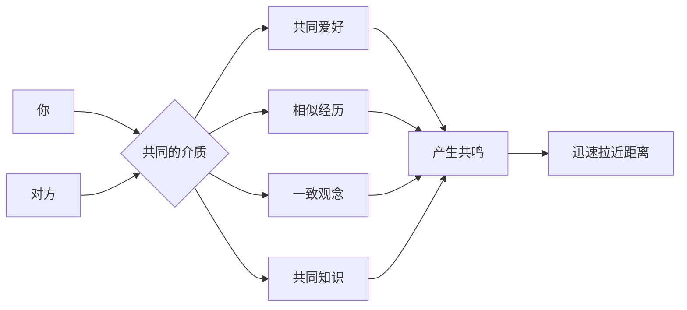
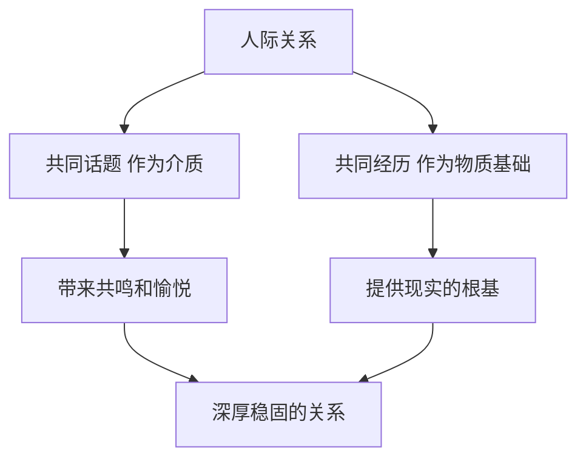

# 第14课：人际吸引的基本原则

## 核心问题：如何才能和别人聊到一块去？

很多人不知道如何跟别人聊天，其中最大的困扰是——**不知道聊什么**。

> [!TIP] 最有效的方法
> 分析自己知道什么，去发现对方知道什么，暗自合计一下你们**共同知道的是什么**。如果你发现对方和你有共同的爱好、相似的经历，怎么可能没得聊？

闲聊不是学术答辩，不需要太多逻辑和深刻思想。轻松愉悦、随意发散就好。你所认为的"不会聊天"、"不擅长沟通"、"恐惧社交"，可能只是因为没有找到能共同探讨的话题。

## 聊得来的本质：共同话题作为介质

就像声音在真空中不能传播一样，**我们与他人情感的共振同样需要介质**。我们需要桥梁，需要纽带，需要载体。

"与君初相识，犹如故人归"——这是因为刚刚开始交谈，就在对方身上看到了熟悉的东西，所以迅速有了故人的感觉。聊天最愉悦的感觉，大概就是**找到共鸣**了。

> [!WARNING] 聊得来的真谛
> "这个经历我也有的，这个心情我能懂的，这本书我也看过，这个电影的这个镜头我也记得。"——这些共鸣时刻，就是情感介质在发挥作用。

## 人际吸引的基本法则：相像律

与常识中"互补相吸"的观点相反，心理学实证研究表明：**人际吸引最基本的原则之一是相像律——相类似的人彼此吸引对方。**

相像包括：
- **抽象层面**：价值观、性格、思想、人生态度
- **具象层面**：喜欢的书、电影、音乐、爱好

对于恋人来说，**共同点越多，彼此越喜欢**。你们之间的介质越多，情感传播的速度和深度也越大。

### 拓展知识储备是关键

想要跟人有话说，可以着手改善的最关键环节就是：**拓展自己的信息及知识储备**。储备越多，你越能和别人找到共同话题，让对方觉得投缘。

> [!EXAMPLE] 冷冷的亲身经历
> 冷冷和室友认识的第一天，发现室友桌子上有阿加莎·克里斯蒂的小说。一聊发现两人都是推理小说爱好者，都喜欢悬疑电影。推理小说和悬疑电影成了她们之间的介质，为她建立了连接的桥梁，她们很快就成了好朋友。室友后来说："感觉你和谁都能聊到一块去。"——那是因为冷冷对各种各样的东西都感兴趣，或多或少都知道一点。

但需要留意的是：如果你的共同话题仅仅建立在广泛的知识储备上，这种"聊得来"是很廉价的。真正坚实的关系介质是**相似的人生态度、精神世界、独特的爱好和对很多问题共同的看法**。

## 另一种介质：共同经历

共同经历是比共同话题更深层的情感介质。这里的共同经历很广泛——读过同一个学校、待过同一个班级、有共同的朋友等。

### 共同经历的作用

1. **破冰的工具**：对于久别重逢的人，共同经历是破冰的最安全切入口
2. **亲切感的来源**：如果新认识的人和你曾在同一个地方生活过，你会立刻感到亲切
3. **关系的物质基础**：共同经历是人际关系坚实的物质基础

### 为什么朋友会渐行渐远？

每一次毕业，和你这个阶段的好朋友可能越来越少联系。不是因为彼此薄情，而是因为你们在不同的路上走着，看到的风景不同，遇到的问题也不同，**不再有共同经历**。

人的本性就是如此：**对那些我们朝夕相见的人，我们能够保持强烈和深切的兴趣。** 感情这种上层建筑需要时时发生的共同经历作为物质基础。

> [!QUESTION] 思考题
> 列出你生命中最重要的几段关系。在这些关系中，你和对方之间的"介质"是什么？是共同爱好、相似价值观，还是共同的经历？有没有哪段关系因为介质变少而疏远了？你可以做什么来增加或维持你们之间的介质？

行动指南

1. **拓展知识储备**：每周尝试接触一个新领域的知识（一本书、一部纪录片、一个播客）
2. **培养兴趣爱好**：有深度地投入1-2个兴趣，这不仅能丰富你的生活，也能成为与他人的连接点
3. **创造共同经历**：与重要的人定期见面、一起做某件事、分享生活中的细节
4. **主动寻找共鸣**：与新认识的人交流时，有意识地寻找共同点
5. **珍惜"聊得来"的人**：如果遇到一个与你有许多共同介质的人，主动维护这段关系

## 总结

想和别人聊到一块去，关键是找到共同话题作为情感介质。人际吸引的基本原则是相像律——相似的人彼此吸引。拓展知识储备能让你与更多人找到共同话题，但深层的价值观共鸣才是坚实关系的基础。共同经历则为关系提供现实的物质基础，是长久维持关系的关键。

**接纳自己，经营关系，正确努力，实现改变。**

---

**相关课程：** [[0015-zi-wo-yan-shen-mo-xing|第15课：自我延伸模型]] 探讨如何保持关系的新鲜感与愉悦