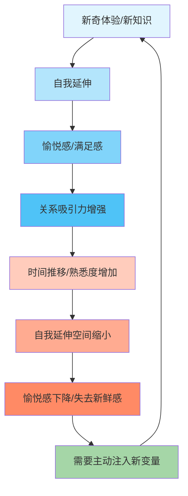

# 第15课：自我延伸模型

## 核心观点

再好的东西也怕习以为常。无论是一段亲密关系、一份工作还是一种爱好，持续重复的刺激都会提高我们的阈值，让我们逐渐麻木、厌倦。但通过"自我延伸模型"，我们可以主动维持新鲜感和快乐。

## 边际效用递减：为什么我们会厌倦

经济学中的**边际效用递减**规律同样适用于人际关系和生活体验。一种事物，只有在第一次尝试时才会觉得惊艳，如果紧随其后持续提供，每增加一次等量供应，你所获得的奖赏会逐渐减少。

> [!TIP] 理解适应
> 人对持续的重复刺激会开启"免打扰模式"。正如刚进入有烟味的房间会觉得刺鼻，但待上一会儿就逐渐感觉不到了——这是我们的生存机制，但也让生活中的美好变得习以为常。

《苏菲的世界》提醒我们："亲爱的苏菲，我不希望你长大之后，也会成为一个，把这世界视为理所当然的人。"小孩子对世界充满好奇，一片落叶、一个开关都能引发他们的强烈兴趣。而成年人恰恰失去了这种能力。

## 自我延伸模型：保持新鲜感的钥匙

**自我延伸模型**（Self-Expansion Model）由心理学家艾伦（Aron）等人提出，指出：

- 新奇的活动、新才能的发展和新的思想观点的获得，具有内在的满足性
- 能扩展我们的兴趣、技能和经验的伴侣关系，最能吸引我们
- 刚刚恋爱的人常常快乐无比，因为新关系促进了彼此知识的增加和自我概念的发展

然而，随着两人逐渐熟悉，对彼此的物理经历和精神体验都大致了解后，能增加自我延伸的内容就逐步缩减。这就是"失去新鲜感"的根源。

## 如何维持新鲜感

根据自我延伸模型，**保持快乐的关键是持续你个人成长的方法**：

1. **提升知识储备**——多读书、多学习新技能
2. **探索不同的经历和体验**——尝试新事物、去新地方
3. **在消耗存量的同时加入增量**——保持输入与输出的平衡
4. **永远记得保持自我更新**——让自己成为一个不断成长的人

> [!WARNING] 不要等待对方来"延伸"你
> 很多人期待伴侣或朋友来给自己带来新鲜感，但真正的关键在于你自己的成长。一个停滞不前的人，很难在一段关系中持续提供新价值。

## 核心公式

新鲜感 = 持续自我更新 + 探索新体验 + 保持好奇心

你所见识的世界、所认识的人、所做的事情、所读的书、所掌握的知识、所拥有的兴趣爱好——满足自我延伸需求，不仅是为了在自我提升的同时增加人生乐趣，也是为了能够引起并维持他人对自己的好奇心。

## 思考题

> [!QUESTION] 自我延伸盘点
> 回顾过去一年，你为自己的"自我延伸"做了哪些事情？你最近一次学习的新技能或接触的新领域是什么？你身边的朋友或伴侣是否也在持续成长？

思考方向

如果发现自己最近的生活一直停留在"存量消耗"阶段，可以从一个小变化开始：读一本从未接触过的领域的书、参加一次新的活动、或者学习一项简单的新技能。不需要大动作，关键在持续。

## 相关课程

学习完本课，建议继续学习 [[0016-you-dian-xi-yin-que-dian-qin-mi|第16课：优点吸引，缺点亲密]]，了解如何在关系中建立更深层次的情感连接。

---

接纳自己，经营关系，正确努力，实现改变。