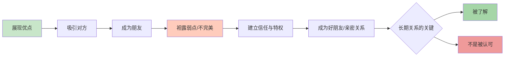

# 第16课：优点吸引，缺点亲密

## 核心观点

我们被别人的优点吸引而成为朋友，但只有看到对方的缺点和弱点时，才能成为真正的好朋友。完美的表象是屏障，不完美才是建立深刻连接的桥梁。

## 优点吸引，但停留在表面

我们喜欢优秀的人——那些闪闪发光的特质，比如在某个领域很厉害、多才多艺、性格很好，会吸引我们忍不住想靠近。但光环本身也是天然的屏障，你只能停留在他的外层，与光环里的人保持一定的社交距离。

心理学上有个名词叫**印象管理**，我们每个人在生活中都会有意或无意地管理自己给别人留下的印象。我们希望自己在对方眼中是整洁的、礼貌的、积极上进的。这些特质是敲门砖，是成为朋友的重要一步——但只能让你们成为朋友，而无法成为好朋友。

## 缺点让彼此建立深刻连接

是哪个时刻我们成为了好朋友？是看到对方**很多很多弱点**的时刻——性格中的小拧巴、某些笨拙、失败和无能为力、某些难堪的经历。那些隐藏在暗处不轻易示人的事物，才是友谊真正生根发芽的土壤。

> [!EXAMPLE] 来自作者的亲身经历
> 高二某天深夜，朋友在宿舍走廊里拽着作者，突然莫名其妙蹲下去哭泣的时刻；某次元旦晚会，大家开开心心，而朋友消失不见，作者知道Ta害怕热闹，去校园角落里找到Ta的时刻——是那些别扭的、奇怪的、不那么讨喜的缺点和弱点被看见的时刻，友谊才真正发生了质变。

电影《心灵捕手》中有一段经典台词：

> "像那样的小事很奇妙，那是我最想念的事。这些小特点让他成为我太太，他也知道我所有的小瑕疵。人们称之为不完美，其实不然，那才是好东西。能选择让谁进入我们的世界。"

**我们同好朋友之间，与同其他人之间的差别，就在于共享的黑暗面上。** 这些真实的另一面，只有你能看到——这是信任，是情感的寄托，是特权。是这些弱点、瑕疵和不完美，才能让彼此建立深刻的连接。

## 恋人之间同样适用

米兰·昆德拉在《生命中不能承受之轻》中描述托马斯对特丽莎的感受："他像个孩子，被人放在树枝涂覆的草筐里顺水漂来，而他在床榻之岸顺手捞起了他。"

北大教授吴晓东评论道：**怜悯当然不等于爱情，但怜悯却能诱发爱情，而爱情的感情中一定有怜悯。** 假如恋人们从来没有在对方身上体验到怜悯的感情，就应该反省一下自己的爱情了——那只是激情，却很难持久。

太完美了不真实，太完美了就会有失可爱。苦心维系自己在他人眼中完美的形象，会带来巨大的心理压力，身心俱疲，而且往往适得其反。

## 被了解，而非被认可

如果我们想要长期健康的人际关系，最基本的目标是**通过关系被了解**——被了解，而不是得到认可。不畏惧于袒露真实，不执着于掩饰自己弱点，会让我们彼此建立深刻的连接。

> [!WARNING] 完美主义陷阱
> 如果你发现自己在每段关系中都小心翼翼维护完美形象，请停下来问自己：我到底是想被认可，还是想被了解？前者让你疲惫，后者让你自由。

## 思考题

> [!QUESTION] 你的"共享黑暗面"
> 回想一下，你和最好的朋友之间，有没有一个"看见对方弱点的时刻"让你觉得关系从此不同了？你在当前的关系中，是否在刻意维持某种完美形象？

思考方向

大多数人习惯性地把最好的一面展示给别人，这本身没有错。但要注意区分"社交展示"和"亲密关系"——在你想深入发展的关系中，适当暴露真实的弱点和困扰，反而会加速信任的建立。试着从分享一件最近让你困扰的小事开始。

## 相关课程

- 上一课：[[0015-zi-wo-yan-shen-mo-xing|第15课：自我延伸模型]]——了解如何维持关系中的新鲜感
- 下一课：[[0017-gou-tong-ji-qiao|第17课：最重要的沟通技巧]]——学习如何通过有效沟通加深关系

---

接纳自己，经营关系，正确努力，实现改变。