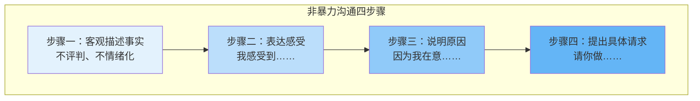

# 第17课：最重要的沟通技巧

## 核心观点

良好的沟通不是天生的，而是可以学习和训练的。本课介绍了三个实用维度：如何表达需求才能让人愿意配合、如何安慰别人才是真正有效、以及如何回应才能让关系长久健康。

## 维度一：非暴力沟通四步骤

表达自己的需求时，可以采用《非暴力沟通》中的四步法：

### 举例对比

| 错误的表达（评判+情绪化） | 正确的表达（非暴力沟通） |
|:---|:---|
| "你一点都不关心我！" | "你工作很忙，最近几天没给我打电话。（事实）我觉得有点不开心，很没安全感。（感受）因为我希望被关心。（原因）我希望你每天晚上睡前给我打个电话。（具体请求）" |

> [!TIP] 核心要点
> 很多人觉得"我把话说那么明白，对方才知道怎么做，那多没意思，这不是真正的懂我"。但正如《非暴力沟通》所言，当我们需要别人的关心时，想要的其实是"即使我还没察觉到自己的需要，对方就能考虑到"。醒醒吧——你不说，只靠暗示和内心戏，是没有人能察觉你的需求的。

## 维度二：如何有效安慰别人

大多数人安慰别人时，常用句式都是**错的**：

❌ "不要难过了，他不配。"
❌ "你会找到更好的。"
❌ "其实你已经不喜欢他了，只是不甘心。"

这些话语的实质是**否定对方的痛苦**，试图让对方停止感受。

> [!WARNING] 不要急于解决问题
> 安慰的首要目标不是解决问题，而是满足对方的情感需求，让对方有被理解的感觉。有了这个基础，对方才会付出信任，才听得进你的建议。

### 正确的安慰方式

1. **放下先入为主的想法**
2. **放下急于做出判断的欲望**
3. **不要急着给出建议**
4. **专注于体会对方的需求**

> [!EXAMPLE] 正确安慰的示范
> - "你觉得很不高兴，是因为你需要被人陪着的感觉吗？"
> - "你现在很难过，是因为你对自己有点生气，觉得可以做得更好，是这样吗？"
> - "你很难过，我知道如果我是你，我肯定也会这样。"
> 
> 核心信息：**你的感受我看到了，我很重视，我认为它是合理的。**

## 维度三：主动且有建设性的回应

加州大学雪莉·盖博（Shelly Gable）的研究表明：**对积极事件的沟通方式，比对消极事件的沟通，更能预测一段感情能否长久。**

心理学将回应方式分为四种：

|  | 建设性 | 破坏性 |
|:---|:---|:---|
| **主动** | "你是怎么做到的？具体是哪个专业？走，我请你吃饭庆祝！" | "是不是要花很多钱？等你毕业都30了吧？" |
| **被动** | "哇，挺好的，你真厉害。"（敷衍式赞美） | "哦，我在忙。" |

**主动且有建设性的回应**是让谈话愉快进行、让关系良性发展的关键：

- 真正关注对方在表达什么
- 针对内容给出积极主动的回馈
- 表达进一步了解的兴趣
- 表达真情实感的关切

> [!QUESTION] 检验你的回应习惯
> 下次朋友或伴侣向你分享好消息时，你的第一反应是真心为对方高兴并追问细节，还是简单说一句"真棒"就切换到自己的话题？试着刻意练习一次"主动建设性回应"，观察对方的反应变化。

练习任务

本周内，找一次机会对身边的人使用"主动建设性回应"。比如同事升职、朋友拿到offer、家人做了一道好菜——抓住对方的高兴时刻，用追问细节和表达真心的方式回应，看看对话氛围会发生什么变化。

## 本课总结

1. **提需求**：用非暴力沟通四步法——客观描述事实 → 表达感受 → 说明原因 → 提出具体请求
2. **安慰人**：不否定对方感受，先共情理解，再谈方法和行动
3. **日常回应**：用主动且有建设性的回应，让每一段对话成为关系的粘合剂

## 相关课程

- 下一课：[[0018-rang-bie-ren-yuan-yi-shi-ni|第18课：如何让别人愿意认识你]]
- 相关课程：[[0011-xue-hui-suo-qu-yu-ma-fan-bie-ren|第11课：学会索取与麻烦别人]]——学会表达自己的需求

---

接纳自己，经营关系，正确努力，实现改变。