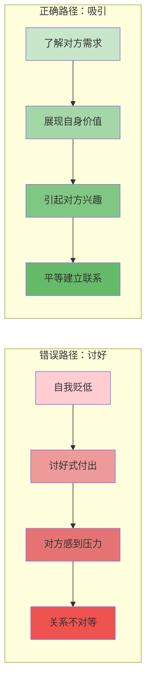

# 第18课：如何让别人愿意认识你

## 核心观点

如果你想和一个人建立联系，让对方愿意认识你，最重要的不是"自我表现"，而是"引起兴趣"。站在对方的角度思考对方需要什么、对什么感兴趣，然后展现你是一个高价值、值得认识的人。

## 一个经典范例

作者分享了一个读者发来的私信，这条私信让作者主动提出"加我微信吧"——尽管对方从未明确提出这个请求。

> "高冷冷同学你好，看到你的简介，觉得很不容易，从化学转到中文……我在某国读大学，某工科本科加硕士，现在在读第二个硕士，某跨度很大的硕士……用化学平衡解释心理问题，真是让我又惊又喜。"

这条私信的成功之处在于：

1. **引起兴趣**——转专业、跨学科的经历让同为转专业出身的作者感到"同道中人"
2. **展现高价值**——没有直接说"我很厉害"，但字里行间透露了学历背景和思想深度
3. **不卑不亢**——姿态平等，没有讨好，没有索取

## 错误的做法

大多数人的私信属于这种类型：

❌ "很喜欢冷冷，想加冷冷微信。"
❌ "冷冷很厉害，希望能给我一些建议。"
❌ "我可以帮你做什么什么，只要给我一个认识你的机会。"

这些表达的核心问题是：**只关注"我喜欢什么、我想要什么"**，而没有考虑对方需要什么。

> [!TIP] 核心原则
> 一切人际关系的本质都是资源置换。这里的"资源"不限于金钱和人脉，也包括情感陪伴、精神交流、情绪价值等看似不功利的方面。当你想认识一个人时，问问自己：**我能提供什么？对方为什么应该花时间认识我？**

## 引起兴趣 vs. 自我表现

| 自我表现 | 引起兴趣 |
|:---|:---|
| 从自己的角度出发，表达自己想表达的东西 | 预设一个受众，精准把握对方的兴趣点 |
| 展示"我是谁" | 展示"你为什么应该认识我" |
| 容易沦为自说自话 | 让对方产生"想认识这个人"的冲动 |

> [!EXAMPLE] 另一个成功案例
> 一位哈工大学弟给作者发私信："我并不需要面包，也并不饥饿。我本科哈工大土木，现在在某国读计算机硕士，我只是想看看我们这种人。"——同样，作者立刻主动要求加微信。

## 正确的姿态：吸引而非讨好

把自己摆到低于对方的位置上，试图用讨好或迎合的方式进一步认识——这不容易成功。一般来说，人们还是喜欢**双方对等、不卑不亢、势均力敌**的关系，这才是让关系长久健康稳定的必要条件。

## 真诚是根本

虽然以上讨论的是方法和策略，但需要强调：**技巧和思路只是辅助，真诚才是根本。**

这不是用来算计人的套路，而是一点小智慧——帮助你更有效地表达自己、建立连接的智慧。同样适用于朋友关系、亲密关系、找工作、和厉害的人结交等场景。

> [!WARNING] 真诚 ≠ 不加修饰
> 真诚不等于毫无策略地"做自己"。真诚是底层的态度，技巧是外层的表达方式。两者结合才是最佳状态——用真诚的心，加上有效的方式，让对方看到一个真实的、有价值的你。

## 本课总结

- 如果你想和一个人建立联系，首先要做的是**引起兴趣**
- 重要的不是"我喜欢什么、我想要什么"，而是**对方需要什么、对什么感兴趣**
- **展现自己是高价值的人**，提供对方主动认识你的动机
- 一切人际关系的本质都是资源置换（广义）
- **平等相待，吸引而非讨好**
- **真诚是根本**

## 思考题

> [!QUESTION] 自我审视
> 想一想你最近一次想认识某个人的场景（可能是某个领域的专家、你欣赏的人等），你是如何表达自己的？你在表达中更多关注"我想要的"还是"对方感兴趣的"？

改进方向

如果发现自己过去多用"索取型"的表达方式，下次可以尝试换一个思路：先研究对方的作品、观点、经历，找到你们之间的连接点，然后用"共鸣+价值展示"的方式去建立联系。比如："我最近在了解XX领域，看到您的XX观点让我深受启发，我也有类似的经历/我在这个方面也有一些积累……"

## 相关课程

- 相关课程：[[0016-you-dian-xi-yin-que-dian-qin-mi|第16课：优点吸引，缺点亲密]]——了解如何在建立联系后深化关系

---

接纳自己，经营关系，正确努力，实现改变。