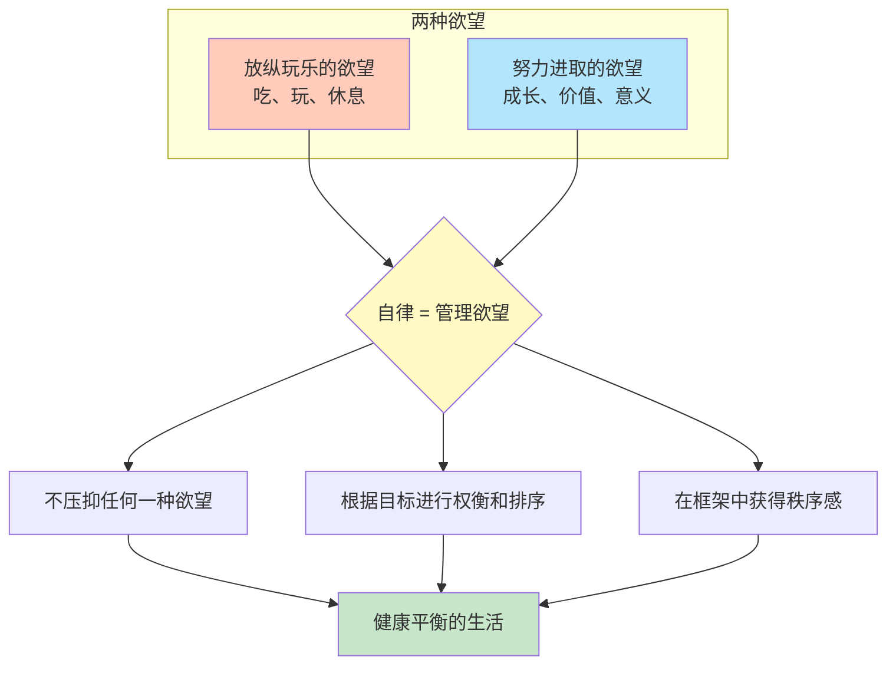

# 第19课：努力和进取也是我们的需求

## 核心观点

如果不需要努力，想要什么就能得到什么，真的会快乐吗？本课给出了一个反直觉的答案：**努力和进取本身也是人类的基本需求**。过程本身就是意义，自律不是压抑欲望，而是对多种欲望的权衡和管理。

## 当生活成为 Easy 模式

日本动漫《齐木楠雄的灾难》中的主人公齐木楠雄拥有各种超能力——心灵感应、瞬间移动、预知未来。他可以做到一切且不费吹灰之力。但结果呢？他几乎无法再从任何事情上得到快乐。生活成为easy模式之后，人生变得十分虚无，毫无悬念的生活没有任何惊喜可言。

> [!TIP] 核心洞察
> 努力的过程本身就是意义，甚至是人生最大的意义。终点和远方激励着我们踏上征程，但目标的实现往往只是一个瞬间。人的一生，就是不停奔波在一段又一段路上。

## 你需要的不仅仅是结果

如果你有一个目标（比如考研复试），但无法静下心来努力，不妨转变一下观念：

**你所需要的不仅仅是复试的结果，为复试做准备这个事本身，也是你需要的。**

你现在的焦虑，不仅仅是因为担忧能否考上，也是因为你没有去完成努力的过程。努力的过程能满足我们内心对于**平静和专注、意义感和价值感**的需求。我们所需要的不仅仅是收获，耕耘其实也是刚需。

> [!EXAMPLE] 作者的人生最快乐时刻之一
> 初中某个周六上午，专心学习了整整6个小时，从清晨5点半到中午11点半。然后心颤着打开电视，刚好播放《春光灿烂猪八戒》第一集。何等的快乐！如果那天上午没做事，大概就只是很寻常地看电视，这个场景也很快会被忘记了。

## 放纵并不能带来真正的快乐

在漫长假期里，你真的快乐吗？每次放假，很多人发现：之前忙碌时想做的那些事，现在一点都提不起劲。

> [!QUESTION] 你的假期体验
> 你有没有过类似的经历——在忙碌时疯狂期待放假，但真到了长假却觉得无所事事，甚至比上学/上班时更不快乐？你觉得是什么导致的？

原因分析

当你有无限的自由时，就像被抛进巨大的虚空之中，可以向任意方向前进，却不知如何是好。快乐往往需要对比——当你处于一个既定的框架之中，被规则约束着，然后某些时刻解绑，这个**瞬间**你才是最快乐的。

我们需要外部给予的秩序。正如李松蔚老师所说："普通人根本就无法承担那么大的虚无感，普通人就适合好好上班过日子。你再怎么鼓励一个人当废物，他也做不到，当一辈子废物实在太难了。"

## 自律是管理欲望，而非压抑欲望

我们常把学习和工作视为痛苦的存在，把自律理解为压抑自己想玩想吃的欲望。但本课提出了一个重要的观念翻转：

**自律是管理欲望，是对努力进取的欲望和放纵玩乐的欲望的权衡和排序。**

当你需要做事情、需要努力时，你不是在压抑自己想吃想玩的欲望，**你是在满足自己想上进的欲望。**

## 管理快乐阈值

长大后很难像小时候那样快乐了——因为有太多可供支配的钱和自由，每件事情都变得习以为常，快乐的阈值被拔得太高。

> [!WARNING] 警惕快乐通胀
> 没有框架约束的自由不是真正的自由，没有被一定的规则捆绑着的快乐，会逐渐失去快乐的价值。人应该学会管理自己的欲望，在受限制的空间中活动，有意识地控制自己的快乐阈值。

## 本课总结

- 如果对事情的结果可以随心所欲，人生就会变得虚无
- **追寻目标的过程，而不是目标的实现，才是幸福的关键**
- 你需要的不仅仅是收获，耕耘本身就是刚需
- **自律是管理欲望，不是压抑欲望**
- 放纵不是得到快乐的方法，快乐需要在框架内才能被感知

## 相关课程

- 下一课：[[0020-chang-qi-wen-ding-nu-li|第20课：长期稳定持续的努力]]
- 相关课程：[[0023-yue-nu-li-yue-jiao-lu|第23课：越努力越焦虑]]——探讨努力中的焦虑问题

---

接纳自己，经营关系，正确努力，实现改变。