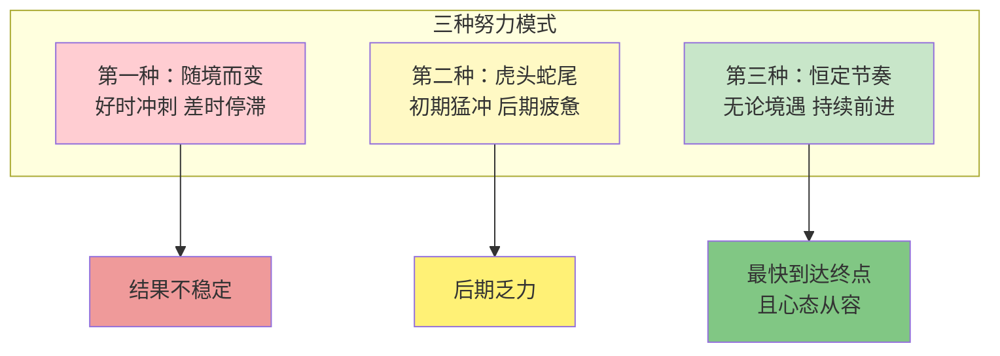

# 第20课：长期稳定持续的努力

## 核心观点

习惯于短期内爆发式努力并取得不错的成绩，看似高效，实则隐藏着问题。大多数人做事像"一日曝十日寒"——状态好时拼命冲刺，状态差时彻底摆烂。真正能做成事的人，拥有**持续稳定的节奏**，无论外部环境和内在情绪如何变化，都能保持恒定的输出。

## 间歇性努力的问题

大多数人习惯于这样的模式：

- 今天太开心了，不如庆祝一下
- 今天太不开心了，不如休息一下
- 今天状态好，多做一些
- 今天状态不好，少做一些

在浪费了很多时间之后，自责、懊悔以及即将到来的deadline，又促使他们临阵磨枪，短时间内迅速完成任务。这种模式虽然偶尔也能获得不错的成绩，但长期来看充满了不确定性和不安全感。

> [!EXAMPLE] 两种学生对比
> 一位保研清华的师兄说："如果去考研，保研的人大概率比只能去考研的人考得好——因为他们基础扎实，更勤奋，且数年来始终如一地付出，拥有稳定的节奏。"
> 
> 而很多人在大学期间习惯于平日懒散度日、期末周突击的模式。两种状态在期末成绩上的差异不大，但长期来看，只有稳定持续的人才是大概率能做成事情的人。

## 20英里法则

心理学家吉姆·柯林斯提出了著名的**20英里法则**：

美国西海岸圣地亚哥距离某地3000公里，徒步旅客分三种：

| 旅客类型 | 行为模式 | 结果 |
|:---|:---|:---|
| **第一种** | 路况天气好时全速前进，恶劣时停在帐篷里抱怨 | 较慢到达 |
| **第二种** | 初始精力充沛每天走四五十公里，逐渐身心疲惫越走越慢 | 较慢到达 |
| **第三种** | **无论路况天气如何，自身心情身体如何，每天走20英里，不多不少** | **最快到达，状态最佳** |

## 为什么不能"好时多走、坏时少走"？

直觉上，顺境时多走点、逆境时少走点，似乎是更合理的安排。但这样做的问题在于：

**人是有懒惰天性的。如果有太多可供操作的空间，你总是能找到原地休息、停止赶路的理由。**

不要想着"明天补回来"，也不要想着"今天多做点"——否则你接下来总是会找借口偷懒，容易放弃长久的作业。最好的方式就是像第三种旅客一样，除非有极端情况发生，不然**每天都走20英里**。

> [!TIP] 村上春树的写作法则
> 村上春树写长篇小说时，每天不多不少写10页。即使心里还想继续写，也照样在10页左右打住；哪怕觉得提不起劲，也要鼓足精神写满10页。规律性对长期工作有极大的意义。

## 变温变压下，化学性质稳定

作者用了一个生动的化学比喻：

> "有段日子我把微信签名改成了'常温常压下，化学性质稳定'，但自己当时的状态却更贴近于'常温常压下，易燃易爆炸'。我的理想状态是**变温变压下，化学性质稳定**。"

这句话可以送给每一个想要持续努力的人——无论外界和内在如何变化，你都能保持稳定的输出节奏。

> [!QUESTION] 你是哪一种旅客？
> 回顾你最近一个月在学习或工作中的表现，你更像是20英里法则中的哪种旅客？你是否有过"状态好时猛学一天，然后歇三天"的经历？如果从现在开始调整节奏，你打算怎么做？

行动建议

1. 设定一个**每天最低工作量**——不多不少，雷打不动
2. 无论状态好坏，完成任务的最低标准后再决定是否加量
3. 遇到"特别想多做"的冲动时，告诉自己：明天保持即可，不必透支
4. 遇到"特别不想做"的抗拒时，告诉自己：完成最低量即可，不用完美

记住：**苟有恒，何必三更眠五更起；最无益，莫过一日曝十日寒。**

## 本课总结

- 大多数人习惯于今天堕落明天拼命的极端模式，计划常被打乱
- 长期看来，拥有**稳定持续节奏**的人才是大概率能做成事情的人
- 顺境时不过分用力，逆境时不沮丧拖延
- 完成长期工作的关键是**规律性**，而非单次的高强度
- 追求的目标：**变温变压下，化学性质稳定**

## 相关课程

- 相关课程：[[0023-yue-nu-li-yue-jiao-lu|第23课：越努力越焦虑]]——探讨为什么努力会带来焦虑以及如何化解

---

接纳自己，经营关系，正确努力，实现改变。