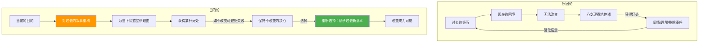

# 第26课：不改变的决心（原因论vs目的论）

## Learning Objectives

- 区分原因论与目的论的根本差异
- 理解"记忆是重构"这一反直觉的心理学发现
- 识别自己"不改变的决心"背后的保护机制

## Core Idea

这是我们一直以来的叙事方式：因为小时候总被否定，所以导致现在不自信；因为过去犯错了就被指责，所以现在小心翼翼。这听起来无懈可击——**过去已经无法改变，所以现在也很难改变**。但这种"原因论"恰恰是阻止我们改变的最大借口。

课程的**核心观点**来自阿德勒心理学：**决定我们自身的不是经历本身，而是我们对经历赋予的意义**。

[[0001-zi-wo-ke-ze-yu-gui-yin|第01课：自我苛责与归因]] 探讨了如何正确看待自己，而本节课则从更根本的层面揭示：你如何看待过去，取决于你现在的目的。

### 原因论 vs 目的论

### 记忆是重构，不是还原

心理学研究发现：**回忆不是对过去事件的准确再现，而是一种重构**。当人们回忆一件事时，会根据当前的需要对内容进行有针对性的选择和调整。你以为的"客观事实"，其实是你为了推导出此刻所相信的结论而编排的叙事。

> [!NOTE] 半杯牛奶的隐喻
> 
> 半杯牛奶摆在那里，悲观的人叹息"只有半杯"，乐观的人欢呼"还有半杯"。同一段过去，你可以选择不同的叙事方式。既然有的是选择，为什么偏要选择悲观的叹息？因为这种叹息为你的"不改变"提供了正当理由。

### 不改变的决心

"你之所以不能改变，是因为自己下了不改变的决心。"这句话听起来毫无道理——明明我一次次下决心要改变！但这些改变的决心只是经不起审视的表象。每次迈出一小步，收到一点点负面反馈，立刻就开始往后退。

**为什么人要坚守不改变？**

1. **保护自己不受伤害**：相比于改变可能带来的成功，你更害怕改变可能带来的失败。现状虽不完美，但可控；一旦失败，会比现在更痛苦。
2. **维护可能性**：如果不做出实质努力，就可以一直保留"只要我做了，我就能变好"的可能性。拖延是手段，目的是维护对自身潜在能力的信心。

[[0027-bai-tuo-wan-mei-zhu-yi|第27课：摆脱完美主义]] 将接着讨论完美主义如何强化这种"不改变"的模式。

> [!TIP] 接受目的论虽然痛苦，却是重新选择的开始
> 
> 你的过去定义不了你，选择的权利始终在你自己手里。人无论在何时、处在何种环境中，都可以改变。

## Worked Example

**原因论叙事**："我因为小时候总被父母否定，所以现在很不自信。这是无法改变的事实。"

**目的论视角**：
- 你坚持这种叙事，可能带来的"好处"是什么？——可以获得同情，可以免除改变的压力
- 如果重新诠释这段经历，能否找到不同的意义？——那段经历也让你更敏感、更能共情他人
- 今天你能做的一件小事，来打破这种叙事？——在某个场合主动表达一个观点

## Practice

> [!QUESTION] Self-check
> 
> 找出你生活中一个长期困扰你的问题，写下你习惯的"原因论"解释。然后尝试用"目的论"问自己：我坚持这个解释，在无意识中获得了什么好处？

Reveal answer

常见的"好处"清单：
- 不需要面对改变的不确定性和风险
- 可以继续留在舒适区
- 获得他人的同情和特殊对待
- 为自己不如意的表现找到借口
- 维持"只要我努力了就能变好"的幻想

识别这些好处不是为了自我批判，而是为了意识到：你其实一直在**主动选择**。既然过去是你选择的叙事，那现在你也可以选择新的叙事。

## Next Step

Continue with the next lesson or complete the review task above before moving on.