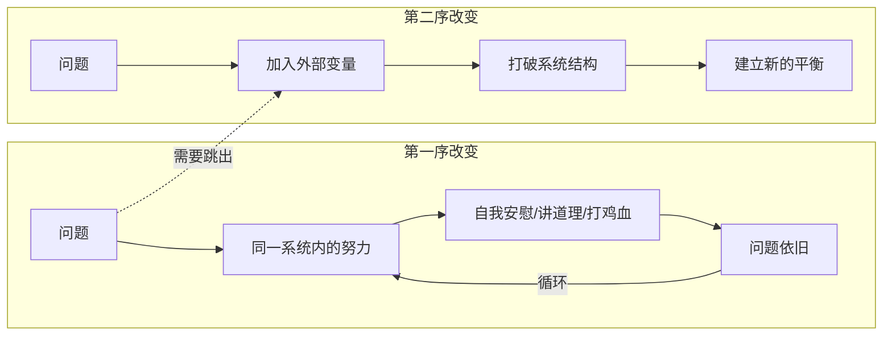

# 第28课：第一序改变与第二序改变

## Learning Objectives

- 理解第一序改变与第二序改变的核心区别
- 识别自己正处于"噩梦系统内"还是"清醒努力中"
- 学会通过加入变量打破系统的僵化结构

## Core Idea

**第一序改变**：在系统内部发生的变化，无论怎么折腾，系统的结构不变。
**第二序改变**：跳出系统本身，进入完全不同状态的改变。

一个经典的比喻：一个做噩梦的人，在梦中可以做许多事——跑、躲、打、喊、跳下悬崖——但无论怎么变换行为，都无法停止噩梦。这就是第一序改变。跳出梦境的唯一方法是**醒来**——这不属于梦境的一部分，而是完全不同的状态，这就是第二序改变。

[[0027-bai-tuo-wan-mei-zhu-yi|第27课：摆脱完美主义]] 揭示了在完美主义框架内挣扎的困境——这恰恰是第一序改变的典型案例。而本节课将提供跳出框架的方法论。

### 第一序改变 vs 第二序改变

### 常见案例

| 问题 | 第一序改变（无效） | 第二序改变（有效） |
|------|-------------------|-------------------|
| 焦虑 | 安慰自己"没事的"，调整心态 | 跑步、冥想、保持充足睡眠 |
| 拖延 | 晓以利害，给自己打气 | 5分钟启动法：先做5分钟再说 |
| 学习动力不足 | 逼自己从早学到晚 | 允许每天休息2-3小时，每周彻底休息一天 |
| 环境影响 | 靠毅力和自觉对抗环境 | 孟母三迁：换到有利的环境 |

> [!NOTE] 孟母三迁的智慧
> 
> 孟子小时候住在墓地附近，学祭拜之事；搬到集市旁边，学做买卖；搬到学宫旁边，才开始学礼节。孟母一直在做第二序改变——改变所处的生态系统，而不是在第一序中靠言传身教和孟子的悟性来对抗环境。

[[0030-ru-he-shi-xian-zhen-zheng-gai-bian|第30课：如何实现真正的改变]] 将进一步探讨如何将第二序改变的思维落实到日常行动中。

### 两个关键思路

**1. 找到真正的问题**

很多时候事情没做好，我们找错了原因。比如：
- "我逻辑能力不行" → 真正问题是"知识储备不足"
- "我学习动力不够" → 真正问题是"没有充分休息"

只有找到真正的问题，才称得上是第二序改变。

**2. 解决具体的问题**

不要喊"我执行力太差、自制力太弱"这类抽象的口号，然后去搜索"如何提高自控力"。真正需要解决的是具体问题：如何让7点到8点的背单词坚持下来？如何让自己今天不玩手机？**真正的改变，最重要且唯一有用的，是具体行动的改变**。

> [!TIP] 在稳定生态中加入一个变量
> 
> 就像化学反应——加入新的反应物，或者改变反应条件，才会有新的反应发生，形成新的平衡状态。在现实生活中，这个"变量"可以是：5分钟的行动、换个环境、建立新的习惯。

## Worked Example

**场景**：总是晚上熬夜刷手机，第二天起不来，陷入恶性循环。

**第一序改变尝试**：
- 告诉自己"今晚一定要早睡"
- 设置手机提醒
- 睡前读励志文章激励自己

**第二序改变方案**：
- 把手机放在另一个房间充电（环境变量）
- 睡前1小时调暗灯光，读纸质书（系统变量）
- 每天固定时间起床，无论几点睡（重新设定系统参数）

## Practice

> [!QUESTION] Self-check
> 
> 找一个你长期想改但一直改不掉的问题。列出你已经尝试过的第一序改变方法，然后思考：加入一个什么样的"变量"，才能打破这个系统的僵化结构？

Reveal answer

判断自己是在第一序还是第二序中努力的简单方法：

- **第一序**：你在跟自己较劲，反复用同样的方法试图改变结果，但收效甚微
- **第二序**：你改变了环境、改变了做事方式、改变了参考框架，结果自然不同

记住：系统之内可以发生许多第一序改变，但因为结构维持不变，所以产生不了第二序改变。想要改变，必须打破结构。

## Next Step

Continue with the next lesson or complete the review task above before moving on.