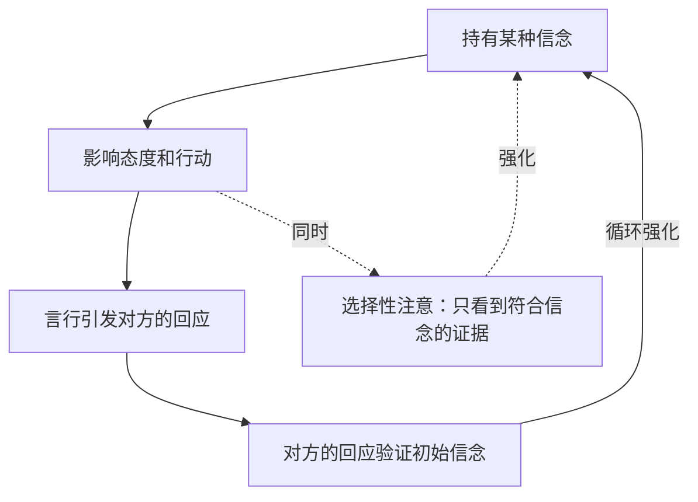

# 第29课：信念即自我实现的预言

## Learning Objectives

- 理解"信念即自我实现的预言"的运作机制
- 区分成长信念与宿命信念
- 学会在人际关系中识别并调整预设框架

## Core Idea

"不好的想法，从嘴里说出来的话是会成真的，像被自己诅咒了一样。"——日剧《重版出来》

**信念即自我实现的预言**：你相信自己能做到，你就能做到；你认为自己做不到，恭喜你，你也是对的。这不是唯心主义，而是一个可观察的心理机制：如果你觉得某件事不能成功，你会感到焦虑和恐惧，进而影响行动，不再有动力去解决问题，最终等来坏结果；如果你相信可以实现，遇到困难时会相信肯定能找到办法，去付出不懈的努力，最终更有可能成功。

> [!NOTE] 亲身经历
> 
> 冷冷曾跟家人说自己做好了"写不出来"的心理准备。家人严肃地说："你应该想的是——无论如何，我就是要写出来，也一定能写出来。"这句话醍醐灌顶。一直给自己灌输"可能做不到"的念头，遇到困难时立马折服于自己的"先知"。思维的转变真的很重要。

[[0022-cong-ming-yu-nu-li|第22课：聪明与努力哪个更重要]] 中提到的成长型思维与本课一脉相承——固定型思维是"宿命信念"，成长型思维是"成长信念"。[[0030-ru-he-shi-xian-zhen-zheng-gai-bian|第30课：如何实现真正的改变]] 将把信念落实到行动层面。

### 自我实现预言的循环

### 人际关系中的自我实现预言

这个理论同样适用于人际关系。你在一开始期待关系是什么样，之后大概率就会变成你所想的样子。即使最初的期望是臆想出来的、毫无根据的，一旦你坚定了预设框架，关系就会让你的预想变成现实。

**例子**：你听说一个人很强势，于是开始防备、警惕。对方知觉到你的态度，也以不友好的方式回馈。你把对方的很多言行都往"强势"上靠拢——即使有些事不属于强势范畴。拿着锤子，看什么都像钉子。

> [!TIP] 别人怎么对你，是你允许的
> 
> 如果你是"老好人"，无论遇到什么人，对方都可能会欺负你。这是因为你对自己的定义就是"好人"，你的言行微妙地表达出"你可以欺负我"的期望，对方感受到你的态度和容易妥协，于是给出了如你所期望的反应。

### 成长信念 vs 宿命信念

**宿命信念**：世界上存在一个和自己完美契合的人。如果恋爱遇到矛盾，说明不是对的人，应该终止关系。这和固定型思维相通——认定现状不可改变，问题无法解决。

**成长信念**：两个人的关系不是固定的，可以不断磨合。相处中的冲突和争吵是正常的，对矛盾的沟通和解决可以让关系变得更好。任何关系都需要付出时间和心思去经营。

## Worked Example

**场景**：准备一个重要演讲，内心一直觉得"我不擅长公开演讲""肯定会搞砸"。

**自我实现预言的运作**：
1. 预设"我会搞砸" → 焦虑紧张
2. 准备不充分，逃避练习 → 演讲时果然表现不佳
3. "看吧，我早说了我不行" → 强化信念，下次更糟

**打破循环**：
1. 替换信念为"我可以做好充分准备" → 采取行动
2. 认真练习，收集正反馈 → 表现提升
3. "我真的做到了" → 建立新信念

## Practice

> [!QUESTION] Self-check
> 
> 你在哪件事上对自己持有"我不行"的信念？这个信念是否正在成为自我实现的预言？试着将它改写为成长信念，并制定一个微小但具体的行动。

Reveal answer

改写公式：
- 从 "我不擅长XX" 改为 "我刚开始学XX，还需要练习"
- 从 "我做不到" 改为 "我现在还没找到方法"  
- 从 "别人都比我强" 改为 "我可以从别人身上学到什么"

微小行动示例：如果你觉得"我不擅长公开演讲"，明天可以主动在3人面前说一段话——不是要证明自己多厉害，只是为了收集一个小小的正反馈。

## Next Step

Continue with the next lesson or complete the review task above before moving on.