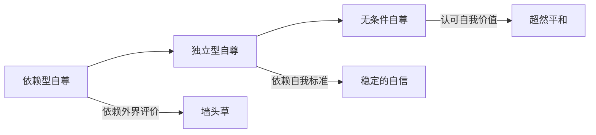
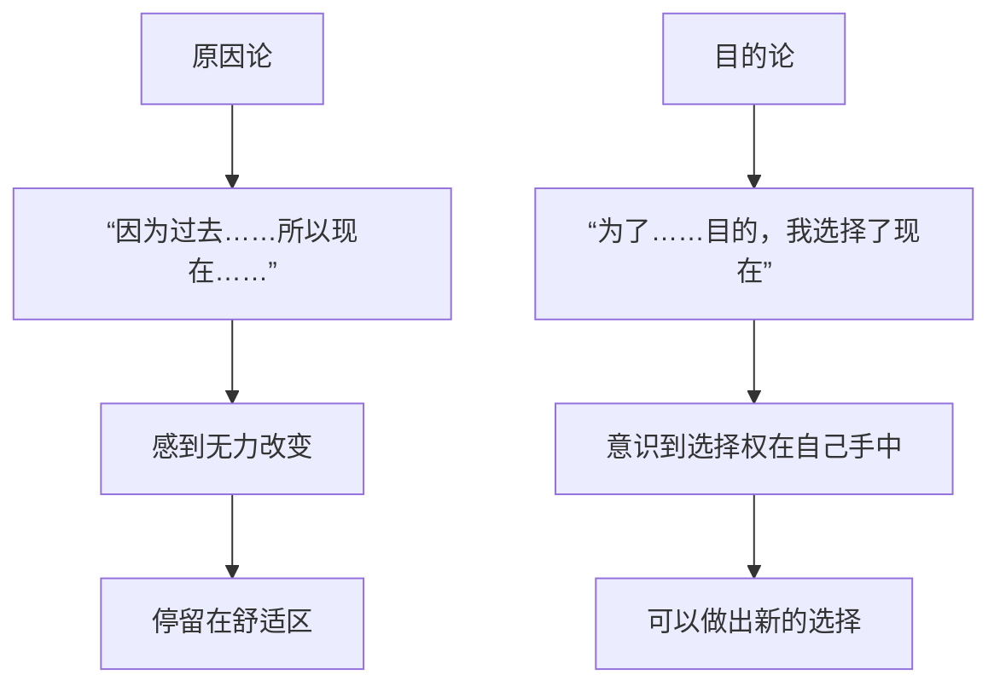

# 核心术语表

## 基础概念

| 术语 | 英文 | 含义 |
|------|------|------|
| 归因 | Attribution | 人们对事件原因的解释方式 |
| 习得性无助 | Learned Helplessness | 因反复失败而认为无法改变现状的心理状态 |
| 自我价值感 | Self-Worth | 个体对自身价值的评价和感受 |
| 自尊 | Self-Esteem | 对自我价值的整体评价 |
| 认知 | Cognition | 对信息的加工、理解和解释过程 |

## 归因维度

| 维度 | 类型 | 健康归因 | 不健康归因 |
|------|------|----------|------------|
| 内外性 | 内部 vs 外部 | 这件事本身难 | 是我愚蠢 |
| 稳定性 | 稳定 vs 不稳定 | 这次精力不足 | 我永远不行 |
| 特殊性 | 普遍 vs 特殊 | 不擅长这道题 | 我不擅长学习 |

## 自尊三层次

## 课题分离

> 区分"这是谁的课题"的方法：某种选择带来的结果，最终由谁来承担。

| 你的课题 | 别人的课题 |
|----------|------------|
| 你的人生选择 | 别人对此的失望 |
| 你的学习/工作 | 别人如何评价你 |
| 你的情绪管理 | 别人是否满意 |

## 第一序改变 vs 第二序改变

| 维度 | 第一序改变 | 第二序改变 |
|------|-----------|-----------|
| 本质 | 系统内部变化 | 跳出系统 |
| 例子 | 在噩梦中跑、躲、喊 | 从梦中醒来 |
| 效果 | 治标不治本 | 根本性变化 |
| 方法 | 说服自己不要焦虑 | 跑步、冥想改变焦虑水平 |

## 沟通模型

### 非暴力沟通四步骤

1. **观察**：客观描述事实，不加评判
2. **感受**：表达情绪
3. **需要**：说明为什么有这种感受
4. **请求**：提出具体可操作的需求

### 回应类型

| 类型 | 描述 | 例子 |
|------|------|------|
| 主动建设性 | 积极关注、深入提问 | "怎么做到的？太厉害了！" |
| 被动建设性 | 敷衍的正面回应 | "挺好的，恭喜" |
| 主动破坏性 | 关注负面 | "这要花很多钱吧？" |
| 被动破坏性 | 无视 | "哦" |

## 思维模式

| 思维模式 | 固定型思维 | 成长型思维 |
|----------|-----------|-----------|
| 能力观 | 能力固定不变 | 能力可以提升 |
| 面对困难 | 容易放弃 | 坚持尝试 |
| 对失败 | 证明自己不行 | 学习的机会 |
| 关注点 | 看起来聪明 | 真正学到东西 |

## 原因论 vs 目的论

## 延伸阅读

相邻课程：[[0001-zi-wo-ke-ze-yu-gui-yin|第01课：自我苛责与归因模式]]、[[0009-ke-ti-fen-li|第09课：课题分离]]、[[0022-cong-ming-yu-nu-li|第22课：成长型思维]]、[[0028-di-yi-xu-gai-bian-di-er-xu-gai-bian|第28课：改变的类型]]