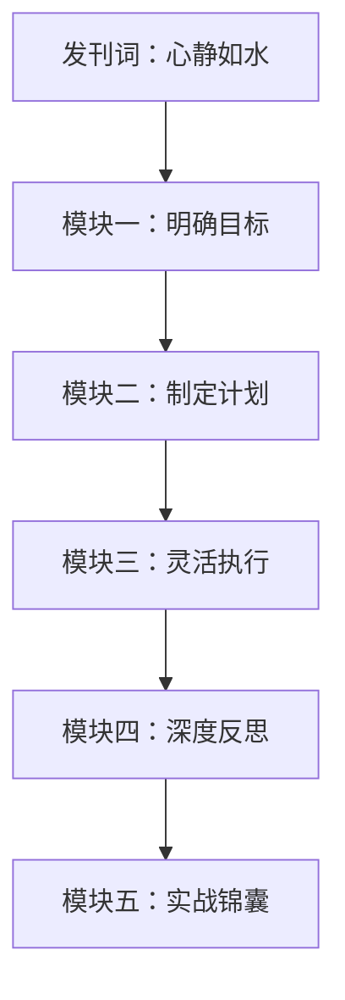

# 课程地图

## 整体路径

## 模块一：明确目标（第00-05课）

| 课程 | 主题 | 核心方法 |
|------|------|----------|
| 发刊词 | 一起成为时间的主人 | 个人效能环、三条命法 |
| 第01课 | 目标实现不了是因为"假大空全" | 四关诊断法 |
| 第02课 | 如何找到自己的长期目标？ | 五年后的一封信（五感法）|
| 第03课 | 如何把目标轻松落地？ | GPS目标落地法 |
| 第04课 | 目标太多时怎么做取舍？ | 三脑理论、决策打分表 |
|第05课 |目标总是半途而废怎么办？ | 事实-感受-分析-行动诊断|

## 模块二：制定计划（第06-10课）

| 课程 | 主题 | 核心方法 |
|------|------|----------|
| 第06课 | 计划没有变化快怎么办？ | 真假计划的区别 |
| 第07课 | 事情很多时怎么安排？ | 行动力四度理论、衣柜整理法 |
| 第08课 | 任务很大时间碎片怎么办？ | 自然计划法 |
| 第09课 | 怎么爬出琐事缠身的泥潭？ | 时间投资人理念 |
| 第10课 | 上班族写书的实战案例 | 顺流计划、分段计划 |

## 模块三：灵活执行（第11-15课）

| 课程 | 主题 |核心方法 |
|------|------|----------|
| 第11课 | 战胜拖延的方法都知道了为什么做不到？ | 拖延四因素、心理防御机制 |
| 第12课 | 如何对症下药战胜拖延？ | 价值链法、优雅拒绝、番茄工作法 |
| 第13课 | 超级困难的事情怎么推进？ | 任务化解三角形 |
| 第14课 | 临时突发事件太多怎么办？ | 加减乘除应变法 |
| 第15课 | 如何快速了解新领域？ | 网事人书法 |

## 模块四：深度反思（第16-20课）

|课程 | 主题 |核心方法 |
|------|------|----------|
| 第16课 | 每天忙成长慢的原因 | 复盘太阳系模型 |
|第17课 |日复盘穿越负面情绪 | 4F复盘法 |
| 第18课 | 周复盘重启高效能 | 周复盘六问 |
| 第19课 | 月复盘实现平衡人生 | 月复盘五步法 |
| 第20课 | 项目复盘萃取经验 | 项目复盘四步法 |

## 模块五：实战锦囊（第21-25课）

| 课程 | 主题 | 核心方法 |
|------|------|----------|
| 第21课 | 个人效能环 | 目标-计划-执行-反思四步法、卡点突破 |
| 第22课 | DO书法 | 以行动为导向的四步读书法 |
| 第23课 | 时间日志找出时间黑洞 | 时间日志三步法 |
| 第24课 | SMART提问减少返工 | SMART提问五问法 |
| 第25课 | 习惯培养地图 | 四阶段三卡点、习惯培养卡片 |

## 推荐学习方式

1. **从头到尾**：沿课程路径系统学习，适合时间管理新手
2. **对症下药**：根据当前最大痛点选择对应模块，适合有具体问题的人
3. **先看实战锦囊**：从第21课个人效能环开始了解全貌，再深入各个模块