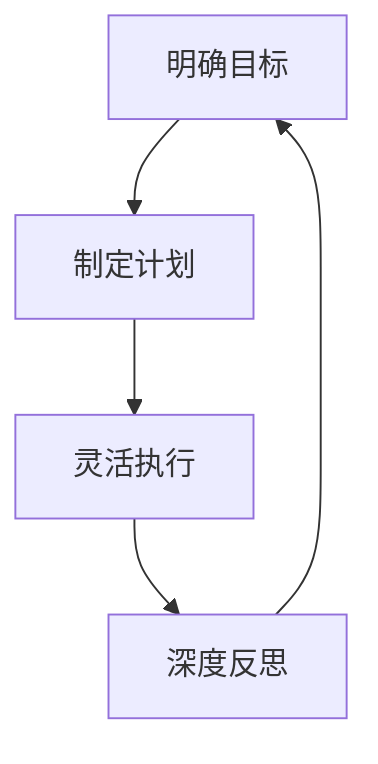

# 时间管理实战训练25讲

> 时间管理的最终目的不是榨干时间，而是实现幸福的人生。在忙忙碌碌中心静如水。

## 课程简介

本课程由邹小强（时间管理百万畅销书《小强升职记》《只管去做》作者）讲授，从人性角度出发，建立一套做事情的系统——**个人效能环**，帮助你找到长期目标、落地具体计划、战胜行动阻碍、建立成长螺旋。

## 适合谁听

- 每天很忙却没有成就感的人
- 目标总是半途而废的人
- 计划没有变化快而焦虑的人
- 想摆脱拖延但方法无效的人
- 想建立个人效能系统的人

## 课程结构

本课程分为五大模块，沿 **目标→计划→执行→反思** 的螺旋上升路径展开：

### 模块一：明确目标（第01-05课）
诊断目标为什么实现不了，找到长期愿景，孵化明确目标，学会目标取舍

### 模块二：制定计划（第06-10课）
做真计划而非假计划，衣柜整理法安排每日事项，任务分解利用碎片时间，投资视角配置时间资产

### 模块三：灵活执行（第11-15课）
战胜拖延的四个因素，应对临时突发事件，推进超级困难的事情，快速了解新领域

### 模块四：深度反思（第16-20课）
日复盘穿越负面情绪，周复盘重启高效能，月复盘实现平衡人生，项目复盘萃取经验

### 模块五：实战锦囊（第21-25课）
个人效能环整合系统，DO书法（以行动为导向的读书法），时间日志找出时间黑洞，SMART提问减少返工，习惯培养地图

## 核心模型：个人效能环

## 课程笔记

| 模块 | 课程 | 核心工具 |
|------|------|----------|
| 明确目标 | 第01-05课 | 四关诊断、五年后的一封信、GPS法、决策打分表 |
| 制定计划 | 第06-10课 | 衣柜整理法、自然计划法、时间投资人三角 |
| 灵活执行 | 第11-15课 | 拖延诊断表、加减乘除应变法、任务化解三角形、网事人书 |
| 深度反思 | 第16-20课 | 4F复盘法、周复盘六问、月复盘五步法、项目复盘四步法 |
| 实战锦囊 | 第21-25课 | 个人效能环、DO书法、时间日志、SMART提问法、习惯培养卡片 |

## 一句话金句

> 时间管理的最高境界不是榨干时间，而是**心静如水**——处理完大大小小的事情之后，内心仍保持平静。

---

*课程讲师：邹小强 | 来源：樊登读书*