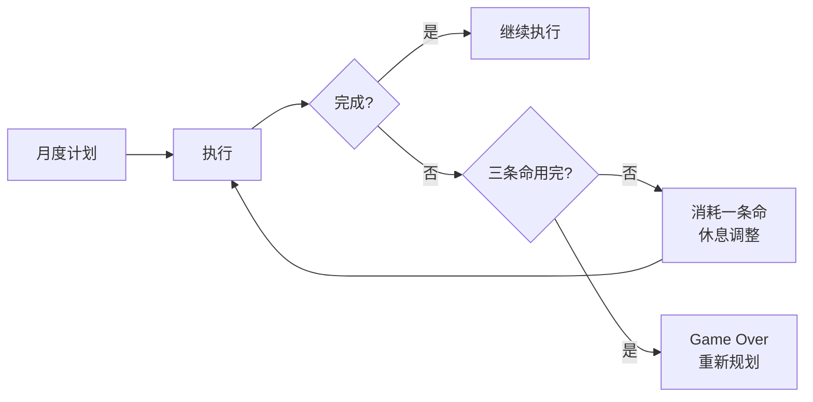
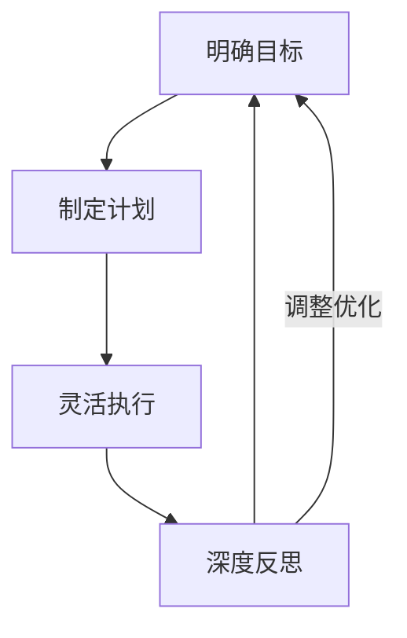

# 发刊词：一起成为时间的主人

## 课程定位：打破刻板印象

传统时间管理方法（如四象限法、番茄工作法）在理论上是成立的，但在实践中常常失灵。原因在于——**这些方法把人当作机器人来对待**。

| 对比维度 | 机器人（代码驱动） | 人（情感驱动） |
|---------|-----------------|--------------|
| 行为模式 | 按预设程序执行 | 遇到不想做的事会逃避 |
| 状态稳定性 | 始终稳定 | 情绪波动，月有高低起伏 |
| 决策逻辑 | 不分利弊，照单全收 | 趋利避害，选择性执行 |

> [!WARNING]
> 过去学了很多"好方法"，一到关键时刻就失灵——不是方法不对，而是方法没有考虑"人"的因素。

### 案例：小剑的晨起读书计划

小剑想要培养**早晨五点半起床读书**的习惯，做了"机器人式"的计划：
- 制定培养习惯计划
- 设置五点半循环闹钟
- 每天在微信群打卡

结果：**总是半途而废**。

调整方案核心——**给自己三条命**：

> [!TIP]
> **三条命法**：每月给自己3次"失败豁免权"。一个月有3次没完成计划，仍然算成功养成习惯。真正的自律不是从不失败，而是失败后不自责、不放弃。

---

## 课程体系：个人效能环

本课程的核心不是零散知识点，而是一套**完整的系统**——**个人效能环**：

| 模块 | 核心主题 | 关键问题 |
|------|---------|---------|
| 一、明确目标 | 找到自己真正想要的 | 目标为什么实现不了？如何找到长期愿景？ |
| 二、制定计划 | 碎片化时代的计划落地 | 如何安排每日待办？如何进行任务分解？ |
| 三、灵活执行 | 克服人性阻碍 | 如何战胜拖延？如何应对突发事件？ |
| 四、深度反思 | 构建成长螺旋 | 每日/每周/每月复盘的具体方法 |
| 五、实战锦囊 | 串联整个系统 | 卡在某个环节时如何突破？ |

> [!ABSTRACT]
> 这门课从**人性角度**出发，建立一套做事情的系统，最终帮助你：找到长期目标 → 落地具体计划 → 战胜行动阻碍 → 建立成长螺旋。

---

## 时间管理的最佳状态：心静如水

来自美国高管效能教练 **David Allen** 的理念：

> [!QUOTE]
> 想象面前有一片平静的湖水，你捡起小石头扔进去，"扑通"一声，激起水花、泛起涟漪，然后又归于平静。湖水就是我们的心境，石头就是大大小小的事情。

**心静如水** = 处理完大大小小的事情之后，内心仍然保持平静。

**时间管理的最终目的**：不是榨干时间，而是实现幸福的人生。

---

## 课程资源

- 25 节音频课程
- 2 个时间管理测评
- 25 个咨询案例解读
- 16 个时间管理实用方法

---

## 课后练习

请思考以下问题并记录你的答案：
1. 你过去用过哪些时间管理方法？它们为什么失效了？
2. 如果在执行一个计划时给自己"三条命"，你会怎么设置？
3. 当前你生活中最大的时间管理困境是什么？属于个人效能环中的哪个环节？

---

> 下一课：[[0001-mu-biao-zhen-duan|第01课：目标实现不了是因为这四个字]]