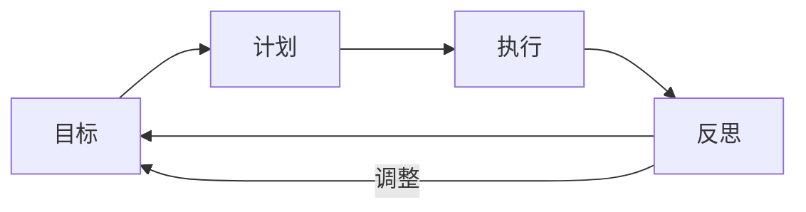

# 第01课：目标实现不了是因为这四个字

## 课前测试：三个问题

请回答"是"或"否"：

1.  你是否有一些自己特别想做，但因为整天很忙所以根本没有时间去做的事？
2.  你是否觉得现在的生活并不是自己想要的，但自己到底想要什么呢——不知道？
3.  你是否觉得当你想做一件事情的时候，全世界都在试图阻拦你？

> [!WARNING]
> 如果你知道制定目标很重要，但回答中有**两个以上"是"**，说明你并没有真正意识到目标的重要性。

---

## 线下体验：被束缚 vs 有目标

讲师在线下课程中会做一个体验活动：

**第一轮：无明确目标**
- 志愿者被多人围住、拽住衣服、按住肩膀、抱住大腿
- 试图挣脱，拼命挣扎，但无法摆脱——最终累得动不了

**第二轮：有明确目标**
- 志愿者大声说出自己想要做的事（目标），以及为什么想做
- 用一支笔代表目标，放在远处桌子上
- 同样被束缚，但志愿者总能挣脱并拿到那支笔

### 为什么第二次成功了？

| 原因 | 说明 |
|------|------|
| **有目标才知道去哪** | 第一轮方向模糊，力量被分散；第二轮有明确方向 |
| **知道去哪，全世界都会让路** | 明确说出目标后，周围的人会被打动而默默支持 |
| **实现目标的幸福感** | 每个人内心都渴望实现目标后的幸福 |

> [!TIP]
> 周围人的"阻碍"往往不是恶意——他们是在"保护"你。当你自己都不知道要去哪时，他们自然不敢放手。真正的解法不是盲目挣扎，而是**找到自己的目标，然后大声说出来**。

### 成功学员案例

- **依依**：从家庭主妇变成拥有被动收入的理财专家，出版了自己的书
- **张强**：实现环球旅行目标，还邂逅了人生伴侣

---

## 目标诊断四关：假、大、空、全

定目标并不容易，**如果一开始定的目标足够靠谱，最终能坚持下来的几率就非常大**。

请想好一个未来六个月想要实现的目标，用以下四关诊断：

### 第一关：是不是"假"目标？（一时激情）

**假目标**的特征：受外界刺激匆忙定下的目标。

| 典型场景 | 冲动目标 | 实际结果 |
|---------|---------|---------|
| 被说胖了 | "我要减肥！" | 两星期后抛之脑后 |
| 出国旅行说不清英语 | "回国后好好学英语！" | 回国后忘光 |
| 看到别人早起锻炼 | "每天坚持跑步！" | 跑了三次就放弃 |

> [!WARNING]
> 假目标不是意志力的问题，而是**你制定了压根不是真正想要的目标**。

### 第二关：是不是"大"目标？（超出能力）

"大"的目标不是指数字大，而是**加了"每天"二字的习惯类目标**。

典型的大目标陷阱：
- "我要**每天**走一万步"
- "我要**每天**背 100 个单词"
- "我要**每天**做 200 个俯卧撑"

失败过程：
1.  开始几天：主动积极完成
2.  第 N 天：下雨 / 应酬等意外打断
3.  中断后：产生强烈挫败感
4.  自我否定："果然是三分钟热度的人"
5.  最终放弃

> [!TIP]
> 听到谁说"每天要干嘛干嘛"，就知道特别不靠谱。给自己留一条退路，比逼自己每天做到更重要。

### 第三关：是不是"空"目标？（没有落地）

**空目标**：有目标数字，但没有配套行动计划。

例：一年读 50 本书——一月份读了 10 本，二月份 3 本，中间一直忙，十月份才想起又读了 5 本，最终只完成 20 本。

> [!ABSTRACT]
> 目标绝对不是独立存在的。目标的后面是**计划**，计划后面是**执行**，执行后面是**反思**，反思后面是**调整目标**——这就是**个人效能环**的雏形。

### 第四关：是不是"全"目标？（啥都想要）

**全目标**：同时想要太多东西，时间资源根本不够。

案例分析：
- 一位学员列出了**25 个年度目标**
- 简单时间计算：
  - 写书：每天 1.5 小时 × 约 547 小时
  - 读书：每天 40 分钟 × 约 243 小时
  - 旅行：15 天 × 360 小时
  - **总计需要：约 1150 小时**
- 可支配时间：每天 2 小时 × 365 = **730 小时**
- **缺口：420 小时**

> [!WARNING]
> 如果你想要实现的目标很多，只能说明一个问题：**你还不知道自己真正想要什么**。

---

## 四关总结

| 关卡 | 口诀 | 核心问题 |
|------|------|---------|
| 假 | 不要定一时激情的**假**目标 | 这是你真正想要的吗？ |
| 大 | 不要定超出能力的**大**目标 | 加了"每天"吗？ |
| 空 | 不要定无法落地的**空**目标 | 配套计划是什么？ |
| 全 | 不要定啥都要的**全**目标 | 你愿意砍掉什么？ |

> [!QUOTE]
> **假·大·空·全**——目标实现不了，通常都因为这四个字。

---

## 课后练习

拿出你目前正在执行的一个目标，用四关逐一诊断：

1.  **假**：这个目标是发自内心想要的，还是受外界刺激一时冲动定的？
2.  **大**：有没有"每天"的要求？留了容错空间吗？
3.  **空**：有配套的计划和执行时间表吗？
4.  **全**：除了这个目标，你还有多少其他目标？时间资源够用吗？

将诊断结果记录下来，为后续课程的学习做好准备。

---

> 下一课：[[0002-chang-qi-mu-biao|第02课：如何找到自己的长期目标？]]