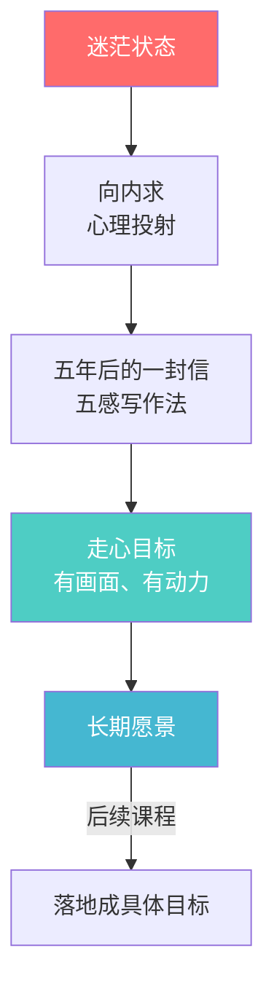

# 第02课：如何找到自己的长期目标？

## 目标的三个来源

不同类型的目标来源于不同的层次：

| 目标类型 | 来源 | 特点 |
|---------|------|------|
| 日/周/月目标（短期） | 行动惯性 | 按部就班，动手完成即可 |
| 年度目标（中期） | 头脑分析 | 通过分析思考决策，找到应该做什么 |
| 五年目标（长期） | 内心声音 | 要倾听内心，才能找到真正的渴望 |

大多数人的困境：
1. **生活不断重复**：早晨不想起→必须起→上班忙一天→回家刷手机→不睡觉→又不想起
2. **对未来迷茫**：感觉现在的一切不想要，但想要什么又不知道

> [!WARNING]
> 两个问题其实是同一个原因造成的：**不知道自己未来到底想做什么**。

---

## 走脑 vs 走心

### 王阳明的启示

内心真正的声音，一直在被头脑的想法遮蔽着。

就像逛商场看到一件心仪的衣服：
- **内心**说："买它买它！"
- **头脑**说："有点贵，颜色太鲜艳了，算了再看看"

从小到大，头脑给内心装了无数层"隔音玻璃"。

### 两种目标动力模式

| 维度 | 走脑的目标 | 走心的目标 |
|------|-----------|-----------|
| 动力来源 | 大脑觉得"应该"做 | 内心特别有动力去做 |
| 典型表现 | 装备多、工具多、行动少 | 行动力强、更容易坚持 |
| 形状比喻 | 橄榄型（装备多，行动少） | 沙漏型（行动多，装备少） |

**扎克伯格学中文案例**：
- 走脑版本的理由：学中文有用、是挑战
- 走心版本的理由：**想象用中文告诉祖母自己要结婚的画面**
- 结果：可以在几千人会场用中文演讲

> [!TIP]
> 走心的目标往往伴随着一个**令人心动的画面**。如果你定了一个目标却总是半途而废，先问问自己：这个目标背后有画面吗？

---

## 心理投射法

> [!QUOTE]
> "行有不得，反求诸己。" —— 《孟子》

**向外求**（读书、上课、找人要答案）无法真正解决人生迷茫的问题。

**向内求**——答案就在自己内心深处。

**心理投射**：将个人的情绪感受、价值观、信念、好恶等个性特征，不自觉反映于外界事物或他人的心理作用。

### 半杯水测试

口渴时看到半杯水：
- "只有半杯了" → 投射出**悲观**心态
- "还有半杯" → 投射出**积极**心态

> [!ABSTRACT]
> 几乎所有性格测试、星座测试，底层逻辑都是**心理投射**。

---

## 给五年后的自己写一封信

### 写信的意义

用信的方式，把自己想要的生活从内心深处"投射"出来。

### 误区一：列干条条，没有画面感（走脑）

**错误示范**：
> "五年后的邹小强，你每天坚持早起、锻炼身体，还完成了注册会计师考试。"

问题：看了没有怦然心动的感觉——这是大脑认为"应该"做的事，而不是内心真正渴望的画面。

### 误区二：尽是感受，没有实质内容

**错误示范**：
> "五年后的我，你一定过得很幸福吧，有人爱、有事做、有所期待……"

问题：动情但没有实际内容，无法指导行动。

### 正确方法：五感写作法

**五感 = 眼、耳、鼻、舌、身**

| 五感 | 写作中可以描绘的内容 |
|------|-------------------|
| **眼**（视觉） | 看到了什么场景、颜色、画面 |
| **耳**（听觉） | 听到了什么声音、音乐、话语 |
| **鼻**（嗅觉） | 闻到了什么气味、味道 |
| **舌**（味觉） | 尝到了什么滋味 |
| **身**（触觉） | 触摸到了什么、身体感受如何 |

**走脑 vs 走心的对比**：

| 方式 | 写法示例 |
|------|---------|
| 走脑 | "下午五点，我们来到海边，一起看日落，然后回家。" |
| 走心 | "跟老婆环岛自驾，到一个人很少的海边，空气中充满咸咸的味道。我们把车停在沙滩边上，坐在车顶上，听着交响乐一样的海浪声，肩并肩看日落。" |

### 写信的环境准备

| 要素 | 建议 |
|------|------|
| **时间** | 周末早晨，早起半小时，趁所有人都还睡着 |
| **饮品** | 倒一杯温开水，避免因喝水打断思路 |
| **工具** | 笔和纸（A4纸，太小会限制情感流动），也可以用印象笔记拍照保存 |
| **背景音乐** | 找一首能让心情安静下来、让思绪流淌的音乐 |
| **心态** | 不要评判自己能否做到——写下来就好，一评判就又走脑了 |

### 写信步骤

1. **憧憬**：闭眼想象五年后的生活画面——你在做什么？和谁在一起？
2. **开头**："五年后的XXX，你好！你现在过着一种怎样的生活呢？"
3. **铺展**：用五感去描述生活细节
4. **保存**：放入手机备忘录，每年可以修改

### 讲师的信：一个参考范本

信中涵盖的要素：
- **家庭**：和家人从非洲回来，足迹遍布五大洲
- **财务**：基本自由，不用大富大贵但不会被生活所迫
- **健康**：保持运动习惯，70岁还要站球场上
- **梦想**：100个梦想清单完成一半
- **社交**：志同道合的朋友，保持阅读习惯

> [!NOTE]
> 这封信被讲师在不同场合读了**几百遍**，每次都有怦然心动的感觉。它就像一个"能量球"，累得快不行的时候读一遍来补充能量。

---

## 核心方法论

> [!TIP]
> 既要低头走路，也要抬头看路。人们每天高速运转，但如果根本走错了方向，跑得越快，错得越远。就从这封信开始，**认真和自己对一次话**。

---

## 课后作业

1. 准备一个安静的周末早晨，拿出笔和纸
2. 播放一首能让自己安静下来的背景音乐
3. 用**五感写作法**给自己的五年后写一封信
4. 信中不要列干条条，而是描绘具体的画面和感受
5. 完成后将信存入手机备忘录，定期回看
6. 记录写信过程中有什么特别的感受

> 下一课：[[0003-mu-biao-luo-di|第03课：如何把目标轻松落地？]]