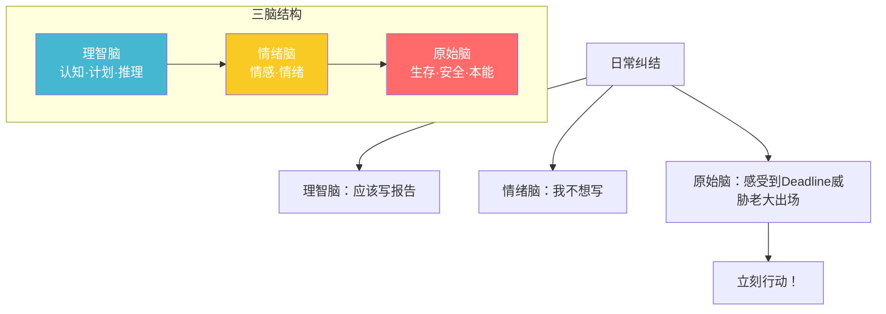
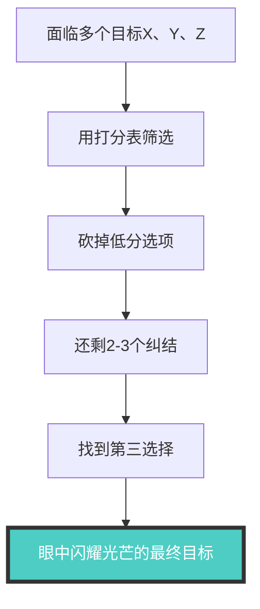

# 第04课：目标太多时怎么做取舍？

## 纠结的根源：三脑理论

美国神经学专家 **保罗·麦克里恩** 提出三脑理论（虽然未经证实，但很适合解释"纠结"这件事）：

| 大脑层次 | 进化时间 | 功能 | 代表动物 | 表现形式 |
|--------|---------|------|---------|---------|
| **原始脑** | 2-3 亿年 | 生存、生理安全、身体知觉 | 蜥蜴 | 战斗 / 逃跑 / 僵住|
| **情绪脑** | 5000 万年 | 控制情感情绪 | 猴子 | 用情绪回应（如婴儿）|
| **理智脑** | 较晚 | 语言理解、学习记忆、推理计划 | 人类独有 | 喜欢颜色和图片（也称视觉脑）|

> [!WARNING]
> 我们陷入纠结是再正常不过的事。理智脑说"应该写报告"，情绪脑说"不想写"——天天都在上演天使与魔鬼的博弈。只有 **Deadline 让原始脑感受到威胁**时，博弈才会被搁置，立刻行动。

---

## 决策打分表

当面临多个目标纠结时，不要干等 Deadline 逼自己用原始脑做决定。而是用**决策打分表**融合情感和理智做决定。

### 表格结构

| 目标 | 热情（0-10） | 痛苦（0-10） | 时机（0-10） | 总得分 |
|-----|------------|------------|-----------|-------|
| 目标 A | | | | |
| 目标 B | | | | |
| 目标 C | | | | |

### 评分维度详解

#### 1. 热情（动力强度）

**动力来源**：热情 = **内心的需要** + **更高的意义**

以打篮球为例:
- **内心的需要**：从小到大被管束，球场上没有束缚，自由表现；激烈的对抗释放侵略性；被伙伴看到和肯定
- **更高的意义**：用"借事修"的心态"——在打球中觉察自己的状态，紧张时放松，着急时平静

> [!TIP]
> 对一件事情的**热情**来源于两个问题：
> 1. 这件事满足了我什么**内心的需要**？
> 2. 我能不能赋予这件事**更高的意义**？

#### 2. 痛苦（解决多深的问题）

**痛苦驱动**的经典案例：
- 一位父亲因为体胖，在学校运动会上和女儿玩两人三脚时摔倒，被全校学生哄笑
- 女儿说："最近你就别来接我放学了。"
- 带着这份痛苦，三个月减重 20 斤，**再也没有反弹过**

> [!NOTE]
> 让我们行动的动力有两个——热情和痛苦。但大部分人都在做"应该做"或"不得不做"的事，既没有热情也没有痛苦。

#### 3. 时机（此刻多适合）

有些目标即使充满热情和痛苦，如果现在不是最佳时机，也应该**理性推迟**。

**案例**：师妹虽然很想当讲师，但因为面临结婚生子，眼下更需要稳定收入的工作 → 给"当讲师"的时机打分较低。

### 使用步骤

1. **筛选目标**：如果纠结的目标太多（如 20-30 个），先自己筛选到 **3-5 个**——工具只是辅助，不能把所有问题都丢给工具
2. **逐一打分**：一个目标一次性打完热情、痛苦、时机三项，再打下一个目标
3. **计算总分**：所有目标打完后再汇总
4. **做决策**：接受分数结果，砍掉低分目标

---

## 第三选择：超越二择其一的智慧

> [!WARNING]
> 工具的终极目的不是替你做决定，而是帮你**看清局面**。真正做决定的还是你自己。

### ️ 真正让人眼中有光的选择

师妹使用打分表后，砍掉了"公司上班"（得分最低），但"当讲师"（喜欢但不赚钱）和"做护肤品"（赚钱但不喜欢）之间仍然纠结。

**关键转折**：在二选其一之外，找到了**第三个选择**：

> **定期举行家庭教育沙龙 → 聚集目标客户 → 顺势销售护肤品**

- 对师妹：既做了喜欢的事（讲课），又赚到了钱
- 对客户：双倍收获——高品质护肤品 + 亲子关系成长

> [!QUOTE]
> 找到真正想要的目标时，**眼中会闪耀出光芒**。这是舍弃其他目标后才会有的光芒。

---

## 核心要点回顾

1. **三脑理论**：原始脑（生存）→ 情绪脑（情感）→ 理智脑（认知），纠结是三脑博弈的结果
2. **决策打分表**：从**热情、痛苦、时机**三个维度给目标打分
3. **工具的边界**：工具只是辅助，真正做决定的是自己
4. **第三选择**：当两难时，跳出二选一的框架，找到**两者兼顾**的第三条路

---

## 课后练习

1. 梳理你当前所有的目标，列成清单
2. 自己先筛选到 **3-5 个**候选目标
3. 用决策打分表逐一打分（热情 - 痛苦 - 时机）
4. 找到得分最高的目标
5. 问自己：这个目标让你眼中有光了吗？
6. 如果还在纠结，尝试寻找**第三选择**

---

> 下一课：[[0005-mu-biao-an-li|第05课：目标总是半途而废怎么办？]]