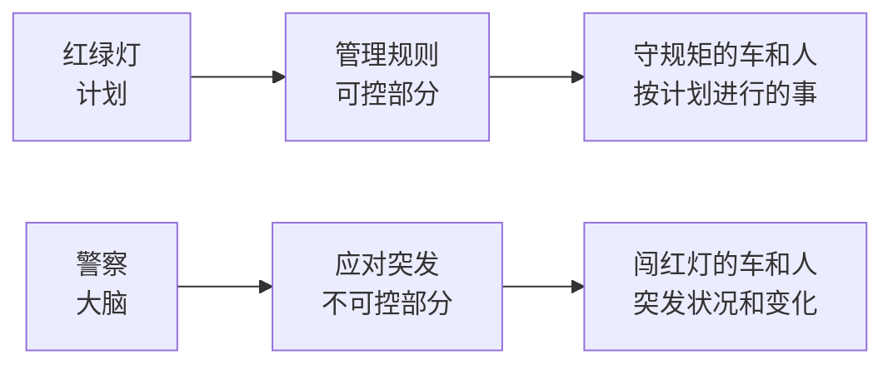
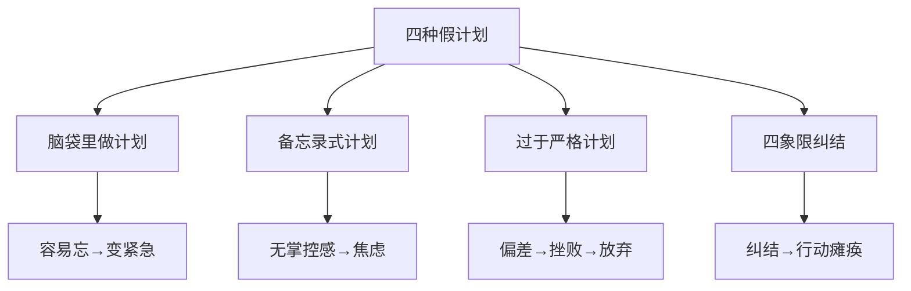

# 第06课：计划没有变化快，为什么还要做计划？

> 很多人说"计划没有变化快"于是放弃做计划，但问题的关键不在于计划本身，而在于你做的究竟是**真计划**还是**假计划**。

---

## 一、计划的目的：管理可控，释放大脑

### 红绿灯比喻

把计划比作**红绿灯**，把大脑比作**警察**：

> 因为有人闯红灯就不要红绿灯了？显然荒唐。计划的角色是指挥可控部分、解放大脑，让大脑去应对突发状况。

### 核心观点

| 错误认知 | 正确认知 |
|----------|----------|
| 做计划是为了管所有事 | 做计划是为了管**可控范围内**的事 |
| 计划像备忘录一样记下来 | 计划是让事情**更容易执行**、更有行动力 |

> [!important] 关键洞察
> 计划和红绿灯一样，是用来**管理可控部分**、**解放大脑**的。大脑应该用于思考与应对变化，而不是记忆待办事项。

### 案例分析

职场妈妈婷婷的一天：六点起床做饭、送孩子上学、赶去上班、被各种打扰、下班回家、陪孩子写作业、哄孩子睡觉。一天下来完全失去自我。

- 她认为"计划没有变化快，做计划没用"
- 但她的问题不是计划没用，而是她做的计划是**假计划**，并且试图管理所有事情

---

## 二、四种假计划

> [!warning] 假计划的特征
> 这四种计划方式都会让你**越计划越焦虑**，最终得出"计划没用"的结论。

### 1. 在脑袋里做计划——容易忘

- 人脑的记忆不可靠，超过**7件事**就容易遗忘
- 忘掉的事情再次想起来时，已变成**重要且紧急**的事
- **大脑擅长思考，不擅长记忆**

### 2. 备忘录式计划——容易焦虑

- 把要做的事列个清单，一项项完成——这**只是备忘录**，不是计划
- 没有达到让大脑"**演练**"的程度
- 大脑看到清单仍不知道**先做什么、后做什么**
- 焦虑来源于**失控**

### 3. 过于严格的计划——容易挫败

- 事无巨细地安排时间（9:00-9:30做A, 9:30-10:00做B）
- 一旦偏离计划就会**失去对计划的信任**
- 产生挫败感：计划没有变化快，干脆不做

### 4. 重要紧急四象限式计划——容易纠结

- 用重要/紧急四个象限分类时容易陷入纠结
  - 例如：读书是重要紧急还是重要不紧急？
- 让你纠结的方法不是适合你的方法

---

## 三、案例对比：真计划 vs 假计划

| 维度 | 假计划 | 真计划 |
|------|--------|--------|
| 心态 | 试图管所有事 | 管可控部分 |
| 存储 | 记在大脑里 | 记在外部系统 |
| 颗粒度 | 模糊项列表 | 明确行动步骤 |
| 弹性 | 严格死板 | 灵活调整 |
| 决策 | 纠结于分类 | 直接可执行 |

---

## 四、本课总结

> [!summary] 核心要点
> 1. **计划的目的**：管理可控部分，把大脑腾出来应对突发状况
> 2. **红绿灯比喻**：计划=红绿灯（规则），大脑=警察（应变）
> 3. **四种假计划**：脑袋里计划、备忘录式计划、过于严格计划、四象限纠结计划
> 4. **解决方案**：从下一课开始学习"衣柜整理法"——做真计划的方法

### 课后练习

1. 回顾你当前的日计划/周计划，属于哪一种假计划？
2. 找出其中一项，尝试用"管可控部分"的思路重新制定。
3. 记录你一天中大脑被待办事项占据的次数，思考如何释放大脑。