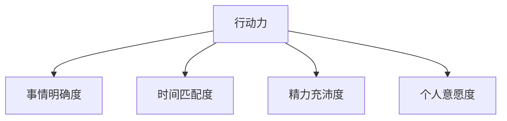
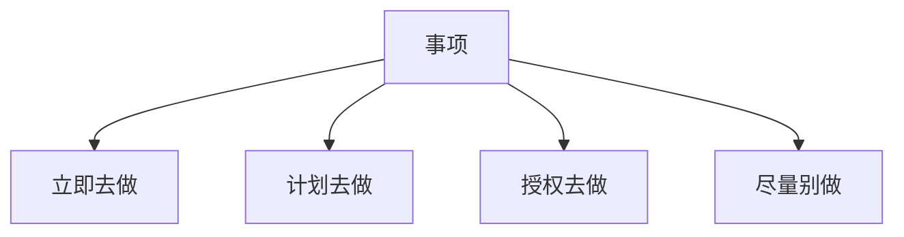

# 第07课：当事情很多时怎么合理安排？

> 真计划的制定方法——衣柜整理法，通过收集、明晰、排程三步，让行动力最大化。

---

## 一、行动力四度理论

行动力遵循一个核心公式：

> **行动力 = 事情明确度 + 时间匹配度 + 精力充沛度 + 个人意愿度**

### 1. 事情明确度

- 人类天性：倾向于做明确具体的事，逃避做复杂模糊的事
- 复杂模糊 = 危险信号（进化遗留）
- 案例：发快递（明确）vs 做PPT（模糊），多数人会先做前者

### 2. 时间匹配度

- 时间 = 杯子（1小时=大杯，15分钟=小杯）
- 任务 = 石头（写PPT=大石头，吸尘=小石头）
- 石头放进杯子 = 行动力强；放不进去 = 行动力弱
- **加班的真相**：下班后有大块时间（大杯子），能放下所有任务

### 3. 精力充沛度

- 精力充沛时行动力强，精力差时行动力弱
- 高效能人士的特点：**重要的事放精力充沛时做，琐碎的事放精力涣散时做**
- 不是根据计划调整精力，而是**根据精力调整计划**

### 4. 个人意愿度

- 拖延的事情大多不是"不会做"，而是"**不想做**"
- 用**意愿度强的事推动意愿度弱的事**
  - 例：晚上约了老同学吃饭必须六点下班 -> 白天效率超高
- 建议：把**工作与生活放在同一张清单**上
- 把**年度计划里今天要做的事**写在清单最上面

---

## 二、衣柜整理法

### 核心比喻

整理衣柜 = 整理大脑中的事项

| 衣柜整理步骤 | 时间管理对应 |
|--------------|--------------|
| ① 衣服全部摊在床上 | ① **收集**：脑袋里的事写到清单 |
| ② 分堆归类（裤子/上衣/夏装/冬装） | ② **明晰**：确定下一步行动，分类管理 |
| ③ 从衣柜搭配衣服出门 | ③ **排程**：列出日计划 |

### 4D任务分类法

遇到任何事项，只需要问自己：**这件事的下一步行动是什么？**

所有事项只有四种下一步行动：

| 分类 | 含义 | 标记方式 |
|------|------|----------|
| **立即做** | 老板盯着、必须今天完成 | 画星号 ★ |
| **计划做** | 有固定时间/需要安排 | 写在左边时间轴 |
| **授权做** | 交给别人处理 | 确认回复时间并跟进 |
| **尽量别做** | 不产生价值的事情 | 不写在清单上 |

### 关键技巧

#### 技巧一：时间预支

> 一天工作8小时，但你实际拥有的时间没那么多。

- 开会、见客户的时间应**预支出去**，写在时间轴上
- 剩下的才是自由支配时间
- 把**午休时间（12:30-13:00）也预支出去**，用于恢复精力

#### 技巧二：任务分解匹配碎片时间

大任务拆解为小步骤，利用碎片时间逐步完成：

| 时间碎片 | 未分解之前 | 分解之后 |
|----------|------------|----------|
| 15分钟 | 做不完工会会费 | 问同事要报表 ✅ |
| 10分钟 | 做不完工会会费 | 简单筛选 ✅ |
| 15分钟 | 做不完工会会费 | 制作Excel表格 ✅ |

> 你不是没有时间，只是没有大块不被打扰的时间。

#### 技巧三：在清单上写下完成思路

- 不仅写"要做什么"，还要写"**大概怎么做**"的粗纲
- 好处：把这件事**彻底忘掉**，清空大脑，专注手头的事
- **做计划的目的不是记住，而是忘记**

#### 技巧四：用生活推动工作

- 将生活事项（如晚上看电影）也写在清单上
- 形成**时间底线**：为了按时下班赴约，白天效率提升
- 这是用个人意愿度推动行动力

---

## 三、排程中的动态调整

三个应对突发事项的调整方式：

1. **插入**（别人布置新任务）：快速走一遍衣柜整理法 -> 立即做/计划做/授权做 -> 排入日程
2. **删除**（任务取消）：直接在清单上划掉
3. **修改**（截止日期变化）：调整日期

---

## 四、本课总结

> [!summary] 核心要点
> 1. **行动力四度理论**：明确度 + 时间匹配度 + 精力充沛度 + 个人意愿度
> 2. **衣柜整理法三步**：收集 -> 明晰（4D分类） -> 排程（动态调整）
> 3. **四个关键技巧**：时间预支、任务分解匹配碎片、写下思路清空大脑、用生活推动工作
> 4. **核心理念**：做计划不仅是写下要做的事，更是**让事情更具行动力**的过程

### 课后练习

用4D分类法对你手头的事情进行归类：

| 待办事项 | 立即做 | 计划做 | 授权做 | 尽量别做 |
|----------|--------|--------|--------|----------|
| 1. | | | | |
| 2. | | | | |
| 3. | | | | |
| 4. | | | | |

然后在评论区分享你做完分类后的感受。