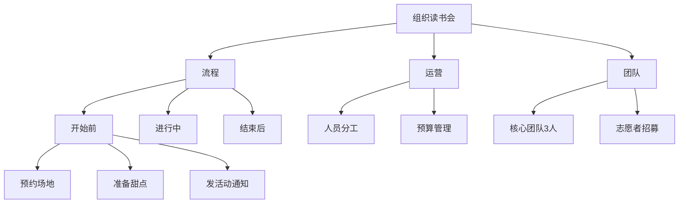

# 第08课：任务很大，时间却很碎片，怎么办？

> 仅仅会安排任务是不够的，还要学会**分解任务**。自然计划法帮助你梳理复杂大任务，利用碎片时间搞定大事。

---

## 一、安排任务 vs 分解任务

| 维度 | 安排任务 | 分解任务 |
|------|----------|----------|
| 定义 | 什么时间做什么事 | 完成这些事需要什么准备 |
| 特点 | 理想化 | 现实化 |
| 关注 | 时间点 | 准备与步骤 |

### 案例分析：客户经理写汇报材料

**安排任务的方式**（理想化）：

1. 规划次日上午9:00-10:00写汇报材料
2. 叮嘱下属别打扰
3. 实际执行时发现问题：
   - 需要客户资料 -> 问客户经理要 -> 等15分钟
   - 老板突然叫去开会 -> 中断
   - 需要具体数据 -> 找支行长核实 -> 电话无法接通
4. 结果：加班完成

**分解任务的方式**（现实化）：

1. 前一天晚上先想：写汇报需要什么？
2. 提前问客户经理要资料
3. 提前向支行长核实数据
4. 第二天写材料时资料已到位，只被叫去开会一个变量

> 安排任务无法避免意外，但**任务分解**可以提前做好准备，减少意外发生。

---

## 二、自然计划法五步

自然计划法由David Allen提出，是**人类最自然的做计划方式**。

### 生活案例：生日聚餐

| 步骤 | 内容 |
|------|------|
| **目标原则** | 离家近、晚点回来、1000以内（原则） |
| **展望结果** | 吃火锅比较热闹（结果画面） |
| **头脑风暴** | 打电话订位、带酒、加油、查团购、通知朋友 |
| **组织梳理** | 先订位 -> 通知时间地点 -> 早点出门 -> 加油 |
| **下歩行动** | 现在就给火锅店打电话 |

---

## 三、完整案例：组织亲子沟通读书会

> 以读者"小丽"组织亲子沟通读书会为例，演示自然计划法在复杂大任务中的应用

### 步骤一：目标原则

> 目标 = 要拿到什么成果
> 原则 = 决策的标准（面对诱惑时不做纠结的底气）

**感性目标 vs 理性目标**：

| 感性目标 | 理性目标 |
|----------|----------|
| 大家非常有收获 | 每场不少于30人 |
| 大家非常开心 | 连续开3期 |
| —— | 每期盈利1000元 |

小丽的理性目标：通过调查表看到会员在亲子沟通方面**持续改善**

小丽的原则：
1. **保持非盈利**：会费用来让读书会更好
2. **小而美**：不追求规模，追求更稳定、更深入的连接

> [!tip] 原则的作用
> 如果投资人说愿意投入资金让读书会快速做大，有原则的人**根本不需纠结**，因为这与"非盈利、小而美"相违背。

### 步骤二：展望结果

> 想象任务成功后的画面，激发动力

小丽想象的画面：
- 每月读书会成为大家期待的聚会
- 每个人都做足准备，不仅读书还打扮美美的
- 讨论交流时思维碰撞
- 不仅解决亲子困惑，还找到可行方法
- 有美味甜点，结束大家舍不得离开

> 展望结果时容易太多，可以在A4纸中间画一个圈，填满即止。

### 步骤三：头脑风暴

> 填补"现实"与"结果画面"之间的差距

小丽想到要做的事：
- 找场地（朋友咖啡馆）
- 招募运营团队
- 邀请重量级嘉宾
- 建立微信群
- 确定读书会流程
- 设置自由讨论环节

> [!warning] 头脑风暴原则
> **不批判，不质疑**——不要刚想出一个想法就否定自己，否则会阻碍思维发散。

### 步骤四：组织梳理

> 把头脑风暴的"珍珠"串成"项链"——收敛归纳

小丽的梳理结果：

- 头脑风暴中认为不需要的任务 -> **删除**
- 确认保留的任务 -> **落实到人**

### 步骤五：下步行动

> 站在"人"的角度列清单

小丽的下步行动：
- 洽谈场地
- 建立微信群
- 撰写活动通知

其他团队成员各自认领自己的行动清单。全过程约5分钟即可完成。

---

## 四、自然计划法的自问清单

> 整个过程是我们与自己的对话。面对大任务问自己这五个问题：

| 步骤 | 问自己 |
|------|--------|
| **目标原则** | 这个大任务我希望拿到的成果和坚守的原则是什么？|
| **展望结果** | 大任务搞定时，我能看到什么、听到什么、感受到什么？|
| **头脑风暴** | 为了实现这个结果，我需要做些什么？|
| **组织梳理** | 这些事我可以怎么归类和细化？|
| **下步行动** | 接下来我要做什么？|

---

## 五、本课总结

> [!summary] 核心要点
> 1. **安排 vs 分解**：安排任务是"我要在什么时候做什么"，分解任务是"我要做完需要什么准备"
> 2. **简单任务**：可以像切蛋糕一样按步骤分解
> 3. **复杂任务**：需要用**自然计划法五步**进行分解
> 4. **自然计划法核心**：目标原则 → 展望结果 → 头脑风暴 → 组织梳理 → 下步行动
> 5. 任务分解的作用：**把目标翻译成任务**，把"我要做什么"翻译成"我要怎么做"

### 课后练习

使用自然计划法梳理你工作或生活中的某个大任务：

1. 写下任务名称
2. 按照五步逐步推进
3. 将结果分享在评论区