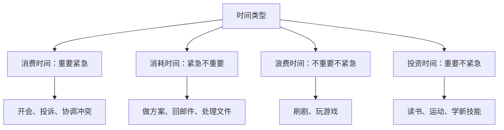
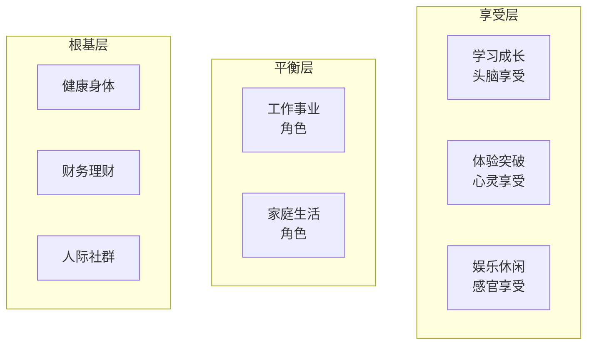

# 第09课：当不想总是陷在琐碎里时怎么出圈？

> 从投资人的视角利用自己的时间，早日摆脱琐事缠身的状态。

---

## 一、你的时间值多少钱？

### 单位时间价值计算

> **单位时间价值 = 年薪 ÷ (251个工作日 × 8小时)**

| 年薪 | 时薪 |
|------|------|
| 10万 | ~50元/小时 |
| 20万 | ~100元/小时 |
| 50万 | ~249元/小时 |

### 应用场景：取特产的选择题

朋友从外地带回特产，你选择怎么取？

| 选项 | 耗时 | 花费 | 时间成本 | 总成本 |
|------|------|------|----------|--------|
| A. 坐地铁 | 1.5小时 | 5元 | 75元（时薪50元） | 80元 |
| B. 叫滴滴 | 1小时 | 30元 | 50元 | 80元 |
| C. 找跑腿 | 0小时 | 40元 | 0元（省下1小时值50元） | -10元（赚了） |

> 有了**时间成本**的概念，就能带着投入产出比的理念去花时间。

### 花钱买专家时间

遇到困惑时，花500元约见时薪1200元的专家：
- 用500元撬动1200元的服务，**回报翻倍**
- 还能链接更多资源

---

## 二、四种时间类型

从时间投资的角度重新解读重要紧急四象限：

| 类型 | 含义 | 常见事件 | 大多数人分配 | 时间投资人分配 |
|------|------|----------|--------------|----------------|
| **消费** | 必要开支 | 开会、处理投诉 | 50% | 50% |
| **消耗** | 必须做但无价值 | 回邮件、处理文件 | 25% | 15% |
| **浪费** | 纯消耗 | 刷剧、玩游戏 | 20% | 15% |
| **投资** | 长期增值 | 读书、运动、学习 | **5%** | **20%** |

> 投资时间短期看不到成果，但时间长了让你**与众不同**。

---

## 三、三个投资时间的理念

### 理念一：追求时间自由

**财富自由** = 被动收入 > 总支出

**时间自由** = **主动时间 > 被动时间**

| 时间类型 | 定义 | 举例 |
|----------|------|------|
| **被动时间** | 应该做、必须做、不得不做的事 | 写报告、拓展客户、去医院 |
| **主动时间** | 想做的事 | 想看书、想早起、想拿销售冠 |

> [!tip] 被动时间可以转化为主动时间
> 把"必须拓展客户"变成"**想**成为销售冠军"，就把被动转化为主动了——这就是柯维讲的**积极主动**。

### 理念二：配置时间资产

**目标九宫格**——实现人生平衡与稳健的工具：

| 层级 | 包含内容 | 作用 |
|------|----------|------|
| **根基层** | 健康、财务、人际 | 不能少，否则崩盘 |
| **平衡层** | 工作、家庭 | 人在社会中的角色 |
| **享受层** | 学习、体验、娱乐 | 头脑/心灵/感官的享受 |

> 时间资产配置的要点：**你可以少，但不能缺**。不需要每天平衡，但需要**每月**做到平衡。

### 理念三：做时间定投

**定投**的两个关键点：
1. 选择你认为**有价值的标的**
2. **固定周期持续投入**

> 要事越做越少，琐事越做越多

作为老板，你会发现：
- 小A：重要的事总超出预期，但琐事经常完不成 -> 把琐事交给别人做
- 小C：琐事都能搞定，但重要事力不从心 -> 无法委以重任

结果：小A的**要事越做越少**（被抽走琐事），小C的**琐事越做越多**（被塞入更多杂事）。

> **每天做十分重要的事，你就会成为十分重要的人。每天做七分重要的事，只会成为七分重要的人。**

#### 实操建议

- 每天在代办清单上标出**3件最重要的事**
- 把更多时间投资在这三件事上
- 如果程序员的下个目标是项目经理 -> 每天多观察和思考项目经理的行为

---

## 四、本课总结

> [!summary] 核心要点
> 1. **时间成本意识**：时薪 = 年薪 ÷ (251 × 8)，带着投入产出比花时间
> 2. **四种时间**：消费（必要）、消耗（必须）、浪费（纯耗）、投资（增值）
> 3. **三个投资理念**：
>    - 追求**时间自由**（主动时间 > 被动时间）
>    - **配置时间资产**（目标九宫格：可少不能缺、月平衡）
>    - **做时间定投**（每天3件要事，长期深耕有价值领域）
> 4. **要事越做越少，琐事越做越多**——把时间定投在要事上

### 课后练习

1. 计算你自己的时间成本（时薪）
2. 在评论区分享：你打算在什么事情上定投超过**三年**的时间？