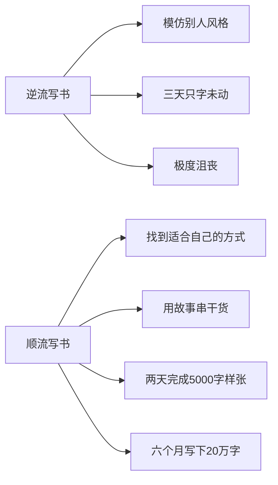
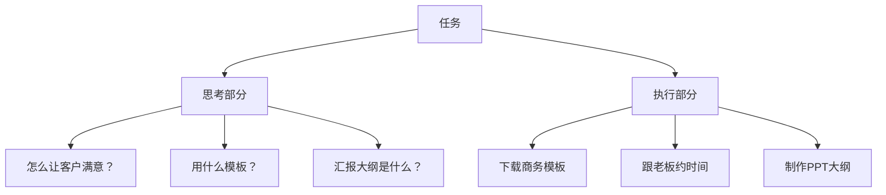

# 第10课：我是怎么一边上班一边写出一本畅销书的？

> 以作者本人创作《小强升职记》的经历为案例，复盘上班族如何在工作之余完成一个大项目——**顺流计划 + 自然计划 + 分段计划**。

---

## 一、用顺流计划解决"写不出"的问题

### 顺流 vs 逆流

> **每个人都有自己的"流"**——顺流而下很轻松，逆流而上很辛苦。

| 阶段 | 方式 | 结果 |
|------|------|------|
| **逆流** | 模仿别人的写作风格 | 3天只字未动 |
| **顺流** | 用故事把干货串联起来 | 2天完成样张，6月写20万字 |

### 关键启示

> 如果做了计划但执行非常痛苦或拖延，可能不是执行力的问题，而是**做事的方式不适合你**。

---

## 二、用自然计划倒退法解决"没时间"的问题

### 设定清晰的目标与时间底线

> 六个月后必须完成（十月底），因为11月2号结婚，这本书是送给太太的结婚礼物。

### 激励措施矩阵

| 措施 | 目的 | 做法 |
|------|------|------|
| **代号命名** | 赋予意义和兴奋感 | 为项目取一个专属代号 |
| **桌面改造** | 持续视觉刺激 | 手机电脑桌面换成项目代号/目标 |
| **愿景板** | 看得见的奖励 | 贴上完成后的奖赏物品图片 |
| **他人监督** | 外部闹钟 | 告诉重要的人，请ta充当提醒角色 |

### 自然计划倒退法的应用

从最终目标**倒退**到下周行动：

| 时间 | 节点 | 备注 |
|------|------|------|
| 11月 | 各书店上架 | 终极目标 |
| 9月底 | 交稿 | 留1个月走出版流程 |
| 8月底 | 写完 | 留1个月修改 |
| 3月 | 正式开始写 | 每天2小时写1000字，5个月 |
| 1-2月 | 整理资料 | 整理笔记、积累案例 |

### 关键启示

> **你不做计划就会被别人计划。**

- 平时有时间，只是没明确这些时间用来做什么
- 别人让加班就去、让聚餐就去、让打游戏就去
- 空余时间全被别人安排了

---

## 三、用分段计划解决"难专注"的问题

### 碎片时间思考，大块时间执行

任何一个任务都分为两个部分：

> 只要想清楚了，执行起来会很快。如果没有想清楚，即使给再多时间也无法推进。

### 执行方案

| 时间段 | 类型 | 做什么 |
|--------|------|--------|
| 上下班路上 | 碎片时间**思考** | 细化晚上要写的内容到每个自然段 |
| 中午午休 | 碎片时间**思考** | 查资料、理素材、写细纲 |
| 晚上7:30-10:00 | 大块时间**执行** | 白天细纲已明确，专注写作 |

### 拖延的真相

下班后准备写方案，有2小时大块时间却仍无法推进：

1. 没想清楚怎么做 -> 无法推进
2. 无法推进 -> 大脑进入**自动驾驶模式** -> 刷手机、刷视频
3. 1小时过去 -> 方案没有任何进展

> **卡在没有思考清楚就去行动。**

### 推荐的时间分段策略

---

## 四、本课总结

> [!summary] 核心要点
> 1. **顺流计划**：找到适合自己的方式做计划、做事，不要硬仿别人
> 2. **自然计划倒退法**：从最终目标倒退到下周行动，不做计划就会被别人计划
> 3. **分段计划**：碎片时间思考（理清到段落级），大块时间执行（专注投入）
> 4. **辅助工具**：
>    - **时间底线**：给自己设硬性截止日
>    - **激励措施**：代号命名、愿景板、他人监督
>    - **愿景板**：把完成项目后的奖励可视化

### 课后练习

如果你打算在工作之余写一本书（或完成一个大项目），回答以下问题：

1. 这本书/项目是什么主题？
2. 你的"顺流"方式是什么（你擅长用什么形式输出）？
3. 你的时间底线设在哪天？
4. 你会设哪些激励措施？
5. 你如何规划"碎片时间思考、大块时间执行"的时间段？