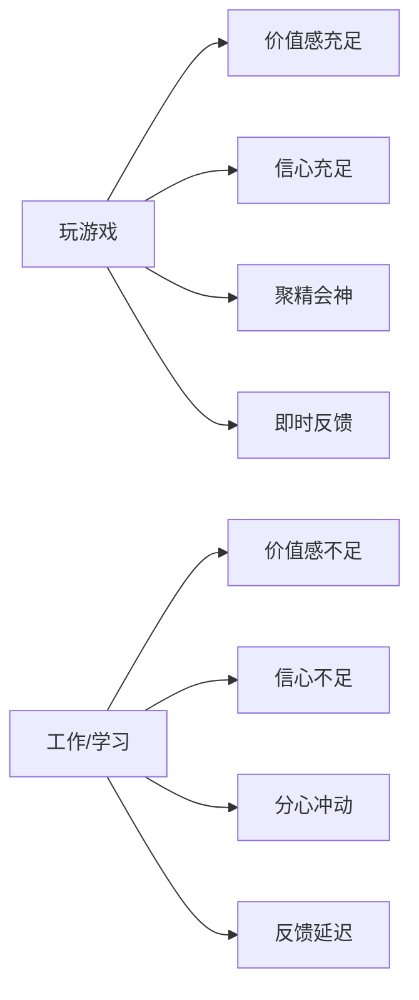
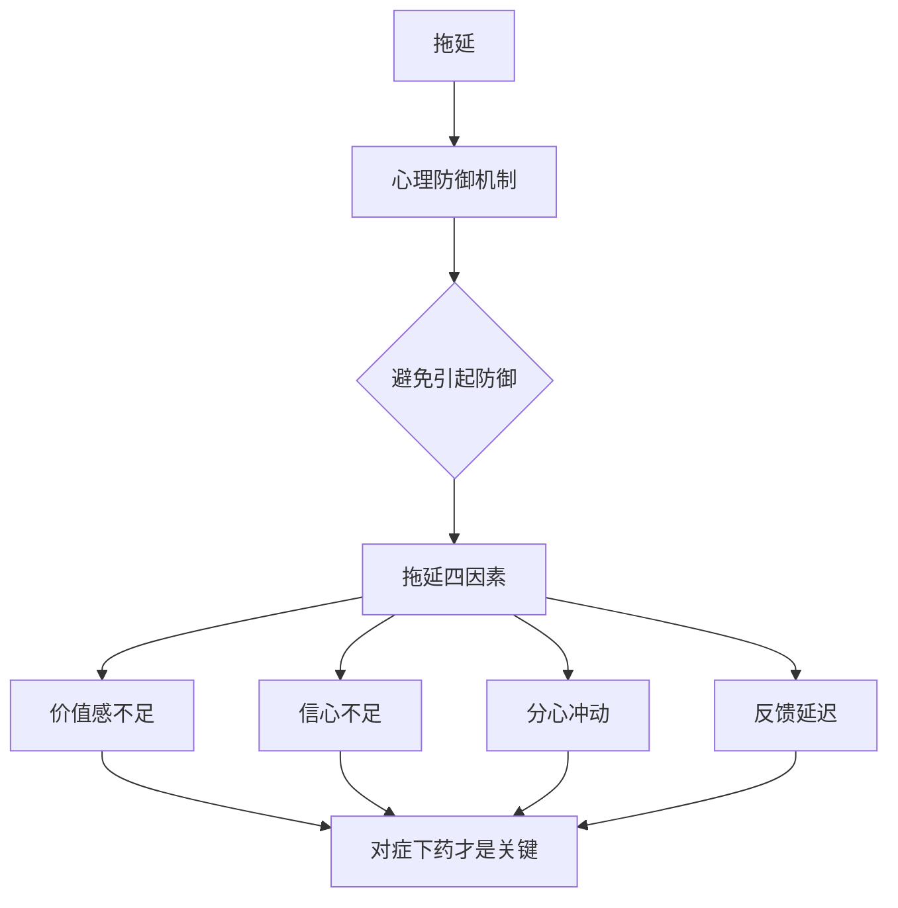

# 战胜拖延的方法都知道，为什么就是做不到？

> **核心问题：** 你知道那么多战胜拖延的方法，却依然拖延——不是因为方法无效，而是因为**没有对症下药**。

---

## 一、拖延现象的本质

### 1.1 什么是拖延？

> [!quote] 拖延的定义
> 明知道这个事该干，但就是拖着不干，而且拖着不干的同时，心里还有强烈的**焦虑和负罪感**。

典型案例——杨阳订酒店：
- 选好酒店后想"再比较几家"，结果一直拖着
- 直到开会前两周才去交订金，会议室已被预订
- 最后花**近一倍价钱**才搞定

### 1.2 为什么玩游戏不拖延？

游戏之所以不拖延，是因为它满足了四个条件：
1. **价值感很足**：放松、成就感、满足感
2. **信心充足**：匹配实力相当的对手，努努力就能过关
3. **不分心**：冲击力的画面、诱惑的声音、触感，调动所有感官
4. **即时反馈**：击败小怪经验值加十，被砍一刀血量减一百

### 1.3 心理防御机制

> [!important] 关键洞察
> 造成拖延的事情，通常都激起了你的**心理防御机制**。这种机制在远古时期帮助人类减轻精神压力以生存，但它会让我们逃避当前的任务。

---

## 二、拖延四因素模型

加拿大卡尔加里大学 **皮尔斯-斯蒂尔教授** 的研究发现，拖延由四个因素造成：

| 因素 | 表现 | 典型例子 |
|------|------|---------|
| **价值感不足** | 看不到做这件事的价值和意义 | 写工作总结："反正写上去又没人看" |
| **信心不足** | 越是没信心，越容易拖延 | 从未组织过年会，老板突然让你负责 |
| **分心冲动** | 做事情时容易分心 | 写PPT时刷淘宝、看朋友圈、倒水吃水果 |
| **反馈延迟** | 成果来得越晚，越容易拖延 | 减重：运动节食一周，一斤没减 |

### 2.1 四因素的深层解读

**追求完美 = 信心不足**
> 追求完美的人容不得自己失败，谨小慎微、如履薄冰，不愿意轻易开始，于是不停拖延。

---

## 三、对症下药：战胜拖延的真正方法

> [!tip] 核心原则
> 战胜拖延要学习的不是战拖方法，而是要学习**分辨**你是因为什么原因造成了拖延。找到主要原因，方法才会有效。

### 3.1 案例：小侄子写作业拖延

| 步骤 | 做法 | 说明 |
|------|------|------|
| 观察 | 先观察30分钟，不急于给建议 | 找出根本原因 |
| 诊断 | 原因是**分心冲动** | 环境和外部干扰 |
| 下药1 | 清空桌面 | 撤掉照片、画、玩具、书 |
| 下药2 | 别打扰孩子 | 不要问要不要喝水，不在外头看电视 |
| 结果 | 1.5小时写完（比同学还快） | 药到病除 |

---

## 四、本课总结

1. **拖延是一种心理防御机制**——摆脱拖延的关键是避免引起这种机制
2. **方法无效的原因**——没有对症下药，盲目使用
3. **拖延四因素**——价值感不足、信心不足、分心冲动、反馈延迟

---

## 五、课后练习

> [!question] 思考题
> 回顾开头杨阳拖着订酒店的案例：
> - 你觉得他的拖延主要是哪个因素造成的？
> - 如果让你来帮他，你会给出什么建议？

**自我诊断练习：**
1. 列出你最近拖延的3件事
2. 对照拖延四因素，判断每件事的主要因素
3. 思考：如果针对这个因素来解决，第一步该怎么做？