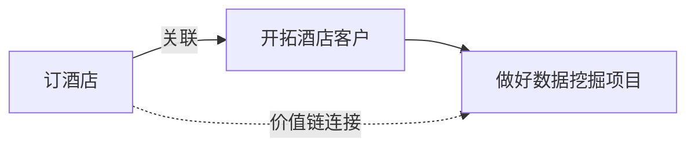
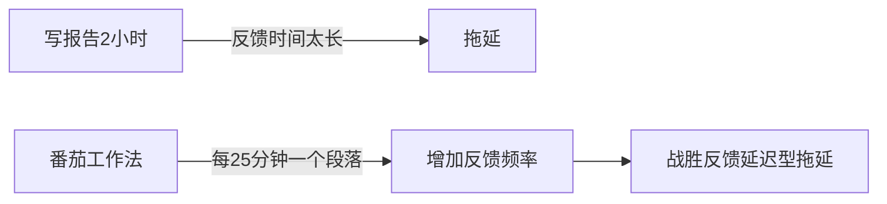
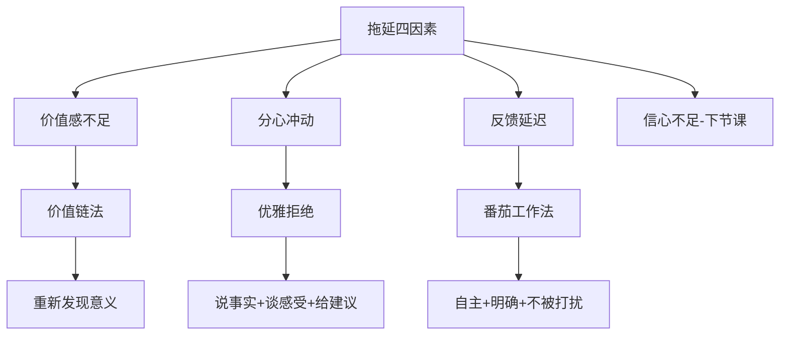

# 如何绕过心理防御，战胜拖延？

> **心法：** 战胜拖延就两步——**第一步对症，第二步下药**。真正有效的方法是自己进化出来的方法，而不是复制别人的方法。

---

## 一、战拖方法论全景

### 1.1 常见战拖方法一览

| 方法 | 做法 | 适用因素 |
|------|------|---------|
| **番茄工作法** | 25分钟专注+5分钟休息 | 反馈延迟 |
| **强制约束法** | 关掉QQ、音乐、手机 | 分心冲动 |
| **烂开始法** | 先写个垃圾版本再修改 | 信心不足 |
| **胡萝卜加大棒法** | 公开承诺，做对奖励做错发红包 | 价值感不足 |

> [!warning] 方法无用不是因为方法错
> 药没有问题，症状也没有问题——问题在于**没有对症下药**。

---

## 二、案例一：杨阳订酒店——价值链法

### 2.1 对症诊断

通过对杨阳一对一访谈发现：
- 订酒店本不是他的分内事（同事突然离职接手）
- 他内心深处是抗拒的
- 每天琐事特别多

**诊断结论：主要因素是「价值感不足」**

### 2.2 价值链法

**操作步骤：**
1. 在纸上画一个圈，写上你抗拒的事（如"订酒店"）
2. 在旁边画另一个圈，写上你**真正想做的事**（如"做好数据挖掘项目"）
3. 问自己：这两者之间有什么联系？
4. 画一条线连接两个圈，写上关联（如"开拓酒店客户"）

> [!quote] 价值链法的本质
> 不是强迫你去做这件事，而是把你真正想要做的事情和这件事关联起来，**重新发现这件事的意义和价值**。

---

## 三、案例二：IT男张强——优雅拒绝

### 3.1 对症诊断

张强早上打算写开发文档，但一进办公室就遇到各种打扰：
- 同事让发文件
- 微信上咨询消息
- 同事到工位找看代码

**诊断结论：主要因素是「分心冲动」（外界打扰引起）**

### 3.2 四种错误的拒绝方式

| 类型 | 话术 | 对方感受 |
|------|------|---------|
| 万分抱歉型 | "哎呀我真的不行，抱歉抱歉" | 热脸贴冷屁股 |
| 斩钉截铁型 | "不行，我现在真的很忙" | 你到底忙啥 |
| 转移目标型 | "让张飞帮你看看吧" | 把我当皮球踢 |
| 装疯卖傻型 | "这个我也不会呀" | 这么敷衍我 |

### 3.3 优雅拒绝三板斧

> [!success] 优雅拒绝公式
> **说事实 + 谈感受 + 给建议**

| 步骤 | 话术示例 | 作用 |
|------|---------|------|
| **说事实** | "我现在手头还有五件事，其中一件是今天下午就要发给老板的" | 事实胜于雄辩，消除误解 |
| **谈感受** | "我现在也头大得很，特别着急" | 引发共鸣，双方站在同一边（共情） |
| **给建议** | "你看能不能这样：先问问别人，不行快下班时再来找我" | 对方更容易接受 |

> [!tip] 前三种方式直接给建议（没说事实+没谈感受），所以对方不知道你为什么要拒绝，也无法感同身受。

---

## 四、案例三：番茄工作法——应对反馈延迟

### 4.1 番茄工作法的起源

> 创造者 **齐列洛** 还是学生时，临近考试无法专注。他问自己："到底能不能专注学习15分钟？" 于是用番茄形状的倒计时器拧了15分钟——发现自己一下子变得专注了。

### 4.2 适用条件判断

> [!danger] 番茄工作法不是万能药
> 找到方法创造的**源头场景**，判断是否适合你。

| 适用（自主性强） | 不适用（自主性弱） |
|-----------------|------------------|
| 行政人员 | 银行柜员 |
| 管理者 | 医生 |
| 程序员 | 繁忙办公室人员 |
| 学生 | - |

**三个前提条件：**
1. **自主性强的场景**——时间可以自己安排
2. **任务明确具体**——知道要做什么
3. **有不被打扰的时间**——能独自一人

### 4.3 番茄工作法的本质

> [!info] 番茄工作法的本质
> 不是时间管理工具，而是**增加反馈频率**的方法。

---

## 五、拖延诊断调整表

### 5.1 拖延像感冒

| 感冒特点 | 拖延类比 |
|---------|---------|
| **内外共同作用**：温差+抵抗力下降 | 信心不足=外在事难+内在担心；分心冲动=外在打扰+内在杂念 |
| **不能一劳永逸**：无法彻底免疫 | 不要试图永远治愈拖延，它容易复发 |
| **对症下药**：风寒vs风热药不同 | 先诊断因素，再匹配方法 |

### 5.2 拖延诊断调整表

| 症状（拖延的事） | 可能的原因 | 对策 |
|----------------|-----------|------|
| 不想写周报/工作总结 | 价值感不足 | 价值链法：关联到升职加薪 |
| 不敢开始新项目 | 信心不足 | 烂开始法：先做个垃圾版本 |
| 总被外界打断 | 分心冲动 | 优雅拒绝+清空环境 |
| 长期任务没动力 | 反馈延迟 | 番茄工作法+设置里程碑 |

### 5.3 建立自己的病历库

> [!tip] 自己总结的方法对自己最有效
> 记录每次拖延的：
> 1. 做什么事拖延了？
> 2. 分析是什么原因
> 3. 最后用什么方法解决

---

## 六、本课总结

---

## 七、课后实战练习

> [!question] 实战题：拖延诊断报告
> 在身边的找一位自称有拖延症的人，根据本课的诊断调整表，完成一份拖延诊断报告，包含：
> 
> 1. **症状**：是什么让对方觉得自己有拖延症？
> 2. **诊断**：经过深入沟通，你们对造成拖延的根本原因达成了什么共识？
> 3. **处方**：你给出的解决办法是什么？
> 4. **反馈**：对方实践之后有什么改变？