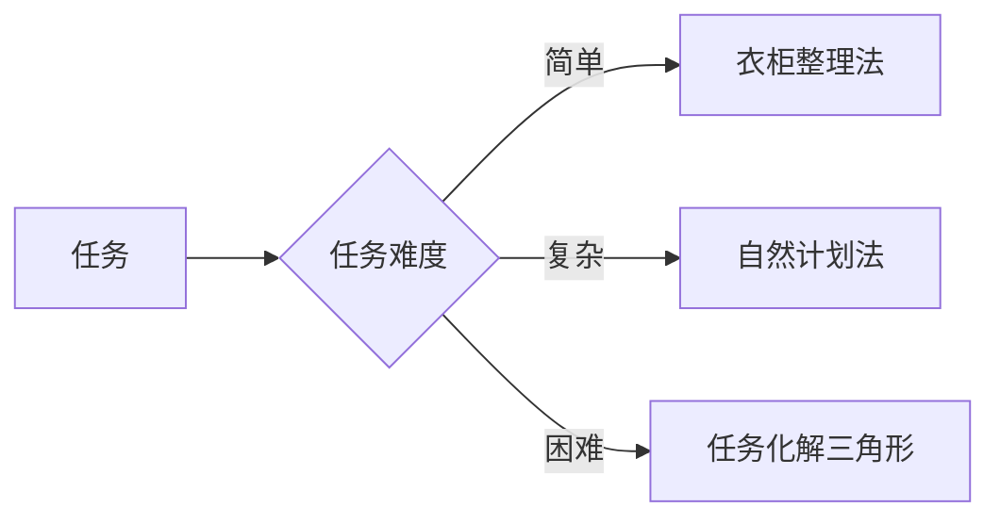
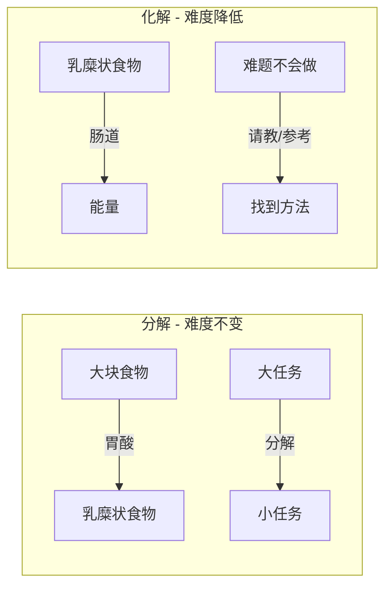
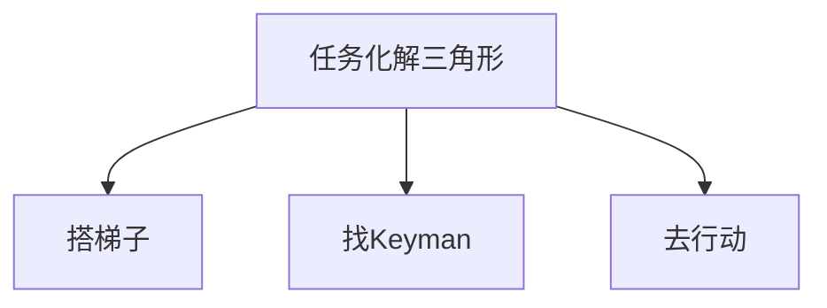
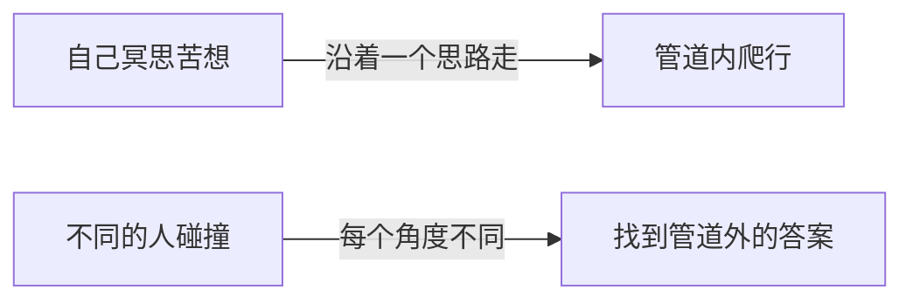
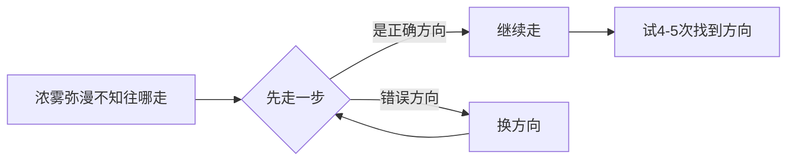
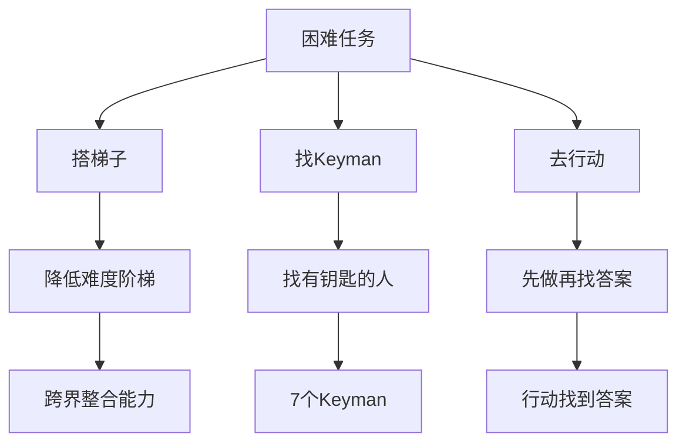

# 遇到超级困难的事情该怎么向前推进？

> **核心心法：** 我们不是找到对的事情然后再去做，而是**先去做，让它变成对的事**。

---

## 一、搞定任务的完整逻辑

| 任务类型 | 方法 | 核心动作 |
|---------|------|---------|
| **简单任务** | 衣柜整理法 | 安排任务 |
| **复杂任务** | 自然计划法 | 分解任务 |
| **困难任务** | 任务化解三角形 | **化解**任务 |

---

## 二、任务分解 vs 任务化解

> 借用身体消化系统的比喻：

| | **消（分解）** | **化（化解）** |
|--|--------------|--------------|
| 本质 | 大任务变成小任务 | 降低任务难度 |
| 难度 | 不变 | **降低** |
| 示例 | 做PPT：列大纲→找素材→选模板→修改 | PPT不会做→请教有经验的人 |

---

## 三、任务化解三角形

> [!quote] 埃隆马斯克的火星移民案例
> 火星移民最大问题不是科技，是**钱**——一个人100亿美金。目标：降到20万美元（和一栋小房子差不多），即成本降低 **5万倍**。

### 3.1 突破点一：搭梯子

埃隆马斯克降低火星移民成本的四步梯子：

| 步骤 | 方法 | 成本降低 |
|------|------|---------|
| 1 | 火箭重复使用（发射→回收→再用） | 大幅降低 |
| 2 | 太空轨道补给燃料（先送上去，再补给） | **500倍** |
| 3 | 在火星上制造燃料（返程不用带） | 多倍 |
| 4 | 使用甲烷燃料（火星上容易制造） | 多倍 |

> [!example] 邹小强的实战：电台节目临时换主题
> 原定讲时间管理，开播前2小时被要求改成**压力管理**。
> 
> **搭的三层梯子：**
> 1. A4纸画格子，写下关于压力管理能想到的一切（头脑风暴）
> 2. 第二张A4纸，用**思维导图**梳理逻辑顺序
> 3. 在思维导图基础上完成演播稿
> 
> **结果：** 1小时搞定一个原本不可能完成的任务

### 3.2 突破点二：找Keyman

> [!info] Keyman = 拿钥匙的人
> 可能是导师（解锁心结）、掌握关键资源的人（提供帮助）。

**七类Keyman清单：**
- 医生
- 律师
- 社群创始人
- 好兄弟
- 合作伙伴
- 老师
- 老板

> [!example] 小川的策划案
> 新产品推广策划案抓掉头发都没有满意方案→邀请两位朋友喝咖啡：
> - 一位：对此领域有独特见解的人
> - 另一位：完全外行但阅历丰富的人
> 
> **结果：** 2小时碰撞出完稿

**为什么找人比冥思苦想有效？**

### 3.3 突破点三：去行动

> [!quote] 山本耀司
> 自己这个东西，往往是看不见的。你要撞上一些别的东西反弹回来，才会了解自己。

**行动的哲学：**

> 所有看不到答案的事情，都是用行动去找到答案的。

**邹小强的使命之旅：**
1. 2007年：老板让看时间管理书 → 去看书、实践、分享
2. 2008年：出版社让写书 → 去写、去出版
3. 2012年：从国企出来成为自由职业者 → 去讲课分享
4. 后来：知道了自己的使命

---

## 四、本课总结

> [!important] 金句
> 我们不是找到对的事情然后再去做，而是**先去做，让它变成对的事**。

---

## 五、课后实战练习

> [!question] 实战题：搭梯子化解困难任务
> 请你用**搭梯子的方式**化解一项困难任务：
> 
> 1. 选一件你目前面临的最困难的事情
> 2. 为它搭三层梯子（每一步降低一点难度）
> 3. 记录下来并在执行后反思：搭梯子是否有效？