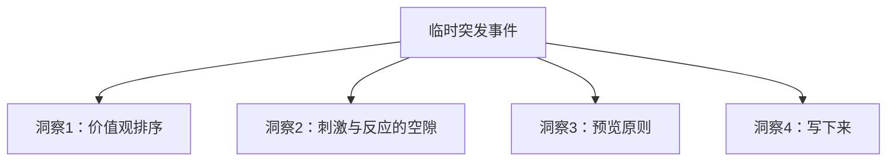
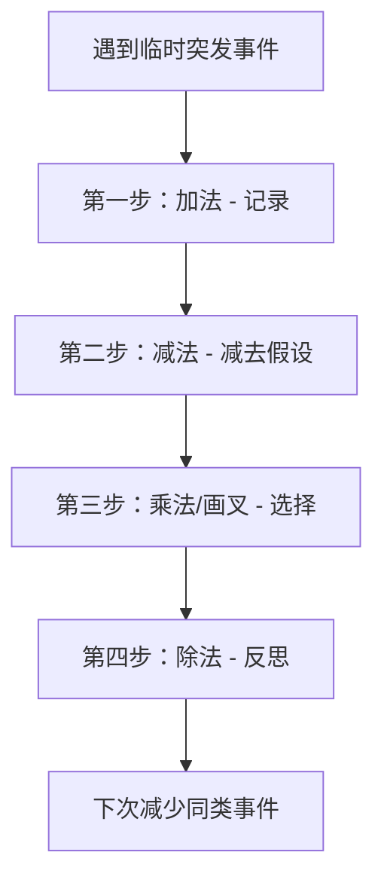
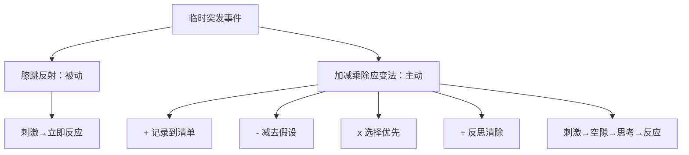

# 临时突发事件太多应该如何处理？

> **核心心法：** 遇到刺激不要立即反应，在**刺激和反应之间留一个空隙**——这是从被动变主动的契机。

---

## 一、膝跳反射 vs 系统方法

### 1.1 什么是膝跳反射式应对？

> [!warning] 常见误区
> 遇到刺激就立即做出反应——哪个催得急就先做哪件事。这种应对方式让你变得非常被动，连情绪的按钮也掌握在别人手里。

**典型场景：**
- 正在写PPT → 同事突然找你审核数据 → 烦躁
- 要么赶紧帮忙（心里想着"赶紧搞定我好写PPT"）
- 要么立刻拒绝（"我还忙着呢"）

### 1.2 从经验到方法论

> 不论你现在的排序是怎样的，一定都是根据自己经验排的——但经验无法应对未来新情况，除非我们能在经验的基础上**提炼出方法论**。

---

## 二、案例：旅游市场监管部的一天

### 情景还原

一个繁忙的早晨，你面前有六件事：

| 编号 | 事项 | 类型 |
|------|------|------|
| 1 | 游客找你讲述旅游经历 | 临时突发 |
| 2 | 客户留言抱怨服务不满 | 临时突发 |
| 3 | 30封未读邮件 | 日常 |
| 4 | 经理要求第一时间汇报 | 计划内 |
| 5 | 请假同事的座机一直在响 | 临时突发 |
| 6 | 会场经理留言让快点回电话 | 临时突发 |

> [!question] 思考
> 你的排序是怎样的？背后反映的是你怎样的**价值观**？

### 2.1 从案例中提炼的四个洞察

#### 洞察一：依据价值观排序

| 排序逻辑 | 表现 | 可能的后果 |
|---------|------|-----------|
| 老板优先 | 经理的事排第一 | 客户等急了投诉 |
| 同事优先 | 同事的事排第一 | - |
| 紧急优先 | 催得急的先做 | - |
| 自己优先 | 自己的事排第一 | - |

> 排序没有对错之分，价值观本身就没有对错。但要**承担这样排序造成的后果**。

#### 洞察二：刺激和反应之间有空隙

> [!important] 关键转变
> **立即回应，但不是立即去做。**
> - 别人交代事情时都会说"很重要、很紧急"
> - 事实不一定如此
> - 你有**不受对方情绪影响的权利**
> - 重要或不重要，**是你自己说了算**

**操作原则：**
1. 把临时接到的事和手头清单里的事做比较
2. 如果手头有更重要的事 → 用拒绝或协商的方式回应
3. 如果它真的更重要 → 才去解决

#### 洞察三：预览原则

> 你现在的排序全部依据于你的**假设**，而不是**事实**。

| 假设 | 可能的事实 |
|------|-----------|
| 会场经理的事很重要 | 可能只是会议桌还没送到（不重要）|
| | 也可能是整栋楼漏水，场地没法用了（重要）|

**预览** = 先不处理，只是看一眼这件事到底是什么事。
> 花5分钟了解全貌，再安排优先级。

#### 洞察四：写下来

> 只要你能把所有要做的事——不管是计划好的还是临时突发的——都**写下来**，你就会更有条理、更有效率。

---

## 三、加减乘除应变法

### 3.1 四步详解

| 步骤 | 名称 | 操作 | 关键问题 |
|------|------|------|---------|
| **+** | 加法 | 记录到待办清单 | "先把所有事写下来" |
| **-** | 减法 | 减去假设，确认事实 | "销售报表是不是必须今天要？" |
| **x** | 乘法/画叉 | 选择当下最该做的事 | "我现在最应该做什么？" |
| **÷** | 除法 | 反思如何清除类似事件 | "主客观原因是什么？如何降低再出现？" |

### 3.2 案例实战：灰灰的推广策划书

灰灰打算下午3-4点完成项目推广策划书（重要不紧急），刚写一半：
→ 同事小张打电话：老板开会要上个月的销售报表（还没做）

#### 第一步：加法（记录）

> "先等一下，一会儿给你回电话。"

把"做上个月销售报表"写到待办清单：
- 完成推广策划书
- **做上个月销售报表**
- 打印合同
- 召开项目讨论会
- 填报发票

#### 第二步：减法（减去假设）

> 花1-2分钟确认：
> - 销售报表是否必须今天要？
> - 手头这些事的deadline是哪天？
> - 推迟一天会不会影响进度？

#### 第三步：乘法/画叉（选择）

**有两个选择：**

| 选择 | 操作 | 注意事项 |
|------|------|---------|
| **改变计划** | 先做报表 | 给大脑快照：把当前想法、思路写下来（或录音），避免回来时进入不了状态 |
| **不改变计划** | 拒绝或协商 | 委婉而坚定："我手头还有策划书没写完，你看能不能晚一点发给你？" |

#### 第四步：除法（反思）

> [!important] 大部分人都会忽略的步骤
> 突发事件来了匆忙应对，走了长呼一口气——下次还会陷入循环。

**两个反思问题：**
1. 造成这个突发事件的主观原因、客观原因分别是什么？
   - 主观：自己没重视报表
   - 客观：老板突然开会要数据
2. 如何降低下次出现的几率或影响？
   - 用Excel公式做成自动分析+仪表盘呈现

---

## 四、本课总结

> [!quote] 金句
> 临时突发事件并不是洪水猛兽——只要你掌握了加减乘除应变法，就**遇事不慌了**。

---

## 五、课后思考题

> [!question] 思考题
> 老师提出："我认为临时突发事件都不是临时突发的。"
> 
> 对于这个观点，你怎么看？欢迎反思自己遇到的"突发事件"，是否真的毫无征兆？