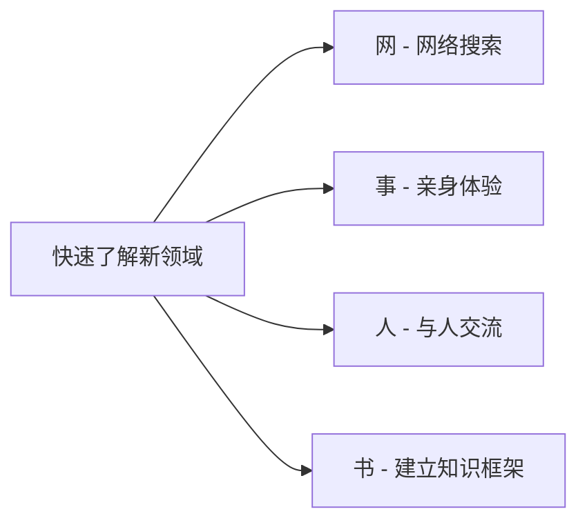
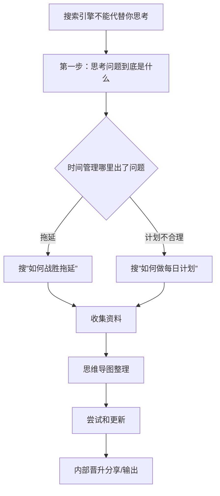
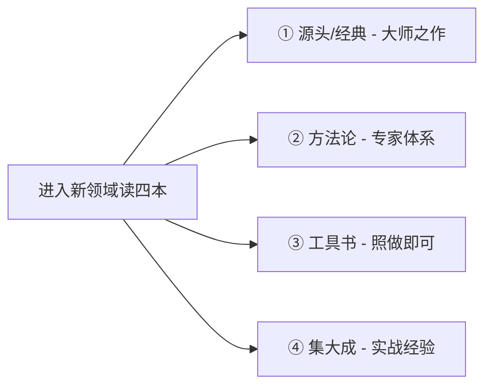
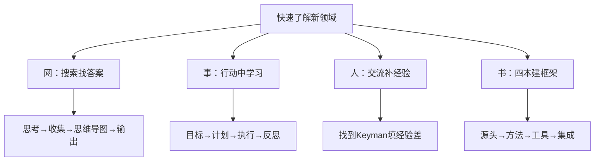

# 如何快速了解一门新领域？

> **核心心法：** 我们的世界变化很快，只有掌握了快速了解新领域的方法，才能摆脱焦虑，永远立于时代的潮头。

---

## 一、为什么需要快速了解新领域？

### 人生每一次重大改变都是进入一个新领域

| 改变 | 新领域 |
|------|--------|
| 从骨干员工到部门总监 | 领导力 |
| 有了新爱好（如尤克里里） | 乐理知识、节奏弹唱 |
| 结婚生子 | 育儿 |
| 买了房子 | 房产相关 |

> [!danger] 更可怕的问题
> 很多人根本没有意识到——这些焦虑是因为他们进入了新领域，但没有快速了解新领域所造成的。

---

## 二、网事人书法



### 案例：表弟的早起计划

表弟决心早起（每天5:30起床）→ 5天放弃 → 意识到早起也是新领域

| 步骤 | 方法 | 在做什么 | 关键成效 |
|------|------|---------|---------|
| **网** | 知乎搜索早起文章 | 发现早起有好多方法技巧 | 入门了解 |
| **事** | 设置21天早起计划 + 加入早起社群 + 换新闹钟 | 亲身体验失败 | 发现"不适合自己" |
| **人** | 约见连续1531天早起达人（1小时2000元） | 找到早起失败的原因和4个建议 | 获得精准方法 |
| **书** | 读《晨间日记的奇迹》 | 早起的核心不是早起本身，而是早起做什么 | 获得知识框架 |

**达人给出的四个建议：**
1. 要早睡
2. 倒数五个数来起床
3. 前一晚准备一杯温开水
4. 先从连续七天开始

---

## 三、网——网络搜索

> 网络搜索可以解决90%的问题，但大部分的人不会用。

### 3.1 常见的错误搜索方式

```
❌ 直接搜："时间管理"
→ 结果：广告、不明觉厉的文章、无法获得想要的答案
```

### 3.2 正确搜索流程



**四步法：**
1. **思考问题** — 先思考你的具体问题是什么（而不是直接搜关键词）
2. **收集** — 用具体问题搜索（如"如何战胜拖延"）
3. **思维导图整理** — 把所有资料用思维导图整理出自己的知识框架
4. **输出** — 通过内部分享或课程把所学讲出来

> 学习不是复制，而是**进化**。这张思维导图就是你经过网络搜索后形成的自己的知识体系。

> 有时候真的不是学明白的，是**讲明白的**。

---

## 四、事——事中学习

### 案例：制作上个月销售数据汇总表

| 步骤 | 做法 | 关键动作 |
|------|------|---------|
| **目标** | 老板让我做这份销售数据的最终目的是什么？他需要从哪些角度分析？希望什么方式呈现？ | 嵌入PPT模板 + 分析优势与不足 |
| **计划** | 要老板的PPT模板保持一致 + 增加沟通频率 + 了解分析指标 + 做成图表 | 渠道对比分析、爆款产品效果 |
| **执行** | 协作部门不发数据→请领导协调；约不上老板时间→打电话；不会做表→找技术部帮忙 | 遇到问题想办法解决 |
| **反思** | 交完表格后自己有什么收获？学到了Excel技术？了解了老板如何分析数据？ | 这才是真正的成长 |

> [!important]
> 每个人每天都有很多事要做，为什么有些人两年后就能升职加薪？正是因为在**事中学习**、在做事中积累经验。

---

## 五、人——通过与人交流获取宝贵经验

### 填补经验差

```
假设这件事需要100分的经验
你只有10分的经验
→ 焦虑到无法行动
→ 需要填补经验差
```

### 找什么样的人？

| 类型 | 优势 |
|------|------|
| **做过这件事的人** | 正反两面经验，给大框架，让你少掉坑 |
| **领导** | 站位高，视野广 |
| **做过这件事的好朋友** | 毫无保留地分享 |

> 读万卷书不如行万里路，行万里路不如阅人无数，阅人无数不如**名师指路**。

---

## 六、书——四本就够

### 大部分人的错误做法

```
搜关键词"沟通"→排名前20的书全买→通读→画重点和批注→做思维导图
```

**两个问题：**
1. **维度太单一** — 越往后收获越少，用思想上的勤奋掩饰行动上的懒惰
2. **不够深入** — 输入太多，输出减少（时间精力是有限的）

### 四本书荐书原则



| 类型 | 特点 | 作者风格 | 示例 |
|------|------|---------|------|
| **① 源头/经典** | 大师所写的奠基之作 | 理论高度 | 《原则》《高效能人士的七个习惯》《学习之道》 |
| **② 方法论** | 资深专家所写的系统方法 | 专业系统 | 《搞定》系列（David Allen）、《精要原理》《思维导图》 |
| **③ 工具书** | 一看就懂，照做就能解决问题 | 日本人擅长 | 《整理术》《人生圆梦手册》 |
| **④ 集大成** | 结合实践经验，将理论/方法/工具融会贯通 | 最接近实战 | 《小强升职记》《只管去做》 |

> 我们是要**快速掌握**一个新领域，而不是全面精通多个新领域。读书不在多而在精。

---

## 七、本课总结



> 世界变化很快，只有掌握了快速了解新领域的方法，才能摆脱焦虑，永远立于时代的潮头。

---

## 八、课后思考题

> [!question] 思考题
> 如果你打算学习一门新乐器，怎么通过**网事人书**的方法快速了解这个新领域？
>
> 请以弹吉他为例，按四个角度列出你的学习计划：
> 1. **网** — 你在网上搜索什么？
> 2. **事** — 你会通过什么实际体验去学？
> 3. **人** — 你会找什么样的人帮助？
> 4. **书** — 你会怎么选书、选哪四本？