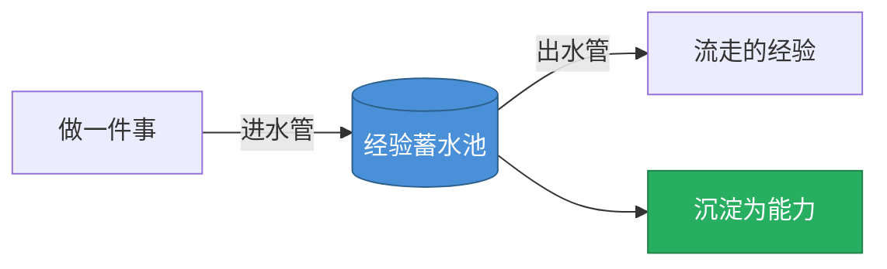
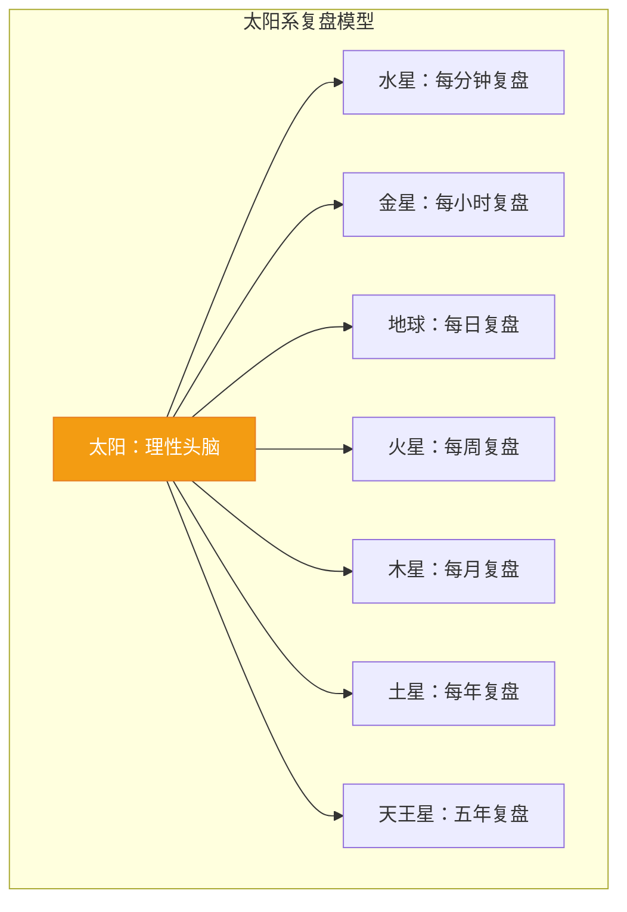

# 第16课：每天都在忙，为什么成长得却很慢？

> 经验不等于能力，做得多不等于做得好。人和人之间的差距，不在于做了多少事，而在于有没有把经验转化成能力。

---

## 一、核心问题：为什么同样工作三年，差距却很大？

两种员工的对比：

| 类型 | 经验积累 | 成长速度 | 结果 |
|------|----------|----------|------|
| **透明员工** | 进水少，出水多 | 慢 | 蓄水池总是空的 |
| **骨干员工** | 进水多，出水少 | 快 | 蓄水池越来越满 |

> [!question] 思考
> 你有没有过这样的体验：一天忙到晚，下班回家却想不起来今天到底忙了些什么？这恰恰说明你的每一天都在"重复"，而不是在"积累"。

---

## 二、经验蓄水池模型

- **进水管**：每做一件事，或多或少都会获得一些经验
- **出水管**：没有经过加工（复盘）的经验会流失
- **关键**：复盘就是对经验进行加工，让经验真正沉淀为能力

---

## 三、什么是复盘？

### 3.1 复盘的字源

复盘最早是围棋术语——对局结束后，复演棋局记录，同时还原当时走每一步时的心态，检查优劣得失，找出攻守漏洞。

> 棋手林海峰的故事：输了棋回家，三个晚上睡不着，一直在"摆棋"，说梦话都在讲棋。这种"摆棋"就是复盘——不是简单按原顺序摆满棋子，而是对每一步重新思考。

### 3.2 复盘的本质

复盘 = **还原过程 + 重新思考 + 推演假设**

| 要素 | 说明 |
|------|------|
| 还原过程 | 回顾当时做了什么，说了什么 |
| 重新思考 | 为什么这么做？还有没有更好的方式？ |
| 推演假设 | 如果换一种方式，结果会有什么不同？ |

> [!tip] 复盘的三重境界
> 1. 还原当时的思考逻辑
> 2. 过滤对局时的情绪，获得"局外人"的从容
> 3. 总结出"套路"，烂熟于心，成为高手

### 3.3 你其实每天都在复盘（只是没意识到）

- 和朋友聚会后，回想"朋友后来好像不太开心，是不是我说错了什么？"
- 和领导沟通后反思"我是不是不够谦逊？"
- 孩子生病了，思考"是昨晚没盖好还是吃坏肚子？去医院工作怎么安排？"

这些思考过程就是复盘。但我们需要的是**刻意复盘**，才能更快成长。

---

## 四、复盘太阳系模型

### 4.1 模型的三个启示

1. **太阳 = 理性头脑**：复盘是建立在理性基础上的思维活动
2. **不同周期的行星**：从每分钟到每年，不同频率的复盘有不同的作用
3. **不同行星特点不同**：不同周期的复盘，目的也不同

### 4.2 不同周期复盘的不同目的

| 复盘周期 | 核心目的 | 关键词 |
|----------|----------|--------|
| **日复盘** | 让经验和情绪流动起来，不淤积 | **流动** |
| **周复盘** | 清空过去，重新出发 | **重启** |
| **月复盘** | 深度反思，自我蜕变 | **涅盘** |
| **年复盘** | 战略纠偏，调整方向 | **转向** |

> [!quote] 核心观点
> - 日复盘的目的 = **流动**——让负面情绪不淤积，让经验流动起来
> - 周复盘的目的 = **重启**——清空杂念，像电脑重启一样打开新的一周
> - 月复盘的目的 = **涅盘**——深度反思带来新的自我认知和行为改变

---

## 五、本课小结

- 经验不等于能力，**做得多不等于做得好**
- 人和人之间的差距，关键在于是否把经验转化为能力
- **经验蓄水池模型**：进水管（做事）和出水管（未加工的经验），复盘是关小出水管的阀门
- **复盘太阳系模型**：不同周期的复盘（日/周/月/年），各自有不同的目的
- 我们需要的不是偶尔的反思，而是**刻意复盘**

---

## 六、课后练习

> [!important] 思考题
> 回顾你过去的这一周：
> 1. 你做了哪些事？其中有哪些经验真正沉淀下来了？
> 2. 如果用一个比喻形容你现在的"经验蓄水池"，它是满的还是空的？为什么？
> 3. 你目前在做的"反思"到底是总结还是复盘？试着用"假如……那么……"做一次推演。

---

**下节课预告**：第17课——如何用日复盘穿越负面情绪？用4F复盘法，让每一天都流动起来。