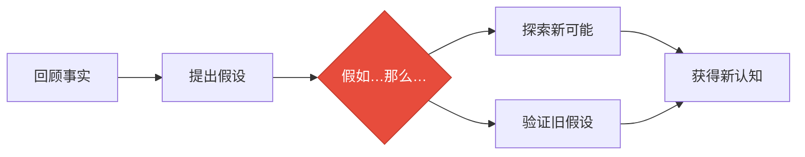
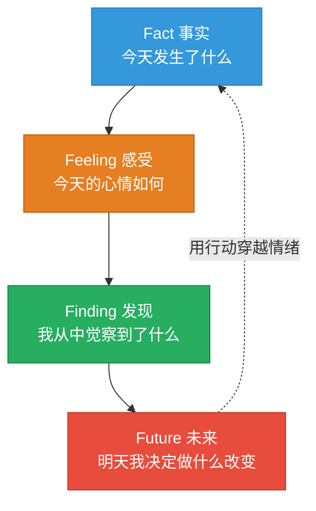
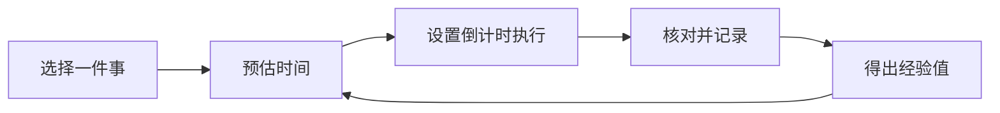

# 第17课：如何用日复盘穿越负面情绪？

> 心情不好的时候，就是效率最低的时候。日复盘不是记录流水账，而是用行动穿越情绪。

---

## 一、效率最低的时刻

你什么时候效率最低？

- 下午快下班时，像"行尸走肉"一样不想动
- 拖延症发作的时候
- **心情不好的时候**——这是效率最低的时刻

> 销售经理小明的例子：早晨效率超高，搞定好几件积压的事。突然接到客户电话，跟了一个月的签约泡汤了——瞬间像被泼了冷水，整个人颓废了，只盯着闪烁的光标发呆。

> [!danger] 负面情绪的"下水道效应"
> 心情不好的时候，就像下水道堵塞一样——**负面情绪淤积，行动力不畅**。日复盘就是疏通这条下水道的工具。

---

## 二、总结 vs 复盘——关键区别在于"推演"

很多人在一天结束时问自己"今天哪些做得好，哪些做得不好"——这其实是**总结**，不是**复盘**。

### 2.1 什么是推演？



| 维度 | 总结（不推演） | 复盘（有推演） |
|------|---------------|---------------|
| 思考方式 | 基于分析与归纳 | 基于假设与验证 |
| 典型问法 | "今天哪做得好/不好" | "假如当时我……那么结果会怎样" |
| 深度 | 停留在表面 | 深入探索可能性 |
| 结果 | 读后感和影评式 | 获得新认知和新行动 |

**判断标准**：有没有使用 **"假如……那么……"** 进行推演。

### 2.2 案例对比

**小明的总结**：
- 好的：早晨一到公司就先做重要的事
- 不好的：丢了订单之后没心思工作

**小明的复盘（有推演）**：
- 当我得知丢了订单以后，**假如**到楼顶狂吼发泄一下情绪，**那么**会不会更容易回到工作状态？
- **假如**我立刻给客户打电话问清楚原因，**那么**会不会没那么焦虑？

---

## 三、4F复盘法——简单有效的日复盘工具



### 3.1 4F与佛家"色受想行识"的对应

| 4F | 英文 | 佛家 | 说明 |
|-----|------|------|------|
| **Fact** | 事实 | **色** | 客观世界发生了什么 |
| **Feeling** | 感受 | **受** | 身心的感受和情绪 |
| **Finding** | 发现 | **想** | 联想、思考、觉察 |
| **Future** | 未来 | **行** | 未来的行动 |
| （放下执念） | — | **识** | 看清4F后，放下对它们的执念 |

> [!quote] 邹小强5年4F复盘体会
> 不论多么令人苦恼的事或郁闷的情绪，通过4F复盘最后转化到行动时，那些情绪似乎不再困扰我了。整个复盘过程就是从事实到感受到发现再到行动——**用行动去穿越情绪**。

---

## 四、4F复盘落地：每日七分钟，四个问题

每天工作结束后，花**七分钟**回答以下四个问题：

### 问题一：今天做了些什么？（Fact）

> 像围棋复演记录一样，**客观还原**今天发生的事实。

好的回答 | 不好的回答
---------|-----------
"今天我安排了13件事，搞定了10件，3件未完成" | "我今天从早忙到晚"（这是抱怨，不是事实）
"业绩超额完成，受到领导赞赏" | "今天还行吧"

> [!warning] 注意
> 我们很容易被感受蒙蔽。写事实时要注意客观还原，避免用情绪性的描述代替事实。

### 问题二：今天令自己满意或沮丧的事情是什么？（Feeling）

要用一对**反义词**，帮助你从正反两个角度审视自己。

| 关键词 | 反义词 | 适用场景 |
|--------|--------|----------|
| 满意 | 沮丧 | 通用 |
| 兴奋 | 失落 | 情绪波动大时 |
| 充实 | 虚度 | 追求成长时 |

**小明的例子**：
- 满意的事：同事遇到难题时我出手帮忙，避免了更大损失
- 沮丧的事：跟了一个月的客户最终没有签约

### 问题三：今天我意识到了什么？（Finding）

> 这一步要**慢下来**，多花时间做推演。

追问自己：
1. 发生了什么事让我总结出这个经验？
2. 当时我是怎么应对的？
3. 有没有其他更好的方式？
4. **如果换一种方式，会产生什么样的结果？**

**小明的发现**：努力并不一定是立刻得到回报的。

### 问题四：我决定明天做出什么改变？（Future）

> [!important] 关键原则
> **所有复盘最终都要落地成明确具体的行动，否则就是纸上谈兵。**

- 改变不要超过 **3个**——越多越不知道从哪里开始
- 必须是 **行动**，不是 **想法**

**小明的行动**：私下约客户见面聊聊，了解最终没有选择我们的真正原因，根据反馈做出调整。

---

## 五、两个必须注意的重点

### 5.1 重点一：培养时间感

**时间感小测试**：
1. 你清楚知道从家出门到进公司大门大约需要多久吗？
2. 老板让你写报告，你清楚知道大约需要多久完成吗？
3. 你计划15分钟的谈话，实际往往也差不多吗？

如果都是"否"，你的时间感需要训练。

**时间感训练四步法**：



1. 选择要做的事（如写报告）
2. **预估**时间（如40分钟）
3. **设置倒计时**执行
4. **核对**实际用时与预估的差异，**记录**下来

> 写三份类似报告后，你会发现：原来写一份报告大约需要50分钟。时间感就这样建立起来了。

**建立时间感的好处**：安排每日任务时更加合理，减少计划被推翻的情况。

### 5.2 重点二：把想法孵化成行动

**想法 vs 行动**

| 想法（悬而未决） | 行动（立刻可做） |
|-----------------|------------------|
| "不再拖延" | "明天上班手机调成勿扰模式" |
| "做个PPT" | "打开电脑选一个模板" |
| "多读书" | "今晚带书到床头，睡前读10页" |

**孵化方法**：不断追问"下一步行动是什么"

```
想法：不再拖延
  → 下一步行动：明天减少刷手机的时间
    → 下一步行动：设置勿扰模式
      → ✅ 行动：明天上班把手机调成勿扰模式
```

---

## 六、本课小结

| 知识点 | 核心要点 |
|--------|----------|
| 总结vs复盘 | 复盘多了"推演"——用"假如……那么……"探索可能性 |
| 4F复盘法 | Fact→Feeling→Finding→Future，用行动穿越情绪 |
| 时间感训练 | 预估→执行→核对→记录，建立准确的时间感知 |
| 想法孵化 | 不断追问"下一步行动"，把模糊想法变具体行动 |
| 日复盘的目的 | **流动**——做完日复盘后没有负面情绪淤积 |

---

## 七、课后练习

> [!important] 实战题
> 用4F法复盘自己的一天：
> 1. 今天做了些什么？（Fact——客观还原事实）
> 2. 今天令我满意/沮丧的事是什么？（Feeling——用反义词）
> 3. 今天我意识到了什么？（Finding——做推演）
> 4. 我决定明天做出什么改变？（Future——孵化成行动）

---

**下节课预告**：第18课——如何用周复盘重启高效能状态？周复盘六问清单，像电脑重启一样打开新的一周。