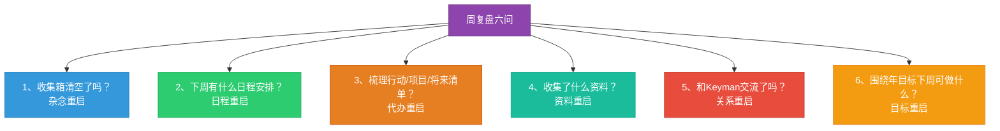
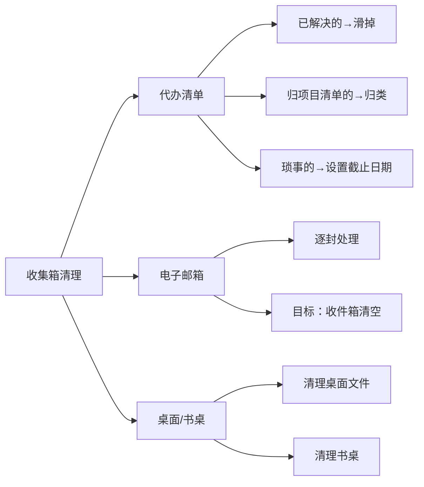
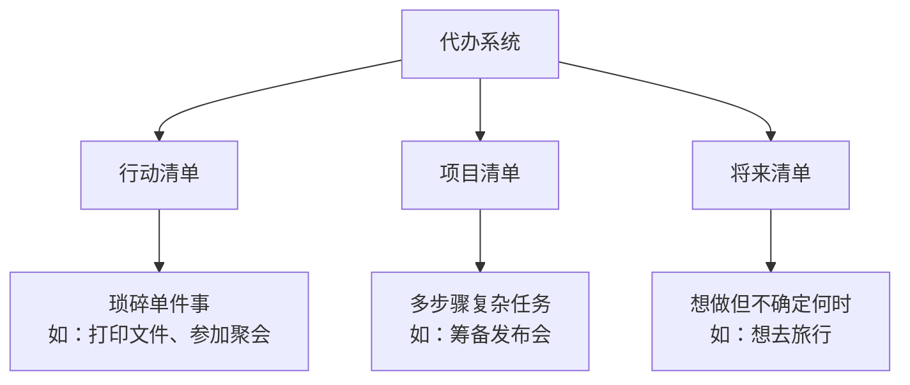
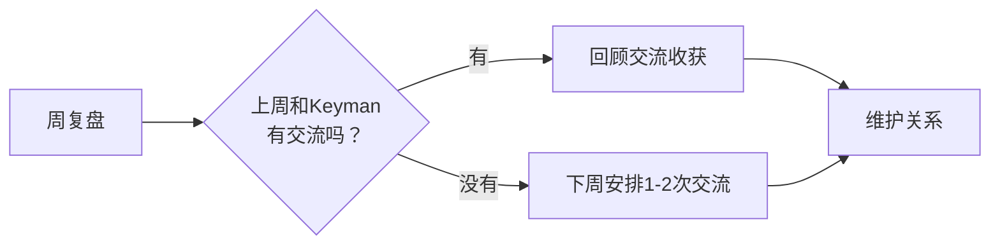
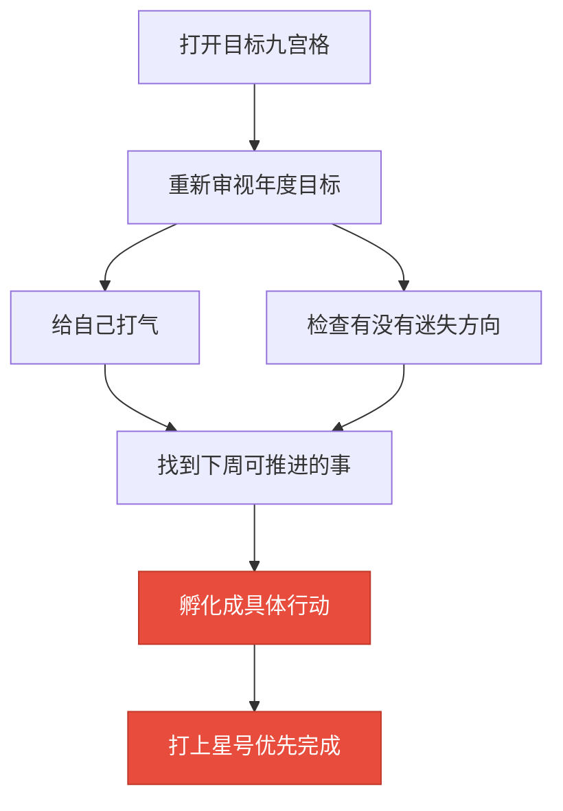

# 第18课：如何用周复盘重启高效能状态？

> 如果你不会做周复盘，学习读书都是白费力气。周复盘就像电脑重启——清空过去的杂念，开启新的一周。

---

## 一、为什么需要周复盘？

### 1.1 小白的困境

小白在外资公司做HR，周末和邹老师喝咖啡时抱怨：
- 公司安排的事，不是因为这个原因就是那个原因，**搁置了好几件**
- 囤了 **三门课和两本书**，没时间学
- 学的那些时间管理方法，**关键时刻失效了**

> [!quote] 核心观点
> 他把改变自己的希望都寄托在不断学习新方法上——这是选择了一条最轻松的路，但却不是一条高效率的路。此时应该做的不是抱怨，而是做一次**周复盘**。

### 1.2 周复盘的本质：重启

**重启 = 从零到一**

| 阶段 | 含义 | 动作 |
|------|------|------|
| **从零** | 清空过去 | 整理杂念、清理积压 |
| **到一** | 开启未来 | 重新聚焦目标、安排计划 |

做完周复盘的感觉，就像电脑重启了一样——干净、清爽、有条理。

---

## 二、周复盘六问清单

> [!tip] 最佳实践
> - **时间**：每周日选一个固定、不易被打扰的时间
> - **工具**：把六问清单打印出来贴在墙上，或写入手账
> - **心态**：对照清单逐条进行，不急不躁

---

## 三、六问详解

### 第一问：收集箱清空了吗？——杂念的重启

**收集箱**：暂存杂物的"中转站"，清理三大方面：

> [!warning] 出来混的总有一天要还
> 如果平时不注重清理，光清空收集箱这一项就要花很多时间。建议每天保持：
> - 代办清单整洁
> - 邮件收件箱清空
> - 电脑桌面整洁
> - 书桌"用完归位"

---

### 第二问：下周有什么日程安排？——日程的重启

**查看日历**，确认下周的约会安排。

#### 日程 vs 代办——关键区别

| 类型 | 定义 | 特点 | 管理工具 |
|------|------|------|----------|
| **日程** | 有固定时间点的约定 | 不能随意更改 | 日历/日程表 |
| **代办** | 有截止日期，无固定开始时间 | 可灵活安排 | 清单/待办列表 |

**举例**：

| 日程（日历） | 代办（清单） |
|-------------|-------------|
| 明天下午2点开会 | 明天做完PPT |
| 晚上8点看电影 | 后天拿到新办的银行卡 |
| 下周三出差 | 本周内回复邮件 |

> [!tip] 先看日程再排代办
> 把查看日程排在前面——先知道下周"已经被占用了多少时间"，后面才方便安排任务。例如：下周三有会议、下周四出差，那么工作应尽量安排在前半周。

---

### 第三问：梳理行动、项目和将来清单了吗？——代办的重启

三种清单的区别：

**操作步骤**：
1. 打开**行动清单**→ 设置下周截止日期
2. 打开**项目清单**→ 提取下周要推进的 → 设置截止日期
3. 打开**将来清单**→ 有下周想做的 → 设置截止日期
4. 打开**日历视图**→ 逐天查看调整（周一太满就拖几件到周二，周四出差就安排思考类工作）

---

### 第四问：印象笔记里上周收集了什么资料？——资料的重启

> 收集资料不是为了收集，也不是为了记忆，而是为了**使用**。

| 做法 | 极端一（收集癖） | 极端二（强迫记忆） | **推荐（中间路线）** |
|------|-----------------|-------------------|-------------------|
| 收集后 | 放进去不管 | 反复背诵 | 存放，周复盘时浏览 |
| 效果 | 只囤不用 | 耗费精力 | 留个印象，用时检索 |

**操作方法**：
1. 打开印象笔记 → 搜索笔记 → 添加搜索选项
2. 选择"创建时间 → 开始于上周"
3. 一键列出上周所有收集的资料
4. **挨个浏览一遍**，加深印象

---

### 第五问：和Keyman交流了吗？——关系的重启

> 这是很多人做周复盘时忽略的部分，但**非常重要**。

#### 什么是Keyman？

**Keyman = 拿着钥匙的人**。他们能在关键时刻为你打开一扇门。

| 类型 | 作用 |
|------|------|
| **导师型** | 解开心结，给予指导 |
| **资源型** | 掌握关键资源 |
| **支持型** | 在困难时提供帮助 |

**常见的Keyman**：医生、律师、好兄弟、合作伙伴、老师、老板、社群创始人……

#### 每个周期的关键人脉维护

> [!tip] Keyman不需要太多，7个左右就够了。
> 
> 不仅是索取，也要考虑自己能给予什么：
> - 普通：送些水果
> - 更高：贡献自己的价值（如提供专业建议）

---

### 第六问：围绕年目标，下周可以做什么？——目标的重启

**每周至少做一件和年度计划相关的事。**

| 不好的写法（想法） | 好的写法（行动） |
|------------------|-----------------|
| "读只管去做" | "周三晚8点阅读《只管去做》30分钟" |
| "多运动" | "周二、周四下午6点跑步3公里" |
| "学英语" | "每天早上用App背20个单词" |

> 把这件事**打上星号**，不论如何都要想办法完成。
> 
> 每周一次重新瞄准年度计划的机会，不断纠偏，年底才能实现目标。

---

## 四、周复盘六问速查表

| 序号 | 问题 | 对应重启 | 关键动作 |
|------|------|----------|----------|
| 1 | 收集箱清空了吗？ | 杂念重启 | 清空清单/邮箱/桌面 |
| 2 | 下周有什么日程？ | 日程重启 | 查看日历，先占时间 |
| 3 | 梳理清单了吗？ | 代办重启 | 行动/项目/将来清单设截止日 |
| 4 | 收集了什么资料？ | 资料重启 | 浏览上周收集的资料 |
| 5 | 和Keyman交流了吗？ | 关系重启 | 没交流就安排 |
| 6 | 年目标下周做什么？ | 目标重启 | 至少做一件相关的事 |

---

## 五、本课小结

- 周复盘的目的是**重启**——从零到一，清空过去，开启未来
- 周复盘**六问清单**覆盖杂念、日程、代办、资料、关系、目标六大维度
- **日程和代办要分开管理**——日程有固定时间，代办有截止日期
- **每周至少做一件和年度计划相关的事**，把想法孵化成明确行动
- 定期维护**Keyman关系**，既是索取也是给予

---

## 六、课后练习

> [!important] 实战题
> 用六问清单复盘自己的一周：
> 1. 收集箱清空了吗？（杂念）
> 2. 下周有什么日程？（日程）
> 3. 梳理行动/项目/将来清单了吗？（代办）
> 4. 上周收集了什么资料？（资料）
> 5. 和Keyman交流了吗？（关系）
> 6. 围绕年目标下周可以做什么？（目标）

---

**下节课预告**：第19课——如何用月复盘实现平衡人生？月复盘五步法，每月一次涅盘重生。