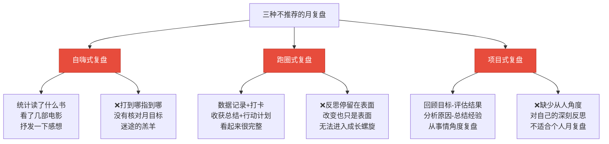
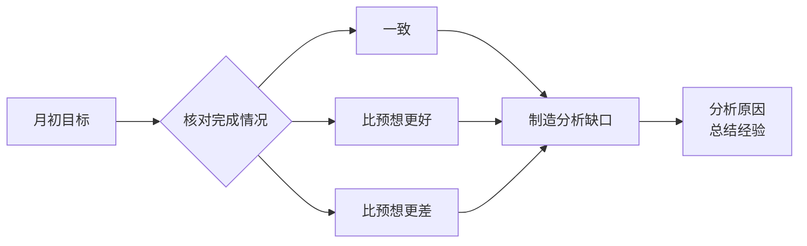
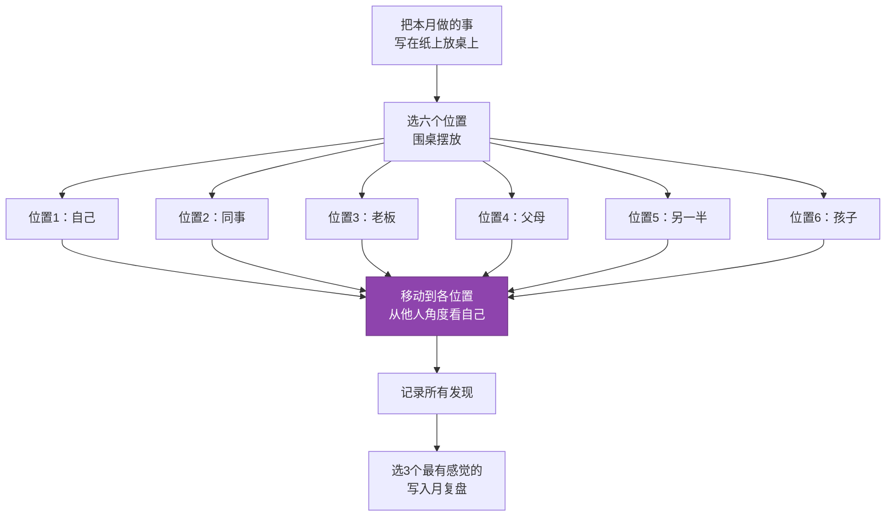
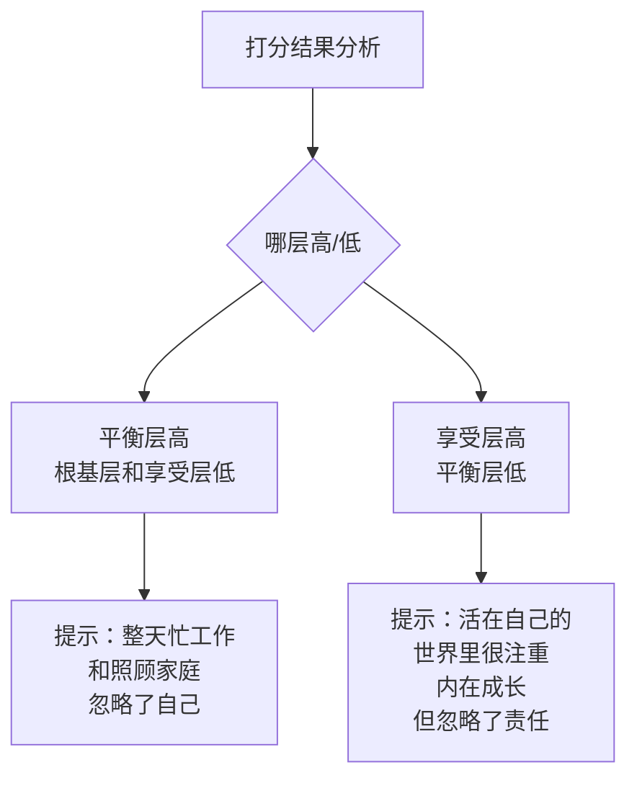
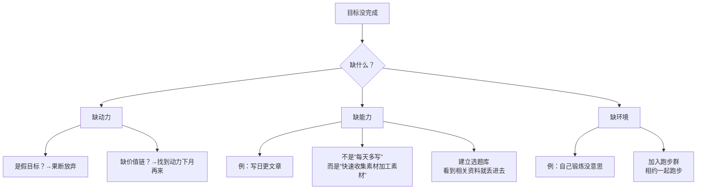

# 第19课：如何用月复盘实现平衡人生？

> 每月一次的复盘，就是每月一次的涅盘重生。你对自己每一次新的了解，都是一次蜕变。

---

## 一、三种不推荐的月复盘

邹小强见过三种常见的月复盘，但**都不推荐**：

| 类型 | 表现 | 问题 |
|------|------|------|
| **自嗨式** | 统计读了什么书、看了什么电影，自我感动 | 没和月目标核对，低水平勤奋 |
| **跑圈式** | 有数据、有感受、有行动，看似完整 | 反思只停留在表面，无法螺旋成长 |
| **项目式** | 回顾目标→评估结果→分析原因→总结经验 | 缺少"从人的角度"的自我反思 |

---

## 二、月复盘的目的：涅盘重生

> 闭着眼睛走七步，能走直线吗？几乎不可能。睁开眼睛走，却很轻松。复盘就是"睁开眼睛"的过程。

### 2.1 复盘的第一个目的：更新对自己的了解

| 表面认知（不够） | 深度认知（√） |
|-----------------|---------------|
| "上个月报了5门网课，3门在跟，2门放弃了，还不错" | "我报那么多网课，是因为目标不够清晰——想变得更好，但不知道具体往哪方面努力" |

### 2.2 复盘的第二个目的：产生新行动

| 旧行动（无效） | 新行动（有效） |
|---------------|---------------|
| "下个月更好地利用碎片时间"（已经说了无数次了） | "下个月拒绝一切应酬"（从来没有做过的行动） |

> [!quote] 核心逻辑
> **了解自己 = 眼睛的观察** | **新的行动 = 大脑的控制**
> 
> 不断了解自己 + 不断付诸新行动 = 不断纠偏 = **螺旋式成长**
> 
> 每次对自己新的了解，都是一次**涅盘重生**。

---

## 三、月复盘五步法

以学员小鹏的4月复盘为例：

### 第一步：月目标完成情况如何？

**小鹏的例子**：月目标11个，完成了8个。

> [!warning] 对照是分析的前提
> 如果没有目标和结果的对照，后面的分析就无从谈起。很多人"感觉自己很忙"，但月初定下的目标没搞定几个——这就是**盲目的瞎忙**。

---

### 第二步：兴奋/沮丧的事情是什么？

选择一个关键词和它的**反义词**：

| 关键词 | 反义词 |
|--------|--------|
| 兴奋 | 沮丧 |
| 幸福 | 难过 |
| 充实 | 虚度 |

> 这一步调动的是**感性脑**，从感受出发。

**小鹏的例子**：
- **兴奋的事**：老公和自己职业上都有了新发展
- **沮丧的事**：口头表达一直困扰自己

---

### 第三步：经验教训——移形换位法

这是月复盘的核心——**跳出盒子思考**。

> [!tip] 一个人在复盘时如果只站在自己的角度，就像**站在盒子里思考**——复盘到让自己感动，却不会有很大的改变。移形换位法帮你跳出盒子。

**小鹏的例子**：
部门走了很多骨干员工，他们抱怨工资低、领导不公平、机会少。小鹏内心也有纠结，但他通过跳出自身，看到了领导的**无助和无奈**，于是采取相反策略——按兵不动、跟领导表忠心、静静等待。结果是**获得升职加薪**。

> 经验教训：**唯有沉住气，静静的等待花开之时**。

---

### 第四步：目标九宫格满意度评价

对[[0009-shi-jian-tou-zi|目标九宫格]]的八个方面打分（满分10分）：

| 层级 | 维度 | 小鹏打分 |
|------|------|----------|
| **根基层** | 健康身体 | 7 |
| | 人际社群 | 7 |
| | 财务理财 | 7（指数基金定投没做） |
| **平衡层** | 工作事业 | 9（事业有突破） |
| | 家庭生活 | 9（夫妻关系升温） |
| **享受层** | 学习成长 | 5（碎片化学习） |
| | 体验突破 | 5（轻度尝试还算成功） |
| | 休闲娱乐 | 5（忙得没时间娱乐） |

---

### 第五步：对自己新的认识

> 人最难了解的就是自己。如果每月都能对自己有一个新认识，你将越来越了解自己，活得越来越通透。

#### 标签 vs 封条

| 类型 | 特征 | 例子 | 能改吗？ |
|------|------|------|----------|
| **封条** | 永久性，指向"你是谁" | "我是一个内向的人" | ❌ 认为不会变了 |
| **标签** | 暂时性，指向"你的特点" | "我不爱在人多的时候说话" | ✅ 可以撕掉贴新的 |

> [!quote] 人生就是一个贴标签然后撕掉标签的过程。你可以贴标签，但不要给自己贴封条。

**小鹏的新认识**：
- 被指责、被质疑、被埋怨时 → 第一反应是**反抗**
- 被肯定、被欣赏、被需要时 → 第一反应是**心生暖意，想要回报**
- 形成条件反射，跟随外界评价调整情绪

他没有说"我是一个控制不住情绪的人"（封条），而是说"我有这么一个特点"（标签）——特点可以改。

---

## 四、缺啥补啥——没完成目标怎么办？

| 缺口 | 本质 | 行动方向 |
|------|------|----------|
| **缺动力** | 目标不真实/没找到价值 | 放弃假目标，或用价值链法找到动力 |
| **缺能力** | 现有的能力不够 | 不是"多花时间"，而是**针对性提升**某项能力 |
| **缺环境** | 缺少外部支撑 | **创造环境**，如加入社群、找同伴 |

---

## 五、月复盘五步法速查表

| 步骤 | 问题 | 关键动作 |
|------|------|----------|
| 1 | 月目标完成情况如何？ | 对照目标→结果，制造分析缺口 |
| 2 | 兴奋/沮丧的事是什么？ | 用反义词，调动感性脑 |
| 3 | 经验教训是什么？ | 移形换位法，跳出盒子思考 |
| 4 | 目标九宫格满意度如何？ | 三层面打分，看出失衡处 |
| 5 | 对自己有什么新认识？ | 贴标签不贴封条 |

---

## 六、本课小结

- 三种**不推荐**的月复盘：自嗨式、跑圈式、项目式
- 月复盘的两个目的：**更新对自己的了解** + **产生新行动**
- 月复盘五步法：目标核对 → 兴奋/沮丧 → 移形换位经验教训 → 九宫格打分 → 新认识
- **标签 vs 封条**：封条说你"是什么人"，标签说你"有什么特点"
- **缺啥补啥**：缺动力放弃/找价值，缺能力针对性提升，缺环境主动创造
- 月复盘的目的是 **涅盘重生**——每月一次自我蜕变

---

## 七、课后练习

> [!important] 实战题
> 用五步法对上个月进行复盘：
> 1. 月初定下的目标完成情况如何？
> 2. 这个月让我兴奋/沮丧的事情是什么？
> 3. 从这些事情上得到了什么经验和教训？（试试移形换位法）
> 4. 为目标九宫格打分——哪层高、哪层低？
> 5. 通过复盘，我对自己有了什么新认识？（贴标签，不贴封条）

---

**下节课预告**：第20课——项目复盘怎么做才能最大程度萃取经验？项目复盘四步法，从经历中提炼可复用的智慧。