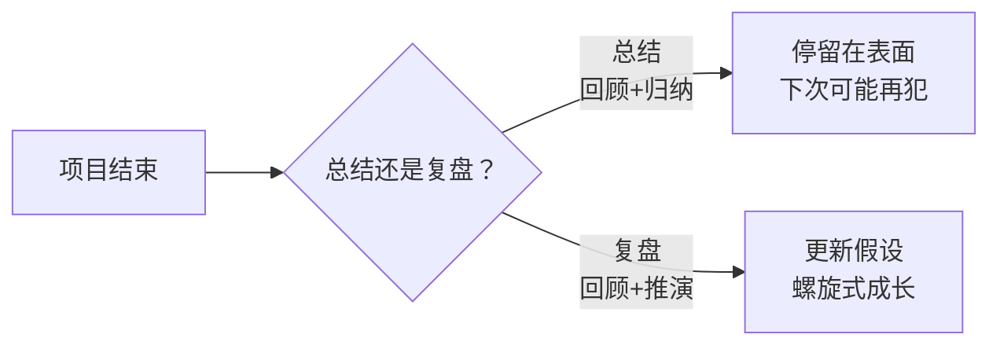
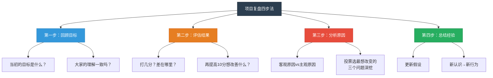
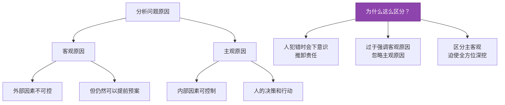
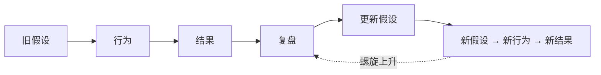
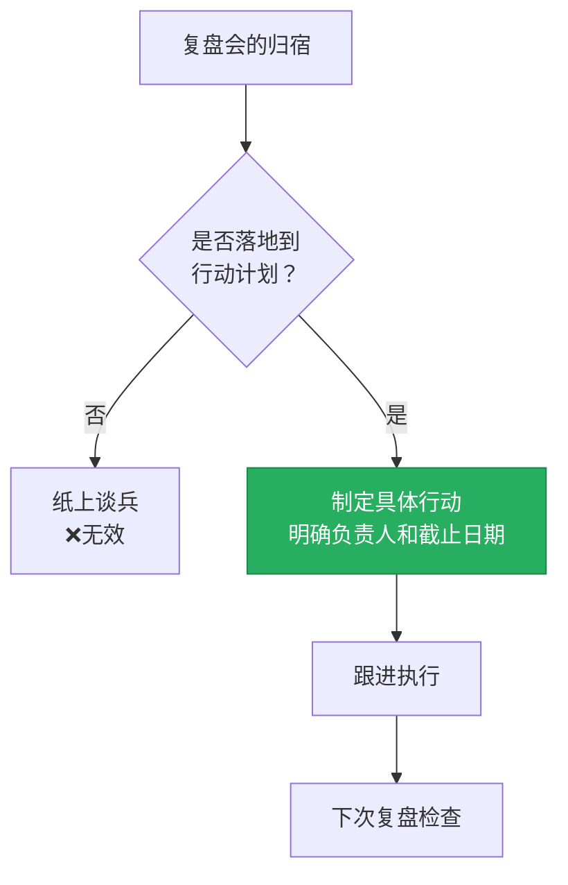

# 第20课：项目复盘怎么做才能最大程度萃取经验？

> 从本质上看，人类只能通过试错法进行学习。项目不管成功还是失败都不可怕，每一次经历都是一次试错。学会从试错的经历中复盘，就是螺旋式成长的捷径。
> —— 彼得·圣吉《第五项修炼》

---

## 一、为什么需要项目复盘？

### 1.1 一个常见的场景

> 周二一大早，项目经理怒气冲冲走进会议室，一拍桌子说：
> "这次新产品发布会非常失败！影响力没达到要求，流程乱七八糟。你们说说，到底怎么回事？"
>
> 一阵死一样的沉默后，有人站起来说："我觉得流程乱的原因是一、二、三……"

**这是项目复盘吗？** —— 不是。

> 这是我们之前讲过的——没有推演就只是**总结**，不是**复盘**。

### 1.2 总结 vs 复盘（回顾）

| 维度 | 项目总结 | 项目复盘 |
|------|----------|----------|
| 动作 | 罗列问题、归纳原因 | 回顾目标、评估结果、分析原因、总结经验 |
| 推演 | 无 | 有（重新假设、探索可能性） |
| 深度 | 表面 | 触及认知更新的层面 |
| 结果 | 知道错了 | 知道"为什么错"+"下次怎么做" |

---

## 二、项目复盘四步法

据说是联想创始人柳传志先生创造的流程，经过上百次实践验证，确实有效。

---

## 三、四步详解（以新产品发布会复盘为例）

### 第一步：回顾目标

**核心问题**：大家还记得我们项目开始前定下的目标吗？

#### 复盘现场的发现

| 问法 | 结果 |
|------|------|
| "这次的目标是什么？" | A说："做一次特别有影响力的发布会" |
| | B说："达到500万预售额" |
| **结论** | 一开始就没有定下**明确统一的目标**，每个人都在"瞎子摸象" |

#### 重新统一目标（推演）

经过讨论，达成共识：
- **全网一亿次曝光**
- **形成600万预售**

根据这个目标，倒推出每个人的工作任务。

> [!warning] 重要提醒
> 如果项目开始前已经有明确目标，这一步就是拿实际结果与目标**对照**。

**案例数据**：
| 维度 | 目标 | 实际 |
|------|------|------|
| 曝光量 | 1亿次 | 6000万次 |
| 预售额 | 600万 | 650万 |

**项目计划与进度**：大部分按计划进行，部分超出预期，部分有偏差。

---

### 第二步：评估结果

**核心问题**：如果满分100分，大家给这次项目打几分？

#### 评估方法

| 步骤 | 动作 |
|------|------|
| 1. 每人写一个分数 | 不打"好/差/一般"这种感受词 |
| 2. 写出"和100分差了多少，差在哪里" | 用具体描述 |
| 3. 写出"如果能再提高10分，你希望提高什么" | 聚焦改进方向 |

> [!important] 用分数不用感受
> 感受启动的是**感性脑**，而原因分析需要启动**理性脑**。用分数可以把讨论拉回理性层面。四步复盘环环相扣，上一环节为下一环节服务。

**案例评分**：
- 有人打60分——虽然网络预售很好，但糟糕的发布会流程严重影响了现场观众的体验
- 如果能再提高10分 → 希望形成一个**发布会标准流程**，大家就不会那么忙乱了

---

### 第三步：分析原因

**核心方法**：投票选出3个最想改变的问题 → 聚焦深挖 → 区分主客观原因

#### 主观原因 vs 客观原因

| 问题 | 客观原因 | 主观原因 |
|------|----------|----------|
| 开会迟到 | 堵车 | 没有充分预估交通状况，早点出发就不会堵 |
| 活动现场混乱 | 参会人数远超预计（500→700人） | 分头邀请时没沟通协调，每人多邀了几位；没有总协调人负责突发状况；看到超预期没有立即协调加椅子 |

> [!tip] 实操建议
> 在白板上直接写两列——**主观原因**和**客观原因**，迫使大家从两个角度深挖。

---

### 第四步：总结经验

#### 核心方法：更新假设

我们很多行为都是基于对事情的**假设**：

| 旧假设 | 行为 |
|--------|------|
| "努力就可以成功" | 拼命努力 |
| "读书就可以增长智慧" | 囤书单 |

**复盘 = 一次一次地自我升级假设的过程。假设变了，行为也会跟着变。**

**更新假设的提问**：现在你对这个项目有什么**新的认识**？

> 先自己思考一分钟，沉淀一下。

**案例中新认知**：
- **旧假设**：做项目就是把自己负责的那部分做好就行了
- **新假设**：和同事们的配合沟通才是做好项目的关键所在

---

## 四、两个关键要点

### 要点一：复盘在事情发生的现场做最好

> 优秀的团队就像好的骑手一样，项目结束之后的第一件事不是庆祝或回家，而是**坐下来复盘**。因为复盘本身就是项目的一部分。

| 时机 | 效果 |
|------|------|
| **现场立即复盘** | 记忆鲜活、情绪适中、经验萃取最充分 |
| 过几天再复盘 | 细节遗忘、情绪淡去、深度不足 |

### 要点二：落地到具体的行动计划

> 我见过太多的无效会议了——讨论的时候热火朝天，似乎总结出很多经验，但最终都停留在纸面上、头脑中，没有落地到具体的行动计划里。

> [!quote] 关键理念
> 不论复盘够不够深刻，只要能付诸行动，都是**有效的复盘会**。只有行动才能带来改变。

---

## 五、项目复盘四步法速查表

| 步骤 | 核心问题 | 关键动作 | 注意事项 |
|------|----------|----------|----------|
| **回顾目标** | 当初的目标是什么？大家理解一致吗？ | 复盘目标，必要时重新统一 | 若已有目标则对照复盘 |
| **评估结果** | 打几分？差在哪？ | 用**分数**不用感受词 | 为下一步分析做准备 |
| **分析原因** | 为什么会这样？ | 区分**主观**与**客观**原因 | 投票聚焦深挖 |
| **总结经验** | 有什么新认识？ | **更新假设** | 沉淀为新认知，改变未来行为 |

---

## 六、本课小结

| 知识点 | 核心内容 |
|--------|----------|
| 项目复盘四步法 | 回顾目标 → 评估结果 → 分析原因 → 总结经验 |
| 主观 vs 客观 | 犯错时人会下意识推卸责任，主观/客观两列并写，全面深挖 |
| 更新假设 | 复盘的本质是升级认知假设，假设变了行为也会变 |
| 复盘时机 | 在事情发生的现场做最好——复盘本身就是项目的一部分 |
| 落地行动 | 不落地到行动计划的复盘都是纸上谈兵 |

---

## 七、课后练习

> [!important] 思考题
> 请问你有过"更新假设"的经历吗？
>
> 回忆一次项目或事情：
> 1. 当初你的假设是什么？
> 2. 经历了什么让你重新思考这个假设？
> 3. 新的假设是什么？它如何改变了你的行为？
>
> 如果有的话，请在评论区分享当时发生了什么。

---

**下节课预告**：第21课——个人效能环，将目标→计划→执行→反思整合为完整的个人效能系统。