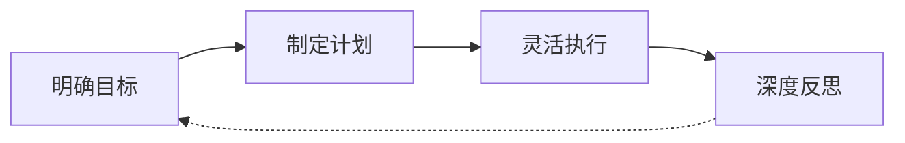
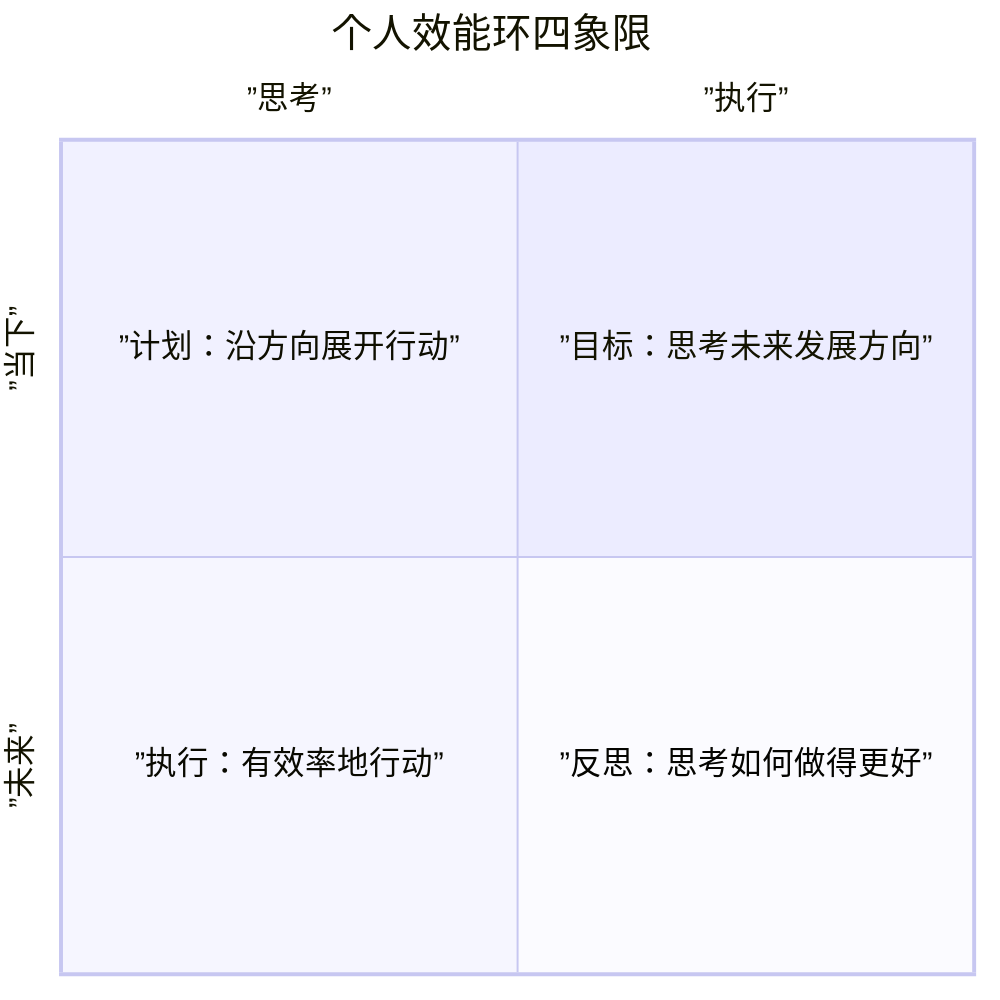

# 第21课：个人效能环——处理多种事情的好用套路

## 处理任何事的万能四步

接到一个任务（如筹办公司年会），只需四个步骤：

**四步拆解——以公司年会为例：**

| 步骤 | 核心任务 | 实操要点 |
|------|---------|---------|
| ① 明确目标 | 挖掘任务发出者的真实需求 | 老板想通过年会达成什么目的？经费多少？是否邀嘉宾？避免"深耕细作"与"创新"主题不匹配而导致返工 |
| ② 制定计划 | 根据需求制定具体实施计划 | 将老套文艺表演换成创新成果展示、短分享、外部头脑风暴 |
| ③ 灵活执行 | 应对执行中的阻碍 | 场地临时无法使用、PPT拖延——灵活应对即可 |
| ④ 深度反思 | 复盘全过程 | 哪些做得好？哪些待提高？重来一次如何调整？形成文档 |

> [!tip] 情绪管理
> 若过程中产生负面情绪（如经费太少），问自己一个神奇问题：**"既然经费这么少，我如何才能在经费这么少的情况下把这件事做得漂亮？"** 松开刹车，继续前进。

---

## 个人效能环模型

前四课所学的方法整合为 **个人效能环**：

**两个维度：**

| 维度 | 说明 |
|------|------|
| **横轴**（事的维度） | 偏重思考 vs. 偏重执行 |
| **纵轴**（人的维度） | 看重未来方向 vs. 看重眼下效率 |

**四个组成部分：**

- **目标**：思考未来发展方向
- **计划**：沿着方向展开行动
- **执行**：有效率地行动
- **反思**：执行后思考如何做得更好

---

## 螺旋上升的两个要素

成长是螺旋上升过程，需满足两个条件：

1. **螺旋**：一套完整的系统（个人效能环 + 运行轨迹）
2. **上升点**：仅有系统而无上升点叫"原地打转"

> [!important] 反思 = 上升点
> 个人效能环中的 **反思** 就是上升点——通过反思把过去的经验升华，让你真正成长。

**生活中的应用：**

| 场景 | 目标 | 计划 | 执行 | 反思 |
|------|------|------|------|------|
| 培养早起习惯 | 连续21天早起 | 几点睡、几点起、睡前仪式 | 执行早起计划 | 不断反思调整 |
| 买房 | 预算、位置、户型 | 看哪些盘、何时看 | 请假、搭地铁看盘 | 辨别哪些盘靠谱 |

---

## 四类卡点与突破问题

当觉得"被卡住"时，用以下问题诊断卡点位置，让效能环重新转动：

### 卡在目标
**表现**：目标很多，但很少有落地的计划

> [!question] 自问
> - **我的下一步行动是什么？**
> - 为了实现这个目标，接下来我打算做什么？

### 卡在计划
**表现**：做了很多计划，但真正完成的很少

> [!question] 自问
> - **不考虑结果的好坏，我何时开始走出第一步？**
> - 代办清单里我最愿意完成的任务是什么？

### 卡在执行
**表现**：行动力强、速度快，但感觉没有成长

> [!question] 自问
> - **我的行动是朝向想要的目标吗？**
> - 如果要让我变得更好，我可以从过去学到什么？

### 卡在反思
**表现**：经常回顾反思，但始终不知道自己要什么

> [!question] 自问
> - **在这件事或这段关系中，我真正想要的是什么？**
> - 我想象中的结果是什么样的？

---

## 练习

回顾你当前工作中最困扰的一件事，用个人效能环诊断：

1. 这件事你卡在了哪个环节？（目标 / 计划 / 执行 / 反思）
2. 用对应的突破问题问自己，写下你的答案
3. 尝试让效能环"流动"起来，记录你接下来要做的第一步

---

## 本课总结

- 处理任何事都可用 **明确目标 → 制定计划 → 灵活执行 → 深度反思** 四步
- 四步组合即为 **个人效能环**
- 效能环可帮助诊断和突破个人的效能卡点
- 螺旋上升需要 **螺旋（系统）+ 上升点（反思）**
- 流动着的效能环就是最舒服的状态