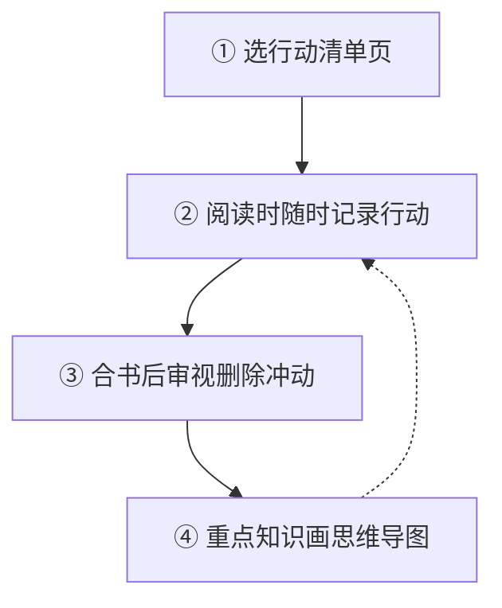

# 第22课：DO书法——为什么读了那么多书但都没啥用？

## 读不进去的真相

别人推荐的好书（如《原则》），买回来却读不进去？

> [!faq] 根本原因
> **认知鸿沟**——读者与作者之间的认知背景和经验差距太大，无法与作者形成对话，光听"听不懂的叨叨"自然会昏昏欲睡。

**解决方案**：**学以致用**——在践行中积累认知和经验，帮助真正读懂书。

> [!quote] 书籍是人类进步的阶梯，践行是读懂书籍的阶梯。

---

## 两种阅读类型

| 类型 | 定义 | 举例 | 是否适用DO书法 |
|------|------|------|:------------:|
| **非功利性阅读** | 没有明确目的，只为享受 | 小说、诗歌、散文 | 否 |
| **功利性阅读** | 带着目的去读，学方法/提认知 | 商业书、方法论 | **是** |

DO书法（Just Do It — The DO）特别适合功利性阅读。

---

## DO书法四步

### 第一步：选行动清单页
- 封面/封底翻开后的**空白页**
- 通常把最后一页当作行动清单

### 第二步：阅读时随时记录行动
- 读到触发行动的知识点，**立即翻到最后一页记录下来**
- 记录后**重新回到阅读状态**
- 循环：阅读 → 触发行动 → 记录 → 回到阅读

> [!example] 以《非暴力沟通》为例
> 读到"倾听的三个层次：倾听内容、倾听感受、倾听对方的需要"→ 触发行动："今晚和老婆卧谈会时，刻意练习倾听的三个层次"→ 立即记录在行动清单页

- 读完一本书通常积累 **15-20个行动**
- 电子书（Kindle等）可用批注功能，读完导出即为行动清单

### 第三步：合书后审视删除冲动想法
- 合上书本的**最后一件事**：重新审视行动清单
- 筛选出**真正想要去做的**，删除**一时的意识冲动**

> [!tip] 每次阅读都是行动的契机，不必等整本书读完再行动。

### 第四步：画思维导图
- 在封面翻开的空白页画全书思维导图
- 只拎重点，**不必包括所有章节、金句、知识点**
- 一本书能真正留下深刻印象的内容并不多

---

## 学以致用：践行 + 个性化创造

### 为什么要个性化创造？

如果一直在"坚持"做事，迟早会放弃——坚持单腿站立，早晚会累倒。

> [!important] 坚持 = 有抗拒
> 在模仿的基础上 + 独特的阅历经验 = **创造自己的版本**
> 按自己的版本做事，就不再是"坚持"，而是顺其自然。

### 案例：番茄工作法的个性化创造

| 标准版 | 个性化创造版 |
|-------|------------|
| 工作25分钟，休息5分钟 | 根据精力设置倒计时 |
| — | 早上精力旺盛 → 设置40分钟倒计时，优先处理重要事 |
| — | 下班前精力涣散 → 设置10分钟倒计时，集中处理琐碎事 |

> [!warning] 创造的前提
> 个性化创造必须建立在 **认真模仿** 的基础之上。

---

## 练习

选择一本你正在读或想读的商业/方法论书籍，尝试DO书法：

1. 找到行动清单页（或新建电子笔记）
2. 开始阅读，每触发一个行动立即记录
3. 阅读结束后审视清单，删除冲动想法，选出3个最想做的行动
4. 在封面空白页画出这本书的思维导图框架
5. 选定一个行动，在24小时内付诸实践

---

## 本课总结

- 读不进去的原因是 **认知鸿沟**
- DO书法四步：**选行动清单页 → 随时记录行动 → 审视删除冲动 → 画思维导图**
- **学以致用**：践行是读懂书籍的阶梯
- **个性化创造**：在认真模仿基础上创造自己的版本，让方法自然持续
- 哪怕只有一个行动、一个点真正用在了生活中，也比囤积一堆知识更有价值