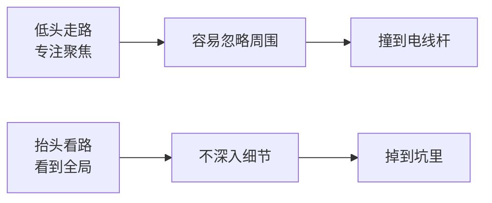

# 第24课：SMART提问——如何建立共同目标，减少返工？

## 返工：效率最低的事

**场景还原**：老板布置写新产品上市推广策划案，你埋头一上午改了又改，最后老板不满意，狠狠批了一顿。

> [!danger] 核心教训
> **在错误的方向上跑得越快，错得越远。**

---

## 低头走路 vs. 抬头看路



| 状态 | 特点 | 典型场景 | 风险 |
|------|------|---------|------|
| **低头走路** | 专注聚焦、心无旁骛 | 玩游戏忘记时间、刷微信坐过站 | 忽略全局，方向错了 |
| **抬头看路** | 看到全局，不深入细节 | 听课学习很多但不行动 | 一直输入不输出 |

### 最佳策略：两种状态切换

> 从 **战略高度** 看清楚方向 → 再从 **战术高度** 全力推进

**小强亲历**：写方案写不出 → 瞥见杯子没水 → 站起来去接水（切换到抬头看路）→ 灵光一现 → 一气呵成搞定方案。

- **紧张** 切换到 **放松** → 好想法常在放松时出现
- **"怎么做"** 切换到 **"目的是什么"** → 思考高度变化带来新发现

---

## SMART原则复习

| 字母 | 含义 | 说明 |
|:----:|------|------|
| **S** | Specific 具体的 | 目标必须明确具体 |
| **M** | Measurable 可衡量的 | 目标必须有衡量标准 |
| **A** | Achievable 可达到的 | 目标在资源支持下可实现 |
| **R** | Relevant 相关的 | 目标与其他目标有关联（像火箭绑助推器，关联越多动力越足） |
| **T** | Time-bound 有时限的 | 目标必须有明确时间底线 |

### SMART判断练习

| 目标描述 | 符合SMART？ | 问题 | 改进建议 |
|----------|:----------:|------|---------|
| "我要在三个月内学会弹吉他" | ❌ | 不具体——什么叫"学会"？ | "我要在朋友聚会上弹唱《春天里》" |
| "我想继续考研究生" | ❌ | 无相关性 | "通过一月份研究生考试增加升职加薪几率" |
| "我要找一个漂亮的配图" | ❌ | 不具体/不可衡量/无时限 | 明确颜色、构图、尺寸、截止时间 |
| "想找月薪十万、身高185以上的男朋友" | ❌ | 不适合用SMART | "每个月跟朋友们聚会一次"——做事靠系统，做人用真心 |

---

## SMART提问法：五问建立共同目标

将SMART原则应用于沟通场景，挖掘任务发出者内心的真实需求。

```mermaid
graph TD
    Q1[”① 您想象中是什么样子？<br/>(S - 具体)”] --> Q2[”② 有什么具体要求？<br/>(M - 可衡量)”]
    Q2 --> Q3[”③ 我需要什么支持？<br/>(A - 可达到)”]
    Q3 --> Q4[”④ 什么时候要？<br/>(T - 有时限)”]
    Q4 --> Q5[”⑤ 对我有什么价值？<br/>(R - 相关性)”]
```

### 五问详解（以老板布置策划案为例）

#### 第一问：您想象中大概是什么样子？→ **S（具体化）**
- 老板：让人耳目一新，利用新媒体做话题营销
- 作用：把模糊的愿景说出来

#### 第二问：有什么具体要求吗？→ **M（可衡量）**
- 老板：曝光量至少 **1000万**，成本控制在 **10万** 以下，带动 **100万** 销售
- 作用：明确衡量结果成败的标准

#### 第三问：我需要什么支持？→ **A（可达到）**
- "我需要技术部的David和设计部的Lucy来支持一下"
- 作用：填补资源/经验/时间落差，**别给自己挖坑**

#### 第四问：什么时候要？→ **T（有时限）**
- 老板：下周一之前
- 作用：明确截止时间

#### 第五问：做好这件事对我有什么价值？→ **R（相关性）** 
- 问自己，不是问老板
- 例：这是老板的信任、考察升职、锻炼组织能力
- 作用：看到价值与意义，更有动力

---

## 与同事沟通：第三选择

与同事沟通时，不是"你问我答"，而是 **双方共同回答**：

| 场景 | 沟通方式 |
|------|---------|
| **老板下达任务** | 用SMART提问挖掘他内心的想法，按他的方向走 |
| **同事协作讨论** | 双方都有想法 → 找出 **第三选择** |

### 第三选择示例

1. 同事说想法 → 你说想法 → 两者不同
2. 不选A也不选B，而是碰撞出 **双方都能接受的新方案**
3. 达成共同愿景后，依次继续其他问题

> 做事靠系统，做人用真心。

---

## 练习

在下次与老板或同事沟通任务时，实践SMART提问法：

1. 记录沟通过程
2. 检查五个问题是否都问到了：
   - [ ] 您想象中是什么样子？（S）
   - [ ] 有什么具体要求？（M）
   - [ ] 我需要什么支持？（A）
   - [ ] 什么时候要？（T）
   - [ ] 对我有什么价值？（R）
3. 如果是与同事沟通，双方是否找到了 **第三选择**？
4. 这次沟通是否减少了后续返工？

---

## 本课总结

- 返工是效率最低的事——**方向错了，跑得越快错得越远**
- 要在 **低头走路** 和 **抬头看路** 之间切换
- SMART提问法五问对应SMART原则，用于挖掘对方真实需求：
  1. 想象中是什么样子→S
  2. 有什么要求→M  
  3. 需要什么支持→A
  4. 什么时候要→T
  5. 对我有什么价值→R
- 与同事沟通时找到 **第三选择**，而非二选一