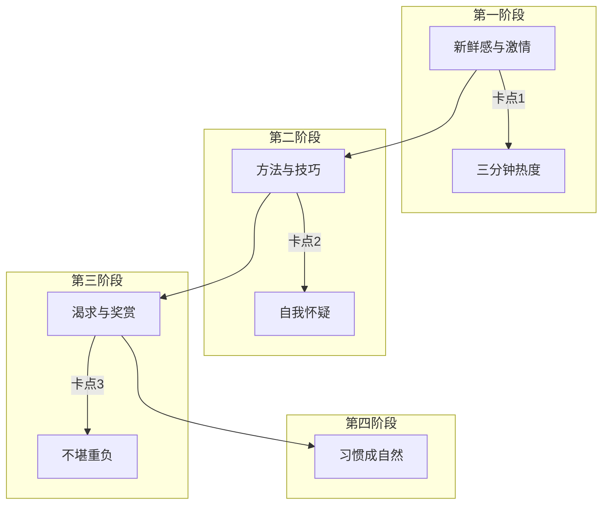
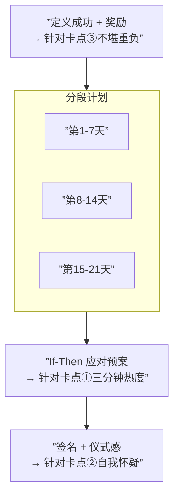
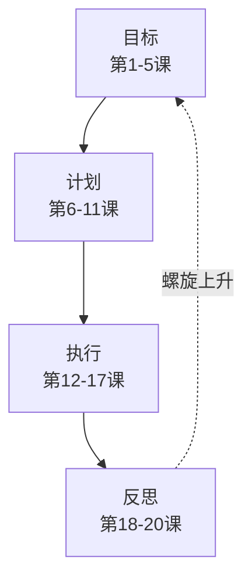

# 第25课：习惯培养——培养习惯总是三分钟热度怎么办？

## 两个错误认知

### 错误认知一：21天养成一个习惯

**真相**：源自美国整容医生马尔兹《心理控制术》——书中写的是整容后需要21天适应新面貌，以及截肢病人幻肢感21天消退。是"习惯某种变化"，不是"养成一个习惯"。

> 实际养成习惯所需天数 **因人而异**：有人53天，有人84天，平均约66天。

### 错误认知二：全靠坚持

**真相**：几乎所有只靠"决心+毅力"培养习惯的人都失败了。培养习惯是 **升级打怪的技术活**。

---

## 习惯培养地图：四个阶段 × 三个卡点

| 阶段 | 依靠 | 对应卡点 |
|:----:|------|:--------:|
| **第一阶段** | 新鲜感和激情 | ① 三分钟热度 |
| **第二阶段** | 方法和技巧 + 伙伴 | ② 自我怀疑 |
| **第三阶段** | 内心的渴求 + 外在的奖赏 | ③ 不堪重负 |
| **第四阶段** | 习惯成自然（伴随喜悦） | — |

---

## 三个卡点与突破策略

### 卡点一：三分钟热度

**表现**：新鲜感退去后发现推石头上山好累，在放弃与继续之间纠结。

**突破策略**：进入第二阶段——**用方法和技巧坚持**

- 把注意力放在 **如何用正确方法比昨天做得更好**
  - 跑步案例：学习正确姿势（前脚掌/后脚掌着地、胳膊摆动、小步快频）→ 过程变得有挑战、有意思
- **找伙伴一起做**
  - 组跑团，一群人一起跑

### 卡点二：自我怀疑

**表现**：身体和意志到了极限，开始质疑初衷："这么辛苦值得吗？"

**突破策略**：进入第三阶段——**找到内心的渴求和外在的奖赏**

> [!example] 欢欢的减肥故事
> 欢欢一直减肥失败，后来发现她真正的渴求不是变瘦，而是 **和老公出去应酬时不给他丢人**。于是建议她把习惯从"减肥"换成"读书"。
> 
> 结果：读书轻松坚持68天。因"富有诗书气自华"，她能在应酬中深入聊天，得到老公朋友的欣赏——**内心渴求被满足了**，习惯自然坚持下去。

### 卡点三：不堪重负

**表现**：培养一个习惯已花很多精力，再培养新习惯力不从心。

**突破策略**：**自生自灭（同一时间只培养一个习惯）**

> 已养成的习惯不再特别关注它，把注意力放在新习惯上。放下 ≠ 不做，只是不再刻意关注。

---

## 习惯培养卡片

在培养习惯之前用心填写此卡，可有效避开三个卡点：

### 卡片各栏填写指南

| 栏目 | 填写内容 | 作用 |
|------|---------|------|
| **定义成功 + 奖励** | "我要培养××习惯"，"连续21天就算成功，奖励自己××" | 让习惯明确，设置终点（避免"无期徒刑"感），**一次只培养一个** |
| **培养习惯的重要性** | "对我来说很重要，因为……" | 明确动力，动力至少打 **8分**（满分10分），否则别浪费时间 |
| **分段计划** | 第1-7天→第8-14天→第15-21天 | 用方法和技巧坚持 |
| **If-Then 应对** | "如果……（阻碍），我就……（应对）" | 预防未预料到的状况——几乎所有半途而废都是因为出现了"没想到" |
| **签名** | 亲笔签名 | 自己与自己的契约，有仪式感 |

> [!tip] 一次性培养多个习惯？
> "每天早晨六点半起床背单词" = 同时培养 **两个习惯**（六点半起床 + 背单词）。人的意志力有限，一次只培养一个习惯，成功几率最大。

---

## 寻找伙伴的关键

> [!warning] 不是关系最好的，而是真正想改变的
> 要找在现实生活中 **真正想做出改变的人** ——他是战友，不是拉拉队。

---

## 全课程回顾总结

至此，**时间管理实战训练25讲** 全部结束。以下是对整个课程体系的回顾：

### 个人效能环（课程核心框架）

### 模块总览

| 模块 | 课程 | 核心收获 |
|:----:|------|---------|
| **模块一** 目标篇 | 第1-5课 | 愿景孵化GPS、九宫格、人生五年、角色平衡、目标筛选 |
| **模块二** 计划篇 | 第6-11课 | 衣柜整理法、待办清单、日程表、周计划、月计划、年计划 |
| **模块三** 执行篇 | 第12-17课 | 拖延症、番茄工作法、应酬法则、临时突发事件、精力管理、碎片时间 |
| **模块四** 反思篇 | 第18-20课 | 日复盘、周复盘、月复盘、年复盘 |
| **模块五** 综合实战 | 第21-25课 | 个人效能环、DO书法、时间日志、SMART提问法、习惯培养 |

### 最后一课的终极提醒

> [!important] 时间管理是一门心理学
> 
> 很多人觉得时间管理反人性——先做痛苦的事、列满日程表。但用不起来不是因为反人性，而是 **没有人性化地使用它**。
> 
> - ❌ 要求自己把所有方法都用起来 → ✅ **先从最容易上手的一个开始**
> - ❌ 强迫自己每天都要怎样 → ✅ **偶尔放松也没关系**
> - ❌ 认为时间管理一学就会 → ✅ **它是一种生活方式，要慢慢来**

---

## 练习

1. 选择一个你最想培养的习惯
2. 填写一张 **习惯培养卡片**（定义成功+奖励、分段计划、If-Then应对、签名）
3. 确认：这个习惯的培养动力是否达到 **8分以上**？
4. 评估当前处于习惯培养地图的哪个阶段，下一个阶段的突破策略是什么
5. 找到一个现实生活中真正想改变的伙伴

---

## 本课总结

- **21天养成习惯是误区**，实际因人而异
- 习惯培养四阶段：**新鲜感 → 方法与技巧 → 渴求与奖赏 → 习惯成自然**
- 三个卡点：**三分钟热度 / 自我怀疑 / 不堪重负**
- **习惯培养卡片** 是避开卡点的实用工具
- **同一时间只培养一个习惯**
- 找伙伴要找 **真正想改变的人**，而非关系最好的人
- **时间管理是心理学**——人性化使用，慢慢来，从最容易的一个方法开始