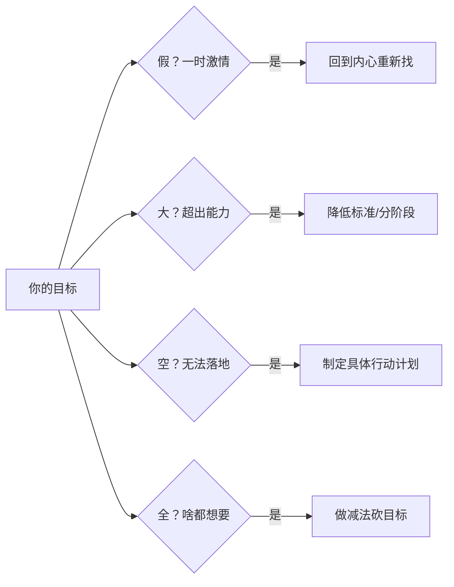

# 方法框架速查表

## 一、目标制定系列

### 目标四关诊断


### GPS目标落地法
| 步骤 | 问题 | 示例 |
|------|------|------|
| 定义愿景 | 你说的XX具体指什么？ | 财富自由=非工资收入>总支出 |
| 选择路径 | 如何实现愿景？ | 赚第一桶金→投资收益→被动收入 |
| 阶段目标 | 第一步做什么？ | 每月被动收入多三千 |

### 决策打分表
| 维度 | 打分(0-10) | 要点 |
|------|-----------|------|
| **热情** | __分 | 内心有多想要？赋予了怎样的意义？ |
| **痛苦** | __分 | 不解决这个目标有多痛？ |
| **时机** | __分 | 眼下多适合做这件事？ |

## 二、计划制定系列

### 行动力四度公式
> **行动力 = 事情明确度 + 时间匹配度 + 精力充沛度 + 个人意愿度**

| 要素 | 提升方法 |
|------|----------|
| 明确度 | 写下具体步骤和大纲 |
| 匹配度 | 任务分解匹配碎片时间 |
| 充沛度 | 要事放在精力最好时段 |
| 意愿度 | 用想做的事推动不想做的事 |

### 衣柜整理法
```
第一步【收集】→ 把所有待办事项写下来
第二步【明晰】→ 4D分类（立即做/计划做/授权做/尽量别做）
第三步【排程】→ 排出当日行程，随时调整
```

### 自然计划法五步
```
目标原则 → 展望结果 → 头脑风暴 → 组织梳理 → 下步行动
```

### 时间投资人三角
1. **追求时间自由**：主动时间 > 被动时间
2. **配置时间资产**：目标九宫格（健康/财富/人际/工作/家庭/学习/体验/娱乐）
3. **做时间定投**：每天完成三件最重要的事

### 要事优先策略
> 要事越做越少，琐事越做越多 —— 把时间投资在重要的事上，琐事会被分配给其他人。

## 三、执行系列

### 拖延诊断调整表
| 拖延原因 | 典型表现 | 解决办法 |
|----------|----------|----------|
| 价值感不足 | 这不是我想做的 | 价值链法（关联到真正目标）|
| 信心不足 | 怕做不好/完美主义 | 烂开始法/找榜样 |
| 分心冲动 | 总被外界打扰 | 优雅拒绝/环境清空 |
| 反馈延迟 | 成果来得太慢 | 番茄工作法/分阶段检查 |

### 加减乘除应变法


### 任务化解三角形
```
        搭梯子（降低难度）
           /  \
          /    \
   找Keyman ——— 去行动（先做再说）
```

### 网事人书（新领域学习）
| 方法 | 具体做法 |
|------|----------|
| 网 | 搜索→收集→思维导图→输出分享 |
| 事 | 目标→计划→执行→反思（在做事中学习）|
| 人 | 请教有经验的人填补经验差 |
| 书 | 读四本：源头书→方法论→工具书→集大成 |

## 四、反思系列

### 4F日复盘法
```
Fact（事实）→ Feeling（感受）→ Finding（发现）→ Future（行动）
```
每天7分钟问自己四个问题：
1. 今天做了些什么？
2. 今天满意/沮丧的事是什么？
3. 今天我意识到了什么？
4. 我决定明天做出什么改变？

### 周复盘六问
1. 收集箱清空了吗？
2. 下周有什么日程安排？
3. 梳理行动/项目/将来清单了吗？
4. 上周收集的资料浏览了吗？
5. 和Keyman交流了吗？
6. 围绕年目标下周可以做什么？

### 月复盘五步法
1. 月初目标完成情况如何？
2. 这个月兴奋/沮丧的事是什么？
3. 从中得到了什么经验教训？
4. 目标九宫格满意度打几分？
5. 对自己有什么新的认识？

### 项目复盘四步法


## 五、实战工具系列

### SMART提问五问
| 问题 | 对应SMART | 目的 |
|------|-----------|------|
| 您想象中是什么样子？ | S（具体） | 明确愿景 |
| 有什么具体要求？ | M（可衡量） | 量化标准 |
| 需要什么支持？ | A（可达成） | 争取资源 |
| 什么时候要？ | T（时限） | 设定ddl |
| 对我有什么价值？ | R（相关） | 找到动力 |

### DO书法四步
1. 选行动清单页（书最后一页空白）
2. 随时记录触发的行动
3. 合书后审视，删掉冲动想法
4. 重点知识画思维导图

### 时间日志三步法
1. **记录**：任务切换时按 Ctrl+Shift+; 记录时间
2. **分析**：统计各类型活动耗时
3. **修正**：针对问题调整行为

### 习惯培养卡片
```
┌──────────────────────────────────────┐
│ 我要培养：每天走一万步               │
│ 培养这个习惯对我很重要因为：久坐腰酸 │
│ 如果培养成功我奖励自己：一台iPhone   │
│                                      │
│ 分段计划：第1-7天 每天5千步          │
│          第8-14天 每天8千步          │
│          第15-21天 每天1万步         │
│                                      │
│ 如果____下雨____，我就____爬楼梯____  │
│ 如果____加班____，我就____餐后散步____│
│                                      │
│ 签名：__________  日期：__________   │
└──────────────────────────────────────┘
```

## 六、个人效能环卡点突破

| 卡点 | 表现 | 自问 |
|------|------|------|
| 卡在目标 | 目标很多，很少落地 | 我的下一步行动是什么？ |
| 卡在计划 | 计划很多，行动很少 | 我何时走出第一步？ |
| 卡在执行 | 很忙但不成长 | 我朝向想要的目标吗？ |
| 卡在反思 | 总回顾但不确定方向 | 我真正想要的是什么？ |

## 核心认知升级

| 旧认知 | 新认知 |
|--------|--------|
| 时间管理=榨干时间 | 时间管理=心静如水 |
| 计划=管理所有事 | 计划=管理可控部分，释放大脑应对变化 |
| 战胜拖延=学方法 | 战胜拖延=诊断原因→对症下药 |
| 习惯=21天+坚持 | 习惯=四阶段三卡点+人性化策略 |
| 目标=应该做的事 | 目标=内心真正想要做的事 |
| 读书=读完记住 | 读书=行动触发+学以致用 |
| 成长=不断学新东西 | 成长=做事→复盘→更新假设 |
| 时间管理=反人性 | 时间管理=人性化使用+偶尔放自己一马 |