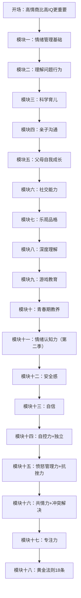

# 课程地图

## 学习路径

## 第一季：精读10本经典

### 模块一：情商教养基石（第01-02课）
| 书目 | 精读著作 | 核心主题 |
|------|----------|----------|
| 第01课 | 戈特曼《培养高情商的孩子》 | 情绪管理训练五步骤 |
| 第02课 | 戈特曼《培养高情商的孩子》 | 父亲参与力与家庭冲突管理 |

**核心能力**：觉察情绪 → 把握机会 → 倾听认可 → 帮助表达 → 解决情绪

### 模块二：应对暴脾气（第03-04课）
| 书目 | 精读著作 | 核心主题 |
|------|----------|----------|
| 第03课 | 格林《暴脾气小孩》 | 理解暴脾气的5个根本能力缺失 |
| 第04课 | 格林《暴脾气小孩》 | 合作式解决方案B方法实操 |

**核心理念**：暴脾气的孩子不是坏孩子，而是尚未具备应对挫折的能力

### 模块三：科学育儿（第05-06课）
| 书目 | 精读著作 | 核心主题 |
|------|----------|----------|
| 第05课 | 梅迪纳《让孩子的大脑自由》 | 孕期大脑发育与胎教真相 |
| 第06课 | 梅迪纳《让孩子的大脑自由》 | 培养聪明快乐宝宝的4+4方法 |

**核心发现**：夫妻关系质量是影响宝宝大脑发育的最关键因素

### 模块四：高效亲子沟通（第07-08课）
| 书目 | 精读著作 | 核心主题 |
|------|----------|----------|
| 第07课 | 法伯《如何说孩子才会听》 | 帮助孩子面对感受 + 鼓励合作5技巧 |
| 第08课 | 法伯《如何说孩子才会听》 | 代替惩罚的7个管教方法 |

**核心理念**：孩子的感受没有对错，行为可以有规范

### 模块五：父母自我成长（第09-10课）
| 书目 | 精读著作 | 核心主题 |
|------|----------|----------|
| 第09课 | 西格尔《由内而外的教养》 | 童年经验如何影响做父母的能力 |
| 第10课 | 西格尔《由内而外的教养》 | 安全感培养、情绪控制与亲子关系修复 |

**核心理念**：做好父母，从接纳自己开始

### 模块六：社交能力培养（第11-12课）
| 书目 | 精读著作 | 核心主题 |
|------|----------|----------|
| 第11课 | 科恩《如何培养孩子的社交商》 | 制定社交目标、发起交往、沟通技巧 |
| 第12课 | 科恩《如何培养孩子的社交商》 | 自信培养、应对嘲笑和被欺负 |

**核心理念**：人际关系比学习成绩更能预测未来的幸福感

### 模块七：乐观品格塑造（第13-14课）
| 书目 | 精读著作 | 核心主题 |
|------|----------|----------|
| 第13课 | 塞利格曼《教出乐观的孩子》 | 乐观三基础：掌控感、积极情绪、解释风格 |
| 第14课 | 塞利格曼《教出乐观的孩子》 | 乐观教养ABC法则与方法 |

**核心理念**：乐观不是自我麻醉，而是如何解释发生的事情

### 模块八：深度理解孩子（第15-16课）
| 书目 | 精读著作 | 核心主题 |
|------|----------|----------|
| 第15课 | 费利奥莎《理解孩子的语言》 | 理解孩子的7个关键问题 |
| 第16课 | 费利奥莎《理解孩子的语言》 | 帮助孩子克服胆小害怕的8个步骤 |

**核心理念**：孩子的情绪是一种语言，等待父母去解读

### 模块九：游戏教育（第17-18课）
| 书目 | 精读著作 | 核心主题 |
|------|----------|----------|
| 第17课 | 科恩《游戏力》 | 游戏力基础与10大原则 |
| 第18课 | 科恩《游戏力》 | 自信、抗挫、乐观、害羞等情境游戏 |

**核心理念**：游戏是孩子主要的沟通方式，会玩就会教育

### 模块十：青春期教养（第19-20课）
| 书目 | 精读著作 | 核心主题 |
|------|----------|----------|
| 第19课 | 尼尔森《十几岁孩子的正面管教》 | 理解青春期 + 四种养育风格 |
| 第20课 | 尼尔森《十几岁孩子的正面管教》 | 情感连结7方法 + 学习压力应对 |

**核心理念**：青春期孩子已是成年人，用对待成人的方式沟通

---

## 第二季：十大情商力系统培养

### 模块十一：情绪认知力（第21-23课）
| 课程 | 核心主题 |
|------|----------|
| 第21课 | 第二季导论——情商培养与十大情商力概览 |
| 第22课 | 情绪是生存机制、沟通工具、情绪粒度概念 |
| 第23课 | 情绪理解力三部分 + 培养方法 |

**核心理念**：情绪是本能，情商是本领

### 模块十二：安全感（第24课）
| 课程 | 核心主题 |
|------|----------|
| 第24课 | 安全型依恋 vs 不安全型依恋、粘人应对 |

**核心理念**：3岁前有哭必应，情绪回应不等于溺爱

### 模块十三：自信（第25课）
| 课程 | 核心主题 |
|------|----------|
| 第25课 | 伤害自信的教养方式、扎实自信培养方法 |

**核心理念**：自信来自"我能"的体验，而非"你真棒"的评价

### 模块十四：自控力与独立（第26-27课）
| 课程 | 核心主题 |
|------|----------|
| 第26课 | 自控力大脑基础、延迟满足、游戏训练 |
| 第27课 | 独立性发展阶段、放手与选择权 |

**核心理念**：自控力是独立性的基础，独立是自信的延伸

### 模块十五：愤怒管理与抗挫力（第28-29课）
| 课程 | 核心主题 |
|------|----------|
| 第28课 | 愤怒管理四步法、公共场合发脾气应对 |
| 第29课 | 输不起的原因、成长型心态、抗挫培养 |

**核心理念**：愤怒不是坏情绪，不会管理愤怒才是问题

### 模块十六：共情力与冲突解决（第30-31课）
| 课程 | 核心主题 |
|------|----------|
| 第30课 | 镜像神经元、共情力培养方法 |
| 第31课 | ICPS训练法、冲突解决四步法 |

**核心理念**：冲突不是坏事，不会处理冲突才是坏事

### 模块十七：专注力（第32课）
| 课程 | 核心主题 |
|------|----------|
| 第32课 | 电子产品三原则、专注力培养方法 |

**核心理念**：最好的育儿神器是父母自己，不是iPad

### 模块十八：黄金法则（第33-36课）
| 课程 | 涵盖法则 |
|------|---------|
| 第33课 | 法则1（先处理心情）、法则2（越激动越冷静）、法则4（说情绪）、法则5（纵向比较） |
| 第34课 | 法则6（情绪质量）、法则7（接纳情绪）、法则10（批评行为）、法则11（关注积极） |
| 第35课 | 法则8（常问感受）、法则9（高质量陪伴）、法则12（不数落）、法则14（顾问式沟通） |
| 第36课 | 法则17（建设性批评）、法则18（表扬特质）、法则13（夫妻不吵架）、法则15（不说但是）、法则16（真诚倾听） |

**核心理念**：先处理心情，再处理事情

## 推荐阅读顺序

1. 按课程编号 **01→36** 顺序学习最系统
2. 如有特定困扰（如暴脾气、青春期），可直接跳至对应模块
3. 每完成一个模块，建议至少实践1周再进入下一模块