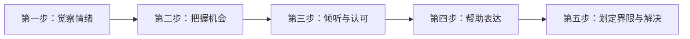

# 第01课：情绪管理训练五步骤——读懂孩子的情绪密码

## Learning Objectives
- 理解父母面对孩子情绪的两种反应类型及其影响
- 掌握情绪管理训练型家长的五大核心步骤
- 学会觉察自己和孩子的情绪，将情绪化瞬间转化为教育机会

## 核心概念

### 父母的两种类型

约翰·戈特曼（John Gottman）博士的研究发现，面对孩子情绪时，父母可分为两大类：

| 类型 | 特征 | 结果 |
|------|------|------|
| **忽视型家长** | 忽略、否定或压抑孩子的情绪 | 孩子缺少应对消极情绪的榜样，情感上疏远父母 |
| **情绪管理训练型家长** | 接纳并理解孩子的情绪，把情绪化瞬间当作教育机会 | 孩子更健康、学习成绩更好、人际关系更佳、抗挫力更强 |

> [!TIP] 关键洞察
> 情绪不是来为难父母的，而是孩子的一种**沟通方式**。当孩子有情绪时，他其实是在说："我有话想说，请理解我。"

### 情绪管理训练五步骤

## 深入讲解

### 第一步：觉察情绪

父母要先觉察**自己的情绪**，再觉察**孩子的情绪**。许多家长只盯着孩子"哪里不对"，却忘了看看自己——结果自己情绪失控时，难以关注孩子的心情。

> 案例：一位父亲抱怨孩子在学校打人，结果发现孩子只是模仿了父亲生气时的行为。

### 第二步：把握机会

情商教练面对孩子的负面情绪时，大脑中的第一个念头是：**机会来了**。每一次孩子伤心、生气、害怕，都是教孩子处理情绪的最佳时机。

### 第三步：倾听与认可

带着同理心积极倾听，而不是说"别哭了"或"你不该这么想"。用"你是说……你觉得……是吗？"的句式反馈，让孩子感到被理解和重视。

### 第四步：帮助表达情绪

帮孩子为情绪"贴标签"——把含混不清的不适感转化为有界限、可定义的情绪词汇（生气、失望、担心等）。研究发现，**为情绪命名能安抚大脑神经系统**，帮孩子更快从不愉快中恢复。

### 第五步：划定界限与解决

先理解并接纳情绪（安抚情绪脑），再讨论解决方案（激活理性脑）。建立"绿灯-黄灯-红灯"行为规则，让孩子在规则框架内思考更好的做法。

> [!WARNING] 常见误区
> 很多父母急于跳过前四步直接进入"解决问题"环节。但在孩子情绪尚未被接纳和理解之前，理性脑无法正常工作——跳过共情的"解决方案"只会引来更大的情绪反弹。

## 实用方法

### 共情倾听三步法

1. **重复确认**："你是说……对吗？"
2. **命名情绪**："你感到很生气/失望/难过，因为……"
3. **接纳不评判**："我理解你的感受。"

### 建立行为规则体系

| 颜色 | 含义 | 示例 |
|------|------|------|
| 绿灯行为 | 被鼓励的行为 | 用语言表达情绪 |
| 黄灯行为 | 不被鼓励但可接受 | 短暂独处冷静 |
| 红灯行为 | 绝对不允许 | 打人、摔东西 |

## 实践练习

> [!QUESTION] 思考题
> 当孩子因为爸爸答应带他出去玩却因出差失约而大发脾气时，你会如何运用情绪管理训练五步骤来应对？

参考答案

1. **觉察**：注意到孩子在生气，同时觉察自己可能因孩子的脾气而感到烦躁
2. **机会**：告诉自己"这是一个教孩子处理失望情绪的好机会"
3. **倾听与认可**："爸爸答应带你出去玩却没有做到，你感到很失望，对吗？"
4. **帮助表达**："你现在的感觉是生气？还是失望？或者两者都有？"
5. **划定界限与解决**："生气是可以的，但摔东西是红灯行为。我们一起来想想，除了发脾气，还有什么办法可以让爸爸知道你的感受？比如写一封信给爸爸？"

## 总结

情绪管理训练的核心不在于"解决问题"，而在于**先连接、再引导**。当父母能够觉察情绪、把握机会、倾听认可、帮助表达、引导解决，孩子就能在每一次情绪波动中学会受益一生的情商能力。正如戈特曼博士所言——父母是孩子最重要的情商教练。

## 延伸阅读
下一课：[[../lessons/0002-父亲参与力与家庭冲突管理|第02课：父亲参与力与家庭冲突管理]]