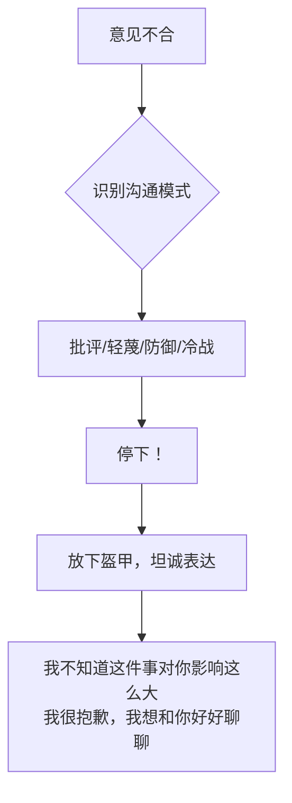

# 第02课：父亲参与力与家庭冲突管理

## Learning Objectives
- 认识父亲参与对孩子情商发展的独特价值
- 学会四大婚姻杀手的识别与应对
- 掌握减少家庭冲突对孩子伤害的四个关键原则

## 核心概念

### 父亲参与力的重要性

戈特曼博士的研究发现，**父亲与孩子的互动方式更能预测孩子未来的学习成绩和人际交往能力**。一项从5岁跟踪到40多岁的研究显示：有父亲陪伴和支持的孩子，长大后更有同理心、人际关系更好、婚姻更幸福。

> [!TIP] 关键洞察
> 原因在于：母亲陪伴往往偏安静、照顾型活动；而父亲陪伴则倾向于**高体能、高刺激的互动**（举高高、躲猫猫、追逐游戏），让孩子在游戏中经历紧张、兴奋、害怕等多种情绪，并学习"放得开、收得住"的情绪调节能力。

### 父亲参与的三个原则

1. **从孕期开始参与**：怀孕时多关心妻子情绪，孩子出生后更愿意主动照顾
2. **参与孩子的日常生活**：不是"孩子陪爸爸打高尔夫"，而是爸爸进入孩子的世界——早餐、生日派对、儿童乐园
3. **不论婚姻状况如何，坚持不缺席**：即使夫妻关系紧张或离婚，父亲也要坚持做孩子的情商教练

## 深入讲解

### 四大婚姻杀手

戈特曼博士通过"爱情实验室"研究发现，夫妻吵架时以下四种沟通模式对婚姻的破坏力最大：

| 杀手 | 表现 | 危害 |
|------|------|------|
| **批评** | 人身攻击（"你从来不负责任"） | 对方感觉被否定，停止理性沟通 |
| **轻蔑** | 轻视、不屑的表情和言语 | 对婚姻伤害比激烈争吵更大 |
| **防御** | 推卸责任、找借口、相互指控 | 双方都不愿面对问题 |
| **冷战（石墙）** | 不理不睬、拒绝沟通 | 比吵架对婚姻伤害更大 |

> [!WARNING] 常见误区
> 许多父母以为"孩子还小听不懂，吵架没关系"。但研究表明：**3-6个月的婴儿**就能对父母争执产生生理反应（心跳加快、身体扭动）；**6个月熟睡中的宝宝**，听到父母吵架时大脑压力荷尔蒙也会上升。

### 减少冲突伤害的四个关键

1. **不要把孩子当武器**：不拿"不让你见孩子"来威胁对方
2. **不要让孩子传话**：不让孩子在父母之间传递吵架内容
3. **和好时让孩子知道**：若在孩子面前吵架，也要让孩子看到和解的过程——"我们刚刚谈明白了，已经没事了"
4. **帮孩子找情绪支持网络**：如果夫妻关系紧张，可以为孩子找信任的叔叔阿姨、老师作为额外的情绪支持

## 实用方法

### 避免婚姻杀手的沟通技巧

### 冲突后和解四步骤

1. 先冷静下来
2. 双方坦诚说出各自的想法
3. 达成解决方案
4. 走到孩子面前说："爸爸妈妈刚才说话太大声了，但我们已经谈明白了，没事了"

## 实践练习

> [!QUESTION] 思考题
> 你和伴侣发生意见不合时，最容易出现四大婚姻杀手中的哪一个？你打算用什么具体方法来避免这种沟通模式？

参考答案

最容易出现的模式因人而异：
- 如果容易**批评**：练习用"我觉得……"代替"你就是……"
- 如果容易**轻蔑**：退后一步，全面看待对方的优点
- 如果容易**防御**：听到批评先深呼吸，说"我想听听你的想法"
- 如果容易**冷战**：说不出口就写下来，用文字代替沉默

关键是，意识到模式本身就是改变的开始。

## 总结

父亲参与不是可有可无的锦上添花，而是影响孩子情商发展的关键因素。同时，家庭冲突不可避免，但重要的是**怎么吵、吵完之后怎么做**——让孩子看到冲突可以被理解、被化解，本身就是最好的情商教育。

## 延伸阅读
上一课：[[../lessons/0001-情绪管理训练五步骤|第01课：情绪管理训练五步骤]]
下一课：[[../lessons/0003-理解暴脾气孩子的根本原因|第03课：理解暴脾气孩子的根本原因]]