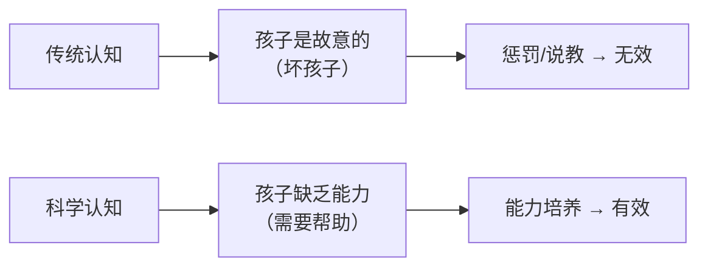
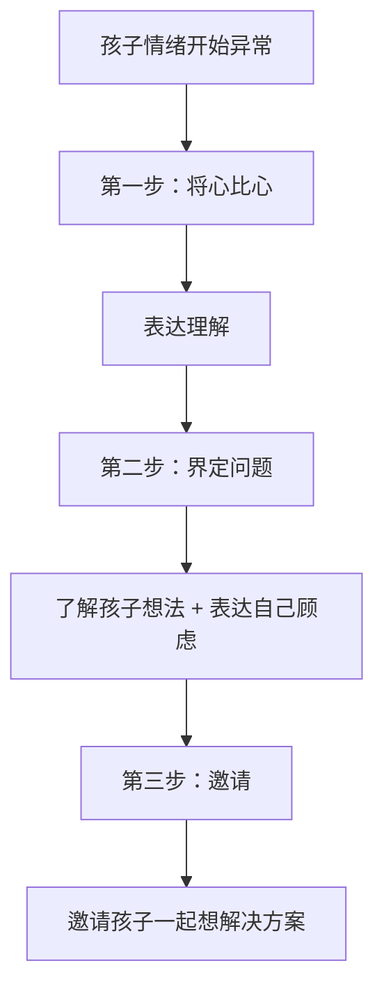

# 第03课：理解暴脾气孩子的根本原因

## Learning Objectives
- 打破"暴脾气孩子就是坏孩子"的认知误区
- 理解暴脾气孩子所缺乏的五种核心能力
- 掌握观察情绪导火索的方法和合作式解决法的初步框架

## 核心概念

### 重新定义暴脾气

哈佛医学院儿童心理学家罗斯·格林（Ross Greene）教授指出：**暴脾气的孩子不是不愿意做乖小孩，而是还没有能力做乖小孩。**

> [!TIP] 关键洞察
> 孩子的心声不是"我能但我偏不做"，而是"如果我有能力我就会做了，但我现在还不知道该怎么做"。

### 暴脾气孩子的两个显著特征

1. **缺乏灵活性（变通力差）**：难以从自己的计划切换到他人的计划
2. **难以忍受挫败感**：一旦受挫，情绪反应特别强烈

## 深入讲解

### 暴脾气孩子缺乏的五种能力

| 能力 | 表现 | 例子 |
|------|------|------|
| **执行能力** | 难以从一个情境转移到另一个情境 | 下课还在跑跳，上课了静不下来 |
| **语言处理能力** | 无法理解和表达自己的情绪 | 挫败时说"我恨你"而非"我很失望" |
| **情绪管理能力** | 积压情绪后因小事爆发 | 在学校受委屈，回家因小事爆发 |
| **认知灵活能力** | 固执于固定做法，抗拒变化 | 认定的做事方式不能改 |
| **人际交往能力** | 难以解读他人意图 | 同学拍他，直接打回去而非判断是否善意 |

> 格林教授用了一个生动的比喻：没有语言能力的小狗，被踩到后只有三种反应——**冲你叫、咬你、逃跑**。孩子缺乏情绪语言能力时，反应也差不多——骂人、动手、拒绝沟通。

> [!WARNING] 常见误区
> 父母常犯的错误是认为孩子"可以做到但不想做"，于是采取打骂、说教、奖励、惩罚等方法。但这些方法的前提是"孩子有能力做到"——如果孩子缺乏能力，这些方法全部无效。

### 情绪爆发的导火索

每个孩子都有固定的发脾气模式：
- 肚子饿的时候
- 等人等得不耐烦的时候
- 读书写字遇到困难的时候
- 无聊的时候
- 筋疲力尽的时候

找到这些规律，就能在孩子爆发前做"降温"处理。

## 实用方法

### 积极合作式问题解决法（三步骤）

这是格林教授提出的核心方法，三个步骤为：

#### 详细说明

**第一步：将心比心（共情）**
- 不说"为什么不吃药"，而说"我知道了，你不想吃药"
- 真诚倾听，先接纳再引导

**第二步：界定问题**
- 从"立场之争"（你要去学校 vs 我不要去）转到"想法讨论"
- 了解孩子想法：你不想吃药，因为太苦了对吗？
- 表达自己顾虑：但妈妈担心你不吃药会继续发烧

**第三步：邀请解决方案**
- 问孩子："你觉得我们怎么做比较好？"
- 如果孩子说"不知道"，爸妈给出选择题
- 培养孩子找到替代方案的能力，提升灵活度和抗挫力

## 实践练习

> [!QUESTION] 思考题
> 请你回想一下，你的孩子在哪些特定情境下最容易发脾气？试着列出3个固定的"导火索"，并思考下一次你可以如何提前预防？

参考答案

例如：孩子在外玩耍精疲力尽后特别容易爆发。那么你可以：
1. 提前预警："我们再玩10分钟就要回家了哦"
2. 快结束时启动B方法："我知道你不想回家，还想继续玩对吗？"
3. 给孩子过渡时间，而不是突然喊停

了解导火索不是为了回避，而是为了在孩子情绪升温时**第一时间启动正确的应对方式**。

## 总结

改变对暴脾气孩子的误解，是有效帮助的第一步。当父母从"孩子故意捣蛋"的思维转变为"孩子需要能力帮助"的思维时，就不再与孩子为敌，而是与孩子共同面对问题。这正是格林教授"合作式解决法"的核心精神——**不是替孩子解决问题，而是和孩子一起解决问题**。

## 延伸阅读
上一课：[[../lessons/0002-父亲参与力与家庭冲突管理|第02课：父亲参与力与家庭冲突管理]]
下一课：[[../lessons/0004-合作式解决方案B方法实操|第04课：合作式解决方案B方法实操]]