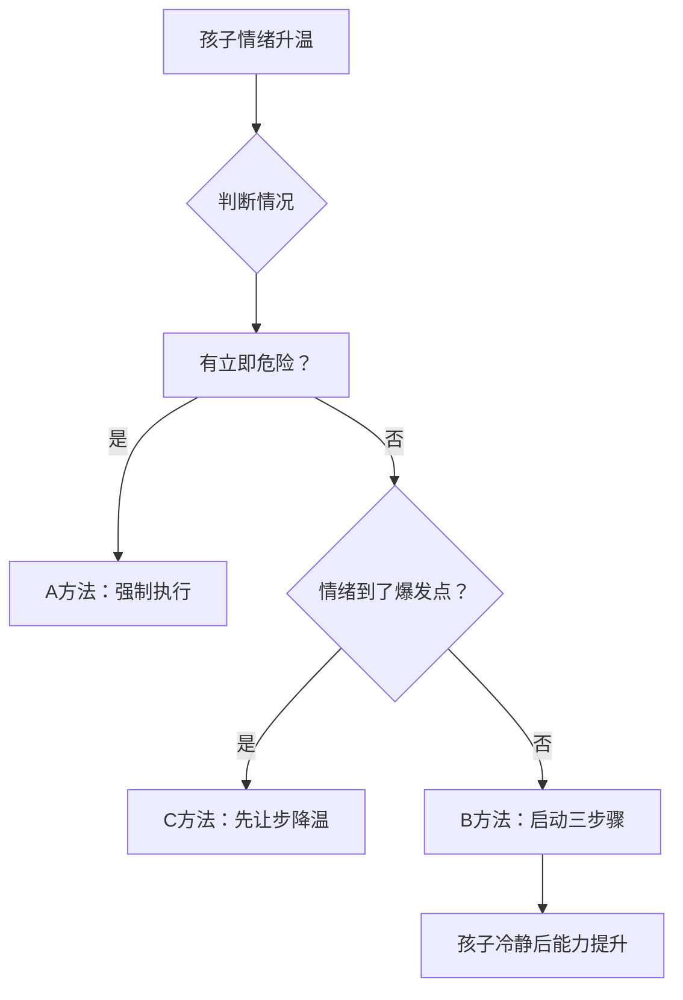

# 第04课：合作式解决方案B方法实操

## Learning Objectives
- 区分ABC三种方法的适用场景
- 掌握B方法三个步骤的实操细节
- 学会在情绪爆发临界点精准启动B方法

## 核心概念

### 三种方法（ABC）的选择策略

格林教授提出的应对暴脾气孩子的三种方法：

| 方法 | 名称 | 做法 | 适用时机 |
|------|------|------|----------|
| **A方法** | 强制法 | 父母强制执行自己的意愿 | 有立即危险时（如孩子冲向马路） |
| **B方法** | 合作式解决法 | 共情→界定问题→邀请方案 | 孩子情绪刚开始加温时（最常用） |
| **C方法** | 暂时让步 | 先按孩子的意思来 | 孩子情绪已全面爆发、无法理性沟通时 |

> [!TIP] 关键洞察
> 很多父母只在A和C之间切换——先是强制（A），无效后放弃（C），却从未尝试B方法。B方法才是帮助暴脾气孩子提升能力的核心方法。

## 深入讲解

### B方法的第一步：将心比心（共情）

**关键动作**：真诚地说出孩子的想法
- 孩子说"我不要回家" → "嗯，你不想回家"
- 孩子说"我还要打游戏" → "你还要继续打游戏对吧"

**常见错误**：听到孩子的话后立刻反驳——"你怎么能不回家呢？"

> 为什么要先共情？孩子情绪激动时，大脑的"杏仁核"（情绪中枢）非常活跃。**被理解和被尊重，是杏仁核安静下来的最快捷径**。孩子感到"爸妈听懂我了"，才会愿意听爸妈接下来要说什么。

### B方法的第二步：界定问题

**关键动作**：从"立场之争"转向"原因探讨"
- 问："你不想回家，为什么呢？"
- 如果孩子说不出原因 → 帮他说："你一下子不知道怎么说对吗？我们来猜猜看……"
- 教孩子"急救话"：**"我需要等一下""我不知道怎么说""这跟我想的不一样"**

> [!EXAMPLE] 亲子暗号技巧
> 和孩子约定一个秘密手语——比如举起右手小拇指代表"我不知道该怎么说"。孩子一举手，爸妈就懂了。这能大大减少情绪升级。

**表达父母自己的想法**：在理解孩子之后，也要说出自己的顾虑和原因——"我们答应了爷爷奶奶要回家吃晚饭"。

### B方法的第三步：邀请解决方案

**关键动作**：邀请孩子一起想双赢方案
- 问："你觉得我们怎么做比较好呢？"
- 如果孩子说"不知道" → 爸妈给选择题
- **不要预设答案**：不要心里已经想好"反正就是要回家"——这样就回到了A方法

> [!WARNING] 常见误区
> "B方法太花时间了，不如直接强制来得快。"事实恰恰相反：不用B方法→孩子大爆发→处理爆发的时间远多于B方法→亲子关系受损→下次爆发更强。B方法不是浪费时间，而是最值得的时间投资。

## 实操演练

### 场景：孩子玩iPad不想吃饭

**第一步（共情）**：
"我理解你现在不想吃饭，还想继续打游戏。"

**第二步（界定问题）**：
"你不想吃饭，但一下子说不出来原因对吗？是不是因为快要过关了，不舍得放下？"
"我们全家要一起吃饭，这是我们的家规。现在怎么办呢？"

**第三步（邀请）**：
"你觉得怎么做比较好？"
"方法一：再玩5分钟，然后去吃饭；方法二：现在去吃饭，明天多玩5分钟。你选哪个？"

> 如果事先约定了游戏时间，请在时间到前**5-6分钟提醒**，让孩子有心理准备。

## 实践练习

> [!QUESTION] 思考题
> 假设场景：孩子在学校和同学打架了，回家后情绪很差。你刚开口问"今天在学校怎么样"，他就大声喊道"不要你管！"——此时此刻，你会选择A、B、C哪种方法？具体怎么做？

参考答案

这种情况建议从**C方法**切入（情绪已爆发/接近爆发），先不做任何教育：

1. **先降温**："好，你先静一静，等你准备好了我们再聊。"
2. 等孩子情绪平复后，**启动B方法**：
   - 共情："今天在学校是不是发生了让你很不开心的事？"
   - 界定问题："能告诉我发生什么了吗？"或"是不是有人做了让你生气的事？"
   - 邀请："我们一起来看看，下次遇到这种情况可以怎么做？"

关键：不急着在情绪爆发时讲道理，先连接再引导。

## 总结

B方法的精髓不在"技巧"而在**心态**——父母需要暂时放下"我是爸妈你必须听我的"的权威思维，真正去理解孩子。每一次B方法的成功执行，都在帮助孩子提升灵活度和抗挫力。坚持使用，暴脾气的孩子会逐渐学会用语言代替情绪爆发，用思考代替冲动。

## 延伸阅读
上一课：[[../lessons/0003-理解暴脾气孩子的根本原因|第03课：理解暴脾气孩子的根本原因]]
下一课：[[../lessons/0005-胎教真与孕期大脑发育|第05课：胎教真与孕期大脑发育]]