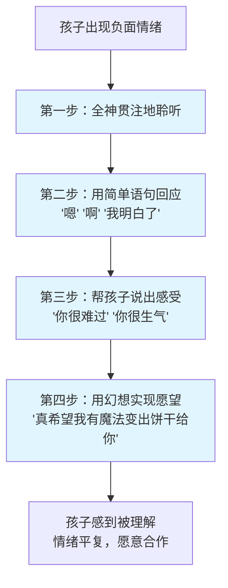

# 第07课：如何说孩子才会听——沟通的艺术

## 学习目标
- 学会接纳孩子感受的四个技巧，帮助孩子面对负面情绪
- 掌握鼓励孩子合作的五种沟通方法
- 理解"合作"与"听话"的根本区别
- 避免常见的破坏性沟通方式

## 核心概念

### 亲子沟通的根本困境

> **孩子不听话，往往是因为父母不懂得怎么说话。**

父母常见的破坏性沟通方式：

| 方式 | 例子 | 后果 |
|------|------|------|
| 责备 | "你怎么又打人了？跟你说几遍了！" | 引发防御和对抗 |
| 骂人/贴标签 | "你怎么这么懒！" | 内化负面自我认知 |
| 威胁 | "你再打游戏试试，我把电脑砸了！" | 恐惧而非理解 |
| 说教 | 长篇大论讲道理 | 左耳进右耳出 |
| 比较 | "你看看别人，再看看你" | 产生嫉妒和自卑 |
| 灾难预言 | "学习这么差，这辈子没出息了" | 自我实现预言 |

> [!TIP] 关键洞察
> 亲子沟通的目标不是**让孩子听话**（因害怕而服从），而是**鼓励孩子合作**（因理解而行动）。合作才能培养孩子自己做决定、自己改变的能力。

## 深入讲解

### 为什么首先要接纳感受？

孩子有负面情绪时，父母常犯的错误是直接否认或转移：
- "别哭了"、"没什么好生气的"
- 急于给建议："你应该这样做..."

正确的做法是接纳感受，原因有三：
1. 孩子是独立的个体，当然有权利拥有自己的感受
2. 感受没有对错之分，**行为可以有规范**，但感受永远值得被理解
3. 当孩子感受到被理解，才有能力集中精力去改变自己的心情

> [!WARNING] 常见误区
> 很多父母担心："我说出孩子的心情（如'你很难过'），他会不会更伤心了？"
> 事实正好相反——被理解的感觉让人安慰，孩子反而更有力量面对负面情绪。

## 实用方法

### 技巧一：帮助孩子面对感受的四个步骤

**第一步：全神贯注地聆听**
- 放下手机、关掉电脑，看着孩子的眼睛
- 实在忙可以说："我非常想听，请给我10秒钟处理好这个"

**第二步：用简单语句回应**
- 心理咨询师三句话：**"嗯"、"啊哈"、"你觉得呢？"**
- 不要急于提问或给建议（"为什么丢了？""下次小心点"）

**第三步：帮孩子说出感受**
- 像镜子一样反射孩子的情绪：
  - 不好的做法："别难过了，不就是一个朋友吗？"
  - 好的做法："你是说今天好朋友有了新朋友，你觉得很难过，是吗？"

**第四步：用幻想方式实现愿望**
- 适合年幼孩子，用夸张幽默化解冲突：
  - 孩子："我想吃饼干！" 
  - 爸妈："真希望我有魔法变出饼干，你想要什么口味？我们自己发明一些世界上没有的口味！"

### 技巧二：鼓励孩子合作的五种方法

| 方法 | 不好的做法 | 好的做法 |
|------|-----------|---------|
| 1. 描述问题 | "你又把桌子弄得乱七八糟！" | "我看到桌上杯盘狼藉，没有被收拾" |
| 2. 提示做法 | "你房间乱得跟猪窝一样" | "这些书请你放回书架上" |
| 3. 用简单词语 | 长篇大论忘记带作业 | 只说："亲爱的，作业"（两个字就够了） |
| 4. 说出感受 | "你怎么老打断我，真讨厌" | "当我在跟别人说话时被打断，我非常不喜欢这种感觉" |
| 5. 用写的不用说的 | 当面唠叨 | 写便条："我知道你很喜欢打游戏。记得我们的约定：写完作业再玩。" |

**便条小技巧**：宝宝看不懂字就画出来，折成纸飞机"飞"给孩子，引发好奇和配合。

> [!TIP] 实用建议
> 当亲子沟通已经僵化到一开口就吵架的程度，最好的办法不是继续说，而是**开始写**。写便条能避免过去的情绪干扰当下的沟通，让孩子更心平气和地接受父母的想法。

## 实践练习

> [!QUETION] 思考题
> 1. 回想最近一次孩子闹情绪的场景，你当时是怎么回应的？如果用今天学到的"四个步骤"重新处理，你会怎么说？
> 2. 你平时最常用的"破坏性沟通方式"是哪一种（责备、威胁、说教、比较、灾难预言）？试着觉察并记录一周内使用这种方式的次数。
> 3. 练习"用写的不用说的"：针对孩子目前一个让你困扰的行为，写一张不超过30字的便条（参考格式：先理解感受 + 再说建议）。

参考答案

**思考题1参考**：例如孩子因为玩具被抢而大哭，以前可能说"别哭了，有什么好哭的"或"让他玩一下又不会怎样"。现在可以：蹲下来看着孩子说（全神贯注）"嗯"（简单回应），"玩具被抢走了，你觉得很生气很委屈，是吗？"（说出感受），然后"真希望我们有魔法玩具，你一个、他一个，永远不用抢"（幻想实现）。

**思考题2参考**：觉察是改变的第一步。每位父母都有自己习惯的"自动化反应模式"，一旦觉察到，就可以有意识地替换为今天学到的五种方法。

**思考题3参考**：便条示例："妈妈知道你很喜欢打游戏，打游戏很有趣。但我们约定好每天30分钟，已经超时了，请关机。爱你的妈妈"。贴上便利贴在电脑上。

## 总结

亲子沟通的核心不是让孩子"听话"，而是让孩子"合作"。当孩子有情绪时，先接纳感受（全神贯注聆听、简单回应、说出感受、幻想实现），再引导行为（描述问题、提示做法、简单词语、说出感受、写便条）。记住一个重要的心态转变：**比知道更重要的是做到**，从今天开始练习这些技巧，亲子关系将大为改善。

## 延伸阅读
下一课：[[../lessons/0008-代替惩罚的7个有效管教方法|第08课：代替惩罚的7个有效管教方法]]