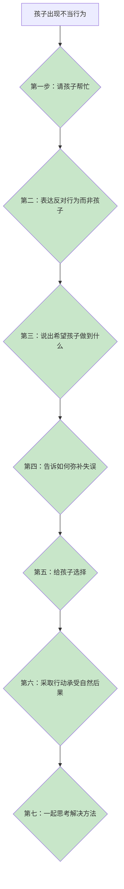

# 第08课：代替惩罚的7个有效管教方法

## 学习目标
- 理解为什么惩罚不是有效的管教方式
- 学会区分"惩罚"与"承受自然后果"
- 掌握七个替代惩罚的有效管教技巧
- 学会用头脑风暴法帮助孩子自己找到解决方案

## 核心概念

### 惩罚 vs 自然后果

| | 惩罚 | 自然后果 |
|------|------|---------|
| 定义 | 故意剥夺孩子权利或增加痛苦来教训他 | 让孩子承受自己不当行为产生的自然结果 |
| 示例 | "不好好吃饭就不准打游戏" | "晚餐15分钟后收桌，没吃够就饿肚子" |
| 心理影响 | 孩子关注"你好讨厌"，而非反思自己行为 | 孩子关注"我的行为导致了什么结果" |
| 教育效果 | 剥夺反思机会，下次照犯 | 促使孩子思考并改善行为 |

### 为什么不该打骂孩子？

1. **增加暴力行为**：打孩子是最糟糕的暴力示范——三岁被打的孩子，五岁时行为明显更暴力
2. **伤害性格发展**：被打的孩子容易敏感、自卑、情绪不稳定，内心充满愤怒
3. **根本原因**：**孩子是另一个人**——没有任何人可以理所当然地去打另一个人

> [!TIP] 关键洞察
> 教育的真正目标不是培养出一个**因为害怕而服从**的孩子，而是培养一个**有能力理解思考、做出更好行为决定**的孩子。惩罚让孩子的注意力从"我做错了什么"转移到"你对我做了什么"，完全剥夺了反思成长的机会。

## 深入讲解

### 惩罚为什么不管用？

当父母使用惩罚时，孩子大脑在想什么？
- 不是："我做错了，我要反思和改正"
- 而是："好讨厌，你又这样对我" / "我不能打游戏了，好难过"

惩罚把孩子的注意力从**关注错误行为**转移到**关注未来损失**，孩子没有机会思考"我为什么会这样"以及"下次该如何做"。

### 打孩子的残酷真相

> 2016年反家暴法通过后，众多学者呼吁：**请爸妈再也不要"以爱的名义"伤害自己的孩子。**

重要的事情说三遍：**不打孩子、不打孩子、不打孩子。**

## 实用方法

### 替代惩罚的七个技巧

以"孩子在超市乱跑"为例：

**技巧一：请孩子帮忙**
- 惩罚式："你给我住手，再不听话我打你了！"
- 替代式："亲爱的，请你去帮我拿三个苹果。"
- 原理：与其告诉孩子不要做什么，不如告诉他可以做什么

**技巧二：对行为而非孩子表达反对**
- 惩罚式："你这孩子怎么这么调皮捣蛋，真是讨厌死了！"
- 替代式："我不喜欢你在超市跑来跑去，这样很危险，也会打扰别人。"
- 原理：反对行为，不攻击人格

**技巧三：说出希望孩子做到什么**
- 惩罚式：一直骂却不说该怎么做
- 替代式："我需要你停下来，跟着我的购物车一起往前走。"
- 原理：明确告诉孩子你的具体要求

**技巧四：告诉孩子如何弥补失误**
- 当饮料打翻时："请你自己想办法把地上擦干净。"
- 原理：让孩子为自己的行为负责，找到弥补方法

**技巧五：给孩子选择**
- "亲爱的，现在你有两个选择：一、跟着购物车好好走；二、我们现在就回家。请问你选哪一个？"
- 孩子说"都不要"时，温和坚定地重复两个选项
- 原理：在可接受的范围内，让孩子自己做决定

**技巧六：采取行动，让孩子承受自然后果**
- 如果孩子选了"跟着走"却又乱跑，平静地说："我理解了，你选择了回家。我们现在就走。"
- 后续：下次上超市不带他，心平气和地解释原因
- 原理：让孩子体验选择带来的自然结果（不是惩罚）

> [!WARNING] 常见误区
> 执行"自然后果"时**千万不能动气**。如果带着怒气说"你看你上次乱跑，谁要带你上街啊"，这就又变成了惩罚。关键是心平气和地让孩子体验自然结果。

**技巧七：一起思考解决方法（五步头脑风暴法）**

当事情过后，找个合适的时间和孩一起回顾：

| 步骤 | 做法 | 话术 |
|------|------|------|
| 1 | 了解孩子的感受和需求 | "你昨天为什么想在超市跑来跑去？" |
| 2 | 说出父母的感受和需求 | "我看不到你会担心，也怕你打扰别人" |
| 3 | 邀请孩子一起讨论 | "我们来想想有什么方法可以解决这个问题？" |
| 4 | 写下所有可能的方法，不做评判 | 无论多离谱都写下来 |
| 5 | 讨论并找出双赢方案 | "你觉得哪些方法可以删掉？" |

> [!TIP] 真实案例
> 有位妈妈用这个方法后，孩子自己想出的方案："下次去超市，爸妈先带我逛15分钟看新鲜的东西，满足好奇心，然后妈妈再推购物车买东西，我就乖乖跟着走。"这个方法比任何惩罚都有效，而且是孩子自己想出来的！

## 实践练习

> [!QUETION] 思考题
> 1. 回想一个你最近对孩子使用惩罚的场景，如果用今天学的七个方法之一来替代，你会怎么做？
> 2. 你平时会打孩子吗？如果会，读完今天的内容，你有什么新的认识？
> 3. 选择一个孩子反复出现的"问题行为"，用"五步头脑风暴法"和孩子坐下来一起找解决方案，记录下孩子提出的让你惊喜的答案。

参考答案

**思考题1参考**：例如孩子打游戏不写作业，以前可能说"再打就没收iPad"（惩罚）。现在可以：说出希望（"我希望你九点前写完作业"）→ 给选择（"现在写还是吃完晚饭写？"）→ 让孩子弥补（"没写完怎么办？明天早起还是和老师说？"）→ 承受自然后果（第二天被老师批评后进行反思讨论）。

**思考题2参考**：打孩子不是管教而是伤害——这是最重要的认知转变。被打了的孩子学到的不是"我做错了"，而是"谁拳头大谁就有理"。如果过去打过孩子，可以找个时间真诚地向孩子道歉，表达自己正在学习更好的教育方法。

**思考题3参考**：当你真诚地邀请孩子参与解决问题时，孩子常常能给出出人意料的创造性方案。因为孩子比我们更了解自己的需求和困难，只是平时没有机会表达。

## 总结

惩罚不是有效的管教方式——它剥夺了孩子反思的机会，破坏了亲子关系，甚至教会孩子用暴力解决问题。七个替代方法（请孩子帮忙、反对行为而非孩子、说出期望、弥补失误、给选择、承受自然后果、共同思考解决方案）构成了完整的不惩罚管教体系。其中最关键的是**五步头脑风暴法**，它能让孩子从被动服从转变为主动解决问题的主人。

## 延伸阅读
下一课：[[../lessons/0009-由内而外的教养|第09课：由内而外的教养——童年经验如何影响做父母]]