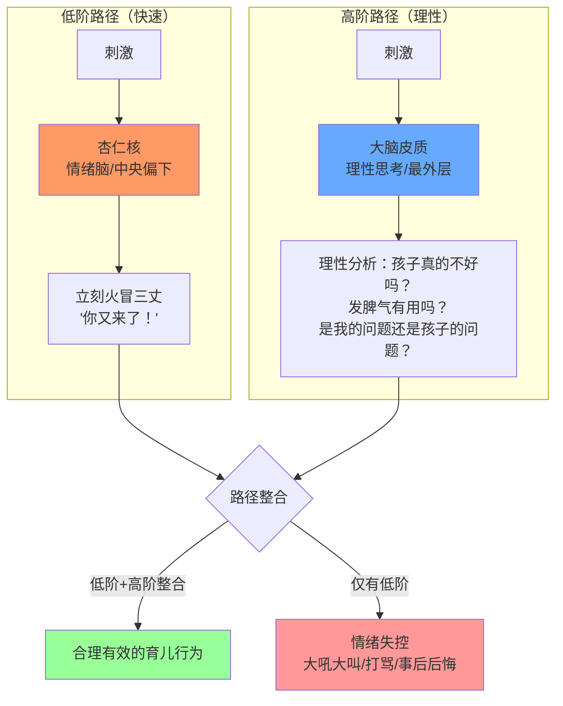
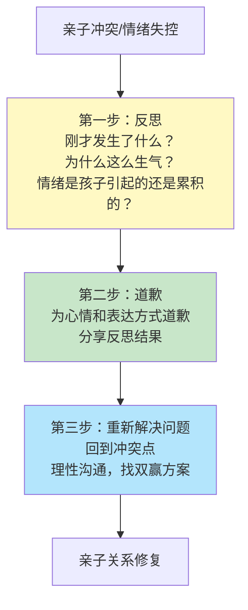

# 第10课：情绪控制、安全感培养与亲子关系修复

## 学习目标
- 理解四种依恋类型及其对孩子一生的影响
- 掌握培养孩子安全感的核心方法
- 了解父母情绪失控的大脑机制及应对策略
- 学会用"反思-道歉-重新解决问题"三步法修复亲子关系

## 核心概念

### 四种依恋类型

Mary Ainsworth的"婴儿陌生情境实验"——妈妈带一岁宝宝进入有玩具的房间，陌生人进入，妈妈离开三分钟，观察宝宝反应：

| 依恋类型 | 宝宝表现 | 爸妈的教养模式 | 未来影响 |
|---------|---------|---------------|---------|
| **安全型** | 妈妈离开时焦虑，回来时冲上去拥抱，得到安慰后继续玩 | 及时关注情绪、积极回应需求 | 内心有安全感，愿探索世界，人际关系良好 |
| **回避型** | 妈妈在与不在无所谓，回来时视而不见 | 忽视孩子需求，哭了不理 | 形成"拒绝型"成人依恋，对情绪不敏感，关系疏离 |
| **矛盾型** | 妈妈回来时想靠近又退缩，难被安慰 | 心情好时回应，不好时不理甚至发脾气 | 非常依赖，黏人，缺乏安全感，总觉得需要别人不断证明爱 |
| **紊乱型** | 行为矛盾混乱 | 不一致行为加剧烈情绪反应甚至身体伤害 | 充满恐惧，对所有人际关系害怕，抗压能力极差 |

> [!TIP] 关键洞察
> 两岁以前的宝宝**有哭必应**。哭了不理不会让他"独立"，只会让他觉得"没有人在乎我"。回应情绪不等于溺爱：情绪永远需要回应，要求不一定都答应。

## 深入讲解

### 情绪失控的大脑机制

情绪在大脑中有两条路径：

> 所谓的"我就是这个臭脾气，要忠于自己，有脾气就要爆发"——在大脑神经科学家看来，这是**大脑功能不够健全**的表现，是低阶和高阶路径无法整合的结果。

**关键认知**：爸妈可以生气，但有能力不对孩子乱发脾气。这不是压抑情绪，而是发挥大脑的整合功能。

### 亲子关系破裂的影响

当父母情绪失控对孩子大吼大叫甚至打骂时，孩子的内心感受是：**被拒绝、被排斥、被讨厌、孤立无援**。这会直接影响孩子的自我意识发展。

> [!WARNING] 常见误区
> 很多父母认为亲子冲突"过了就过了，反正孩子还是我的孩子"——实际上，严重的亲子冲突会造成**心理上的恶性破裂**，需要认真修复，否则会损害孩子的自我意识发展和安全感。

## 实用方法

### 方法一：培养安全型依恋（建立安全感）

**核心原则：及时关注、积极回应**

- 孩子哭闹时：走身边、关心、回应需求（"是冷了、饿了、还是尿不湿了？"）
- 回应情绪 ≠ 答应要求：孩子睡前想吃冰淇淋→回应情绪（"我知道你现在很想吃"）→坚持规矩（"但我们说好了晚上不吃冰淇淋"）

### 方法二：情绪即将失控时的"四步冷静法"

| 步骤 | 做法 | 具体话术/行动 |
|------|------|--------------|
| 1 | **觉察生理变化** | 注意心跳加速、呼吸变快、双手绷紧——这是生气的信号 |
| 2 | **暂停互动** | 不是掉头就走，而是说："我现在有点生气，需要点时间冷静，待会再来和你说" |
| 3 | **做放松练习** | **二八四呼吸法**：两拍吸气→八拍屏气→四拍吐气；或站起来走动 |
| 4 | **启动高阶路径** | 问自己：面对孩子这个行为，我的教育目标是什么？现在做什么才能达到目标？ |

### 方法三：亲子关系修复"三步法"

当亲子关系因冲突出现裂痕时：

**第一步：反思**
- 刚才发生了什么？
- 为什么我这么生气？
- 情绪是孩子引起的，还是之前累积的？
- 是否与自己童年的成长经验有关？

**第二步：道歉**
- 很多父母认为"给孩子道歉"丢面子——事实上，不道歉才做了最糟糕的示范：冲突后不需要反思、不需要负责任、不需要关心对方感受
- 正确的道歉方式：
  - **为心情道歉**："不好意思，我刚才讲话太大声了，没有考虑到你的感受"
  - **分享反思结果**："刚才老板打电话让我压力很大，一转身听到你说要买这么贵的东西，我就急了。其实我的气很多不是冲你来的"

> [!TIP] 关键洞察
> 分享自己失控的原因比单纯道歉更有效。当孩子知道"原来爸妈发这么大的火，不是因为我让他讨厌"，对孩子的自我评价和自尊心是极大的保护。

**第三步：重新解决问题**
- 回到冲突点上，进行一次理性沟通
- "我觉得那个东西性价比低了点，你要不要再考虑一下？"
- 找到双方都能接受的解决方案

## 实践练习

> [!QUETION] 思考题
> 1. 反思你自己的依恋类型：你觉得自己是安全型、回避型、矛盾型还是紊乱型？这和你小时候父母/照顾者的教养方式有什么关联？
> 2. 回忆一次你对孩子情绪失控的场景。如果用"四步冷静法"重新经历，你会在哪个步骤做出不同的选择？
> 3. 如果你曾经在冲突中伤害过孩子，试着用"反思-道歉-重新解决问题"三步法来修复这段关系。写下你想对孩子说的话。

参考答案

**思考题1参考**：这个觉察本身就是成长。很多父母发现自己是回避型或矛盾型时，会恍然大悟——原来自己对孩子的"冷"或"黏"是有根源的。觉察之后，就可以有意识地调整自己的行为模式。

**思考题2参考**：例如在"觉察生理变化"这一步，如果及时发现了自己的心跳加速、双手绷紧，就可以在"暂停互动"这一步做出不同的选择——说"我需要冷静一下"而不是继续爆发。二八四呼吸法在关键时刻非常有效。

**思考题3参考**：道歉话术示例："宝贝，对不起，妈妈/爸爸刚才对你大吼大叫了，那是我的不对。不是因为你不乖，而是因为我工作上遇到了烦心事，没管好自己的情绪。你能原谅我吗？我们现在来好好谈谈刚才的事情，好吗？"

## 总结

孩子的安全感来源于父母**及时而一致的回应**——两岁以前有哭必应，建立安全型依恋。父母情绪失控是因为大脑的"低阶路径"（杏仁核）快速启动而"高阶路径"（理性大脑）未能参与整合。通过觉察生理变化、暂停互动、放松练习、启动理性思考四个步骤，可以在失控边缘悬崖勒马。当亲子关系已经受损时，"反思-道歉-重新解决问题"三步法是有效的修复工具。记住：**道歉不是示弱，而是给孩子做了最好的冲突管理示范。**

## 延伸阅读
上一课：[[../lessons/0009-由内而外的教养|第09课：由内而外的教养——童年经验如何影响做父母]]
下一课：[[../lessons/0011-社交商培养|第11课：培养孩子的社交商]]