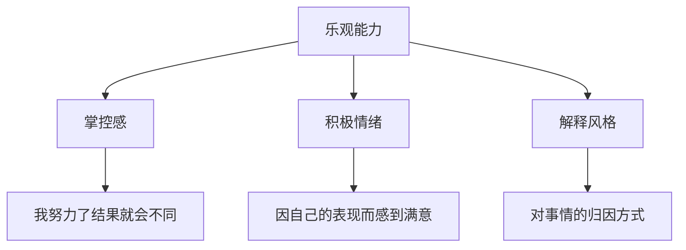

# 第13课：如何教出乐观的孩子——乐观三基础

## 学习目标
- 理解乐观能力的三大基础：掌控感、积极情绪、解释风格
- 掌握培养孩子掌控感的正确方法
- 区分"感觉满意"和"表现满意"
- 理解解释风格的三个维度：永久性、普遍性、个人化

## 核心概念

本课基于美国积极心理学之父马丁·塞利格曼（Martin Seligman）的经典著作《教出乐观的孩子》。塞利格曼教授是积极心理学的创始人，他认为心理学不仅要帮助人从"负八到负二"，更要把普通人从"正二提升到正六"。

> [!TIP] 关键洞察
> 乐观不是每天喊励志口号，而是当事情发生时，你如何解释它——这就是"解释风格"（Explaining Style）。乐观与悲观就在一念之间，而这个"一念"会决定孩子接下来全部的情绪和行动。

## 深入讲解

### 乐观能力的三大基础

### 基础一：掌控感

掌控感是指孩子认为自己有能力用自己的行为来影响事情发展的结果。悲观的人认为"我做什么都没用"，乐观的人觉得"只要我努力，结果就会大不同"。

**常见误区：错误的鼓励方式**

一个男孩搭积木失败，爸爸说："你是最棒的！你是太空船专家！"但孩子却说："才不呢，我做得太差了，我根本就是个笨蛋。"

塞利格曼教授指出这位爸爸有三个不妥之处：
1. **说的不是真的**——孩子心知肚明自己没有搭好，虚假表扬会削弱父母话语的分量
2. **没有帮助孩子解释失败原因**——孩子说"我是笨蛋"时，爸爸应该引导他正确归因：这次失败不代表以后
3. **包办代替**——爸爸最后说"我来帮你做"，传递的信息是"事情做不好可以放弃，别人会来解救你"

**正确做法**：和孩子分享自己小时候类似的糗事，让他知道你理解他的挫败感；然后换个目标让他能自己完成（如"我们来搭个小城堡"），产生"表现满意感"。

> [!WARNING] 常见误区
> 孩子做得好与不好都得到同样的表扬，会让孩子产生另一种"习得性无助"：反正结果都一样，我何必努力？表扬要有差别——做得好时大力表扬，没做好时肯定努力、指出进步空间。

### 基础二：积极情绪——感觉满意 vs 表现满意

| 类型 | 含义 | 问题 |
|:---|:---|:---|
| **感觉满意** | 我觉得我很棒（但并没有真正的成就） | 假装快乐不是真正的快乐 |
| **表现满意** | 因为我的能力和表现，我真正感到开心 | 这是真正需要培养的能力 |

**正确的表扬方式**：
- 没做好时：不说"你好棒"，而是说"我看得出来你非常努力了，继续努力会更好"
- 有进步时："哇，你比上次进步了！"
- 表现好时："你在这里做得特别棒，爸爸妈妈真为你高兴"

### 基础三：解释风格——三个维度

解释风格（归因方式）是判断一个人乐观还是悲观的核心指标，包含三个维度：

#### 1. 永久性

| | 坏事发生时 | 好事发生时 |
|:---|:---|:---|
| **乐观者** | 暂时的："这次没考好" | 永久的："我数学一直不错" |
| **悲观者** | 永久的："我一辈子数学都不会好了" | 暂时的："这次运气好而已" |

#### 2. 普遍性

| | 坏事发生时 |
|:---|:---|
| **乐观者** | 特定的："我数学不好" |
| **悲观者** | 普遍的："我所有学习能力都很差" |

#### 3. 个人化

| | 坏事发生时 |
|:---|:---|
| **乐观者** | 客观归因："我这次不够努力，题目也有点难" |
| **悲观者** | 全部揽到自己身上："都怪我，是我把事搞砸了" |

> [!TIP] 家长自查
> 当育儿遇到挫折时（如孩子打游戏不肯放手），悲观的父母会想："我真是个失败的父母，这点事都搞不定，其他还能做什么？"——这是普遍化和永久化的悲观解释。乐观的父母会想："今晚沟通没做好，但其他方面我做得不错，明后天换个方式再试试。"——这是特定化和暂时化的积极解释。

## 实用方法

**给孩子选择的机会**：吃饭、玩玩具时多问"这几个你想选哪一个？"，增加孩子的掌控感。

**分享自己的糗事**：当孩子挫败时，说说自己小时候类似的经历，让他知道你理解他的感受，而不是包办代替。

**有差别地表扬**：根据孩子的不同表现给予不同反馈，强化"表现满意感"。

## 实践练习

> [!QUESTION] 思考题
> 
> 你的孩子画画后觉得自己画得不好很沮丧。请对比以下两种回应方式，说说哪种更好、为什么？
> 
> 回应A："你画得太棒了！你是最棒的小画家！"
> 
> 回应B："我小时候画画也觉得自己画得不好，但多练习就会进步。你看这里颜色用得很有创意，我们要不要一起再画一张？"

参考答案

回应B更好。因为：
1. 回应A是虚假表扬，孩子心知肚明画得不好，反而会降低对父母话语的信任。
2. 回应B先共情（分享自己的糗事），再指出具体的优点（颜色用得有创意），然后提出可行的行动（再画一张）。
3. 重点在于帮助孩子获得"表现满意感"——通过实际行动创造让自己满意的结果，而非假装快乐。

## 总结

培养乐观的孩子需要三大基础：给予孩子掌控感（让他觉得自己的行为能影响结果）、培养表现满意感（因真实成就而开心）、以及帮助孩子形成积极的解释风格（从永久性、普遍性、个人化三个维度调整归因方式）。表扬要有差别，鼓励要具体，共情要真诚——这比空洞的"你最棒"有效得多。

## 延伸阅读
上一课：[[../lessons/0012-自信培养与应对嘲笑|第12课：自信培养与应对嘲笑]]
下一课：[[../lessons/0014-乐观教养ABC法则|第14课：乐观教养ABC法则与方法]]