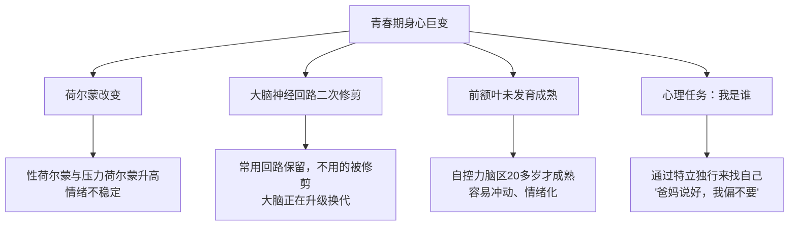

# 第19课：青春期亲子关系与正面管教

## 学习目标
- 理解青春期孩子身心巨变的四大原因
- 识别四种养育风格及其对孩子的影响
- 掌握正面管教的四个R原则，学会修补亲子关系

## 核心概念

### 重新认识青春期

许多家长对青春期孩子的感受是"搞不懂"和"搞不定"——孩子变了，变得不认识了，特别难相处、难理解、难沟通。

> [!TIP] 关键洞察
> **青春期的孩子，其实已经是个成年人了。** 从演化心理学视角来看，当生理上已经具备繁衍后代的能力，就意味着"成年"。青春期是过去一百年才被发明的概念——因为人类的寿命延长、教育体系拉长，才创造了这个"过渡期"。如果能用对待成人的态度来对待青春期的孩子，很多紧张的亲子关系其实大可不必。

### 青春期身心巨变的四大原因



**关于"早恋"**
对异性有好感、想靠近，是一种生物行为。当身体准备好时，自然而然会出现。因此"早恋"是一个伪概念。父母要做的不是禁止，而是说："恭喜你，现在你已经是成年人了。接下来会有新的感受和挑战，老爸老妈很乐意和你一起研究怎么做。"

## 深入讲解

### 四种养育风格

书中将青春期孩子的养育风格分为四类：

| 类型 | 特点 | 做法 | 对孩子的负面影响 |
|------|------|------|-----------------|
| **砖头型（控制型）** | 坚硬、沉重、伤人 | 惩罚或奖励：禁足、扣零花钱、"考得好才给钱" | 认为强权即公理；为得到爱放弃自我；学会操控父母 |
| **地毯型（骄纵型）** | 任人践踏、束手无策 | 溺爱、予取予求 | 认为别人都应该对我好；更在乎物质；缺乏处理失望的能力 |
| **幽灵型（忽视型）** | 像幽灵一样看不见摸不着 | 放弃、不管 | 认为"我不重要也不可爱"；被迫过早承担责任 |
| **正面管教型** | 和善而坚定 | 积极、建设、鼓励 | 学会自由与责任并存；相互尊重；错误是学习的机会 |

> [!WARNING] 常见误区
> 追求**短期效果**的家长会想："我怎么做才能让孩子乖乖听话？""我怎么做才能让问题立刻消失？" 而正面管教追求的是**长期效果**："我怎么做才能帮助孩子变得更有能力？""我怎么做才能进入孩子的内心世界？"

### 初二男孩爸爸的转变

一位初二男孩的爸爸学习后决定用对待成人的方式看待儿子。他发现用商量的方式而不是命令的方式跟孩子互动后，亲子关系缓和了不少——原来不跟他讲话的儿子，开始跟他说心理话了，包括在学校喜欢谁、讨厌哪个老师。老爸说："我找回我的儿子了。"

## 实用方法

### 正面管教的四个R：从错误中学习

当亲子关系出现裂痕时，用四个R来修补：

```
1. 承认 (Recognize) ── 认识到自己有失误
2. 承担责任 (Responsibility) ── 明确告诉对方哪些地方是自己的责任
3. 和好 (Reconciliation) ── 表达歉意，修补关系
4. 解决问题 (Resolution) ── 一起想办法从错误中学到能力
```

**案例：孩子对老师出言不逊后的父子冲突**

- **背景**：孩子当着全班面对老师说"你教书那么烂我才没学好"。老爸知道后劈头盖脸骂了孩子一顿。孩子回怼："你说话又好到哪里去？"
- **四个R的应用**：
  1. **承认**：老爸冷静后意识到——儿子说得对，我说话也不客气
  2. **承担责任**：走到孩子房间说："你说的对，我刚才说话很不客气，没考虑你的感受"
  3. **和好**："不好意思，我刚才做得不够好，你已经是个大人了，我应该更尊重你"
  4. **解决问题**：问孩子："老师不开心，你对老师的做法也不满意，接下来你觉得该怎么办？" 通过不断发问帮孩子自己找到方案，比如写信向老师道歉

> 每一次父母愿意为自己失误的言行向青春期孩子道歉，都是**展现尊重并把孩子当成年人对待的最好方式**。

## 实践练习

> [!QUESTION] 思考题
> 你的孩子最近经常锁上房门不跟你说话，你敲门他会很不耐烦地说"别烦我"。请分别用"砖头型""地毯型""幽灵型"和"正面管教型"四种风格写出你的回应，并分析哪种最有效。

<details>
<summary>参考答案</summary>

**砖头型回应：** "你这是什么态度？把门打开！再不开门我就要没收你的手机，周末也别想出门了！"
- 结果：孩子可能更愤怒，亲子关系更加对立

**地毯型回应：** "好好好，我不烦你。你想吃什么？妈妈给你做好吃的送进去好不好？"
- 结果：孩子学会用"别烦我"操控父母，无法学会尊重他人

**幽灵型回应：** 叹口气走开，心想"管不了你了，随你吧"
- 结果：孩子感到被放弃，"我不重要"的信念被强化

**正面管教型回应：** 先在门外平静地说："我知道你现在需要自己的空间，我尊重你。等你想聊的时候，我随时都在。" 过几小时，敲门说："我做了你爱吃的点心，要不要出来一起吃？" 如果孩子出来，不提锁门的事，可以先聊轻松的话题。等关系缓和后，再找机会说："有时候我也需要自己的空间，所以你锁门我能理解。不过如果有什么事情你愿意跟我说，我很乐意听。"

**分析：** 正面管教型既尊重了孩子当下的需求，又传递了"我在这里支持你"的信息，还保留了未来沟通的可能性——这才是长期有效的做法。
</details>

## 总结

青春期不是一场灾难，而是一次亲子共同成长的机会。当孩子进入青春期，请把他当作一个正在努力寻找自己的成年人。用正面管教的方式——和善而坚定，注重长期效果而非短期控制。记住：**错误是学习的机会**，每一次冲突都可以成为培养能力、加深关系的契机。

## 延伸阅读
下一课：[[../lessons/0020-青春期孩子学习压力应对|第20课：青春期孩子学习压力应对]]