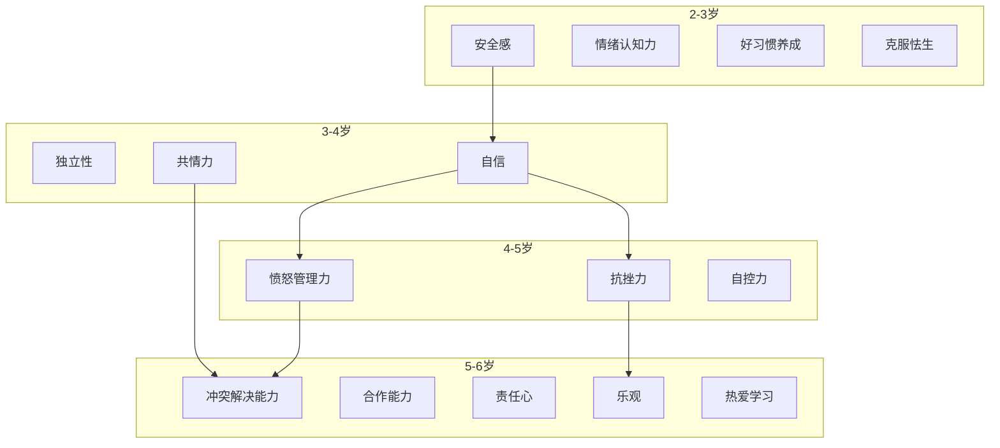

# 第21课：第二季导论——情商培养与十大情商力

## 学习目标
- 了解第二季课程的整体框架与十大情商力体系
- 理解情商为何可以终身培养，以及其背后的脑科学依据
- 掌握幼儿情商分龄发展体系，了解各年龄段的关键启蒙期
- 理解"赋能型家长"与"救火型家长"的本质区别
- 认识"新三好"家庭教育目标与情商作为品德基础的内在逻辑

## 核心概念

### 第二季课程：十大情商力

第二季课程围绕**十大情商力**展开，每项能力都是孩子心理健康与人格健全的基石：

| 情商力 | 定义 | 启蒙关键期 |
|--------|------|------------|
| **情绪认知力** | 觉察、识别并准确命名自己情绪的能力 | 2-3岁 |
| **安全感** | 对环境和人际关系感到安全、可依赖的内心状态 | 2-3岁 |
| **自信** | 相信自己的能力和价值，敢于尝试和表达 | 3-4岁 |
| **自控力** | 调节冲动、延迟满足、管理自己行为的能力 | 4-5岁 |
| **独立性** | 自主思考和行动，不依赖他人也能完成任务的能力 | 3-4岁 |
| **愤怒管理力** | 识别愤怒信号并以适当方式表达和调节的能力 | 4-5岁 |
| **抗挫力** | 面对失败和困难时不轻言放弃、能够反弹的能力 | 4-5岁 |
| **共情力** | 理解并感受他人情绪和立场的能力 | 3-4岁 |
| **冲突解决能力** | 在人际分歧中寻找双赢方案的能力 | 5-6岁 |
| **专注力** | 将注意力持续集中在目标活动上的能力 | 5-6岁 |

> [!TIP] 关键洞察
> 许多育儿难题——孩子乱发脾气、不听话、不专注——其实是因为孩子**缺乏相应的情商能力**，而非故意为难父母。孩子的每一个"问题行为"，都是一个能力缺失的信号。

### 幼儿情商分龄发展体系

张怡筠博士团队基于大脑科学研究和中国家庭在地化研究，建立了适合中国宝宝的幼儿情商分龄发展体系：

> [!WARNING] 关键提醒
> 分龄体系中的关键期是**启蒙关键期**，而非"窗口期"。例如自信在3-4岁进入最佳启蒙阶段，但自信是终身需要关注和培养的能力，绝非过了这个年龄就无法发展。关键在于：在该年龄段开始，大脑已做好充分准备，此时培养事半功倍。

### 情商力发展的递进关系

各项情商力之间存在先后逻辑，前一项能力的建立是后一项能力发展的基础：

- **安全感**是**自信**的基础——只有感到安全，孩子才敢于探索和尝试
- **自信**与**共情力**、**愤怒管理力**是**冲突解决能力**的基础——有自信的孩子才敢于面对冲突，能共情才能理解对方立场，能管理愤怒才能冷静沟通
- **抗挫力**是**乐观**的基础——能从挫折中反弹，才能对未来保持积极期待

## 深入讲解

### 为什么情商可以培养？脑科学依据

这是一个有科学答案的问题，绝非个人感受和主观看法。

**大脑发育的关键事实：** 胎儿出生时，大脑神经系统大约只完成了**10%到15%**。也就是说，还有80%以上的大脑神经回路是在出生之后逐步发育完成的。

> 简单理解：宝宝出生时，他的大脑是一个**半成品**。

尚未完成的部分如何发展？完全取决于**后天的环境、别人对待他的方式以及成长经验**。这就是为什么所有专家都说孩子的教育至关重要。

**情商与智商的关键差异：**

| 维度 | 智商（IQ） | 情商（EQ） |
|------|-----------|-----------|
| 受遗传影响 | 较大 | 部分，但后天更重要 |
| 发展特征 | 到一定年龄后趋于稳定，不再高速成长 | **可以终身成长** |
| 培养空间 | 有限 | 无限——只要愿意付出行为上的努力，情商可以不断提高 |

**情绪脑与理性脑的发育节奏：**

- **情绪脑**：出生后不久就基本发育成熟——所以情绪是天生的
- **管理情绪和控制情绪的大脑部分**（前额叶皮层）：是整个大脑中**最晚发育成熟**的部分

这就意味着：孩子天生就有情绪，但**管理和回应情绪的能力必须通过学习获得**。父母对待孩子的教养方式，直接决定了孩子能否发展出这些关键能力。

> [!TIP] 两个经典案例
> 1. **暴脾气孩子**：有些孩子天生情绪强度大、持续时间长。但正如罗斯·格林（Ross Greene）博士的研究所示，只要父母懂得方法，通过不断的亲子互动练习，孩子能够学会觉察自己的情绪（"我生气了"），并在情绪失控前找到更好的表达方式。
> 2. **胆小害羞的孩子**：如果父母理解孩子、不强迫、提供具体帮助（如何面对焦虑、如何开展人际关系、如何建立自信），再害羞的孩子也能变得落落大方。

### SEL社会情绪学习课程

情商课程并非凭空而来的概念，它在全世界已经实践多年：

- **1995年**：丹尼尔·戈尔曼（Daniel Goleman）让"情商"这个概念火遍全球。他在1990年代成立了专门认证和推广情商课程的协会。
- **SEL课程**（Social Emotional Learning，社会情绪学习课程）已在许多国家广泛推广并取得显著效果。
- **耶鲁大学校长彼得·萨洛维（Peter Salovey）** 本身就是情绪智力研究的先驱。他于今年（2026年）3月通过耶鲁北京中心成立基金会，开始在中国推广儿童情商教育。

### 情商是品德的基础

许多家长重视品德教育，希望孩子诚实、勇敢、乐于助人——但忽略了这些品德都需要**情商力作为基础**。

**案例一：诚实需要抗压能力**

当孩子撒谎时，许多父母的第一反应是责骂："你怎么可以撒谎？你不是一个好孩子！" 但孩子此刻需要的不是被痛骂，他也想做个好孩子，只是**他没有能力做到**——

- 他缺乏**抗压能力**和**抗焦虑能力**（"等会儿要被妈妈骂了怎么办？"）
- 他缺乏**冲突管理能力**（"万一我说实话被痛骂，该怎么应对？"）

如果孩子连这些基础情商力都没有，面对"说实话还是撒谎"的选择时，他当然只能选择撒谎。骂孩子只会雪上加霜——越骂他越怕与你沟通，于是只能继续撒谎。

**案例二：分享需要共情能力**

希望孩子有公德心、乐于助人、愿意分享——但如果孩子从未被关注过**共情能力**的发展（"他现在真的很难过，如果有人帮助他，他会很高兴"），他就不容易伸出援手。

> [!WARNING] 重要启示
> 当我们要求孩子做到良好的品德表现时，却没有提供他应具备的情商能力，这对孩子是不公平的。**骂孩子只会越骂越糟**——正确的方法是帮助孩子培养相关的情商能力。

### "新三好"家庭教育目标

许多家长焦虑于该让孩子学什么才艺（英语、乐器、体育……），却忽略了最根本的问题：**家庭教育到底要教什么？**

张怡筠博士提出家庭教育的**"新三好"**目标：

1. **情商好** —— 人格健全、心理成熟的基础（最容易被忽视）
2. **习惯好** —— 家长通常已经比较关注
3. **身体好** —— 家长通常已经比较关注

> 现在许多家长送孩子学各种才艺，但孩子连基本的情绪管理、与人相处的能力都还没有培养好。一位父亲在家长工作坊中一语中的："你们家孩子现在最该学的，不是才艺，而是**自我管理**——管理好自己的脾气，学会跟别人相处。"

### "赋能型家长" vs "救火型家长"

张怡筠博士提出了两种家长类型的核心区别：

| 类型 | 行为模式 | 结果 |
|------|----------|------|
| **救火型家长** | 等问题出现了才冲过去处理："怎么办怎么办？烦死了！" | 疲于奔命、特别焦虑，问题不断反复 |
| **赋能型家长** | 帮助孩子培养能力，让孩子有能力自己解决问题 | 从根源上预防问题，孩子越来越独立 |

这个比喻非常形象：**救火型家长就像到处扑火，而赋能型家长则是把房子变成防火材质，让它根本不会失火。**

## 实用方法

### 第二季课程安排

第二季课程为期**十周**，共**三十堂课**，按以下节奏进行：

| 时间 | 内容 | 目的 |
|------|------|------|
| **周一、周三** | 主题课程分享 | 系统学习十大情商力的培养方法 |
| **周五** | 上一周主题的QA答疑 | 家长实践后提出疑问，互动讨论 |

> 这个安排的特别用意是：家长在听了课后有**一周时间实践**，完成亲子任务练习，再发表心得和疑问。这样设计的目的是**真正赋能家长**，让家长有机会练习，然后成为高情商教练。

### 十大情商力核心要点

在第二季中，每项情商力将作为单独主题展开。以下是各能力培养的关键方向：

1. **情绪认知力**：帮助孩子准确识别和命名自己的情绪
2. **安全感**：建立安全型依恋，让孩子敢于探索
3. **自信**：培养"我能行"的信念
4. **自控力**：学会延迟满足和行为调节
5. **独立性**：鼓励自主思考和行动
6. **愤怒管理力**：觉察愤怒信号，学会适当表达
7. **抗挫力**：从失败中反弹，不轻言放弃
8. **共情力**：理解他人的感受和立场
9. **冲突解决能力**：寻找人际双赢方案
10. **专注力**：持续聚焦目标活动

## 实践练习

> [!QUESTION] 思考题：盘点你的育儿模式
> 回顾最近一周与孩子相处的经历，想一想：你更像"救火型家长"还是"赋能型家长"？请举出一个具体事例，说明你是如何应对孩子的某次情绪爆发的？如果再来一次，你会如何用"赋能"的方式来处理？

参考答案

**救火型模式识别：** 常见的救火型表现包括——
- 看到孩子发脾气就心烦意乱，只想着赶紧让ta停下来
- 直接替孩子解决问题，而不是教ta自己处理
- 用惩罚或奖励来"控制"行为，而不关注背后的能力缺失

**赋能型模式转换：** 如果再来一次，可以这样尝试——
1. 先深呼吸，告诉自己："这是培养孩子情商能力的机会"
2. 蹲下来，共情倾听："你很生气，因为……对吗？"
3. 帮孩子识别情绪："这种感觉叫做生气/失望/委屈"
4. 引导孩子思考解决方案："除了发脾气，还有什么办法可以让自己好过一点？"
5. 事后复盘："今天我们用了一种新方法来处理生气，你觉得怎么样？"

**关键区别：** 救火型关注"如何让问题消失"；赋能型关注"如何让孩子因此成长"。

> [!QUESTION] 思考题：你的孩子处于哪个年龄段？
> 对照幼儿情商分龄发展体系，看看你的孩子目前处于哪个年龄段（2-3岁、3-4岁、4-5岁还是5-6岁）？这个阶段最需要关注的情商力是什么？你打算如何开始培养？

参考答案

举例：如果孩子**3岁半**，应重点关注**独立、自信和共情力**的启蒙——
- **独立性**：让孩子自己穿衣服、收拾玩具，做错了也鼓励"你试过了，真棒"
- **自信**：多给孩子做选择的权力（"你今天想穿红色还是蓝色的衣服？"），每完成一个小任务就给予具体肯定
- **共情力**：阅读绘本时多问"你觉得小熊现在是什么感觉？""如果你是小熊，你会怎么办？"

注意：如果3岁半的孩子还经常发脾气，不必过度焦虑——4-5岁才是愤怒管理的启蒙关键期，现在可以开始铺垫，但不要强求达标。

## 总结

第二季课程的核心是帮助家长从**碎片化的育儿知识**走向**系统化的情商培养**。本节课给出了整个课程的宏观框架：

1. **十大情商力**是第二季的核心内容，涵盖情绪认知力、安全感、自信、自控力、独立、愤怒管理力、抗挫力、共情力、冲突解决能力和专注力。
2. **脑科学依据**证实情商可以终身培养——出生时大脑只完成10%-15%，剩余部分由后天环境和教养方式塑造。
3. **SEL社会情绪学习课程**已在全球推广多年，丹尼尔·戈尔曼和耶鲁大学校长彼得·萨洛维等学者是这一领域的重要推动者。
4. **幼儿情商分龄发展体系**指明了2-6岁各年龄段应重点启蒙的能力，但关键期不是窗口期——过了年龄仍可培养。
5. **情商是品德的基础**——诚实需要抗压能力，分享需要共情能力，培养品德必须先培养能力。
6. 家庭教育的"**新三好**"是：情商好、习惯好、身体好。
7. 要做"**赋能型家长**"而非"救火型家长"——帮助孩子拥有能力，让他自己解决问题。
8. 课程安排为**周一周三主题课、周五答疑课**，留足一周时间让家长实践和反思。

正如张怡筠博士所言——**"想的是孩子，改的是自己。"** 让我们一起做孩子最喜欢的情商教练，培养孩子终身受益的情商力。

## 延伸阅读
上一课：[[../lessons/0020-青春期孩子学习压力应对|第20课：青春期孩子学习压力应对]]
下一课：[[../lessons/0022-情绪认知力理解孩子的情绪|第22课：情绪认知力（上）——理解孩子的情绪]]

术语参考：[[../reference/glossary|术语表]]