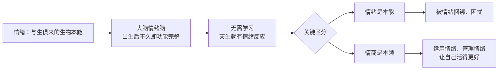

# 第22课：情绪认知力（上）——理解孩子的情绪

## Learning Objectives
- 理解情绪的三大生物功能：生存机制、沟通工具、记忆增强器
- 区分"情绪是本能"与"情商是本领"的核心差异
- 辨识面对孩子情绪的四种态度及其影响
- 掌握高情绪粒度的概念与示范方法

## 核心概念

### 面对孩子情绪的四种态度

当孩子开始哭闹、情绪爆发时，父母脑海中闪过的第一个念头，往往会决定后续的亲子互动走向。这四种态度分别是：

| 念头 | 背后心态 | 父母的情绪反应 | 对孩子的影响 |
|------|----------|----------------|-------------|
| **糟糕，麻烦来了** | 害怕、焦虑，认为孩子情绪是大麻烦 | 焦虑、无助 | 孩子感受到父母的不安，情绪被放大 |
| **可恶，冲突来了** | 认为孩子在故意作对 | 生气、愤怒 | 亲子陷入权力斗争，孩子情绪被压制 |
| **奇怪，为什么呢？** | 好奇、疑问，想了解原因 | 平静、探索 | 孩子感到被关注，有机会表达自己 |
| **真好，机会来了** | 把情绪当作沟通密码，视为教育契机 | 积极、期待 | 孩子的情商在每一次情绪波动中得到成长 |

> [!TIP] 关键心态转变
> 孩子的情绪不是来为难父母的，而是他的一种**沟通方式**。当他有情绪时，他其实在说："我有话想说，请理解我。"把每一次情绪波动都视为了解孩子内心世界、帮助他成长的大好机会。

### 情绪是本能，情商是本领

**情绪**是天生的——大脑中掌管情绪的区域（情绪脑）是大脑最早发育成熟的部分之一，出生后不久就已功能完整。孩子产生各种情绪反应不需要后天学习。

**情商**是后天需要培养的——有了情绪之后，如何运用这些情绪、不被情绪捆绑，才是需要学习和练习的本领。

## 深入讲解

### 情绪的三大生物功能

#### 1. 情绪是生存机制

情绪的产生不是为了丰富人生体验，而是为了**活命**。它像心跳、呼吸一样，是生物体赖以生存的必要功能。

**生存机制的运作方式：**
- 宝宝出生后到两岁前不具备语言能力
- 肚子饿了、身体不舒服了，只能用强烈的情绪反应（哭、闹、叫）来引起外界关注
- 这实际上是发出求救信号："快来看看我吧，我不行了！"
- 如果没有这个机制，孩子饿了没人理、发烧了没人管，生命将危在旦夕

> [!WARNING] 重新认识孩子的哭闹
> 当孩子有情绪时，他其实是在施展与生俱来的**生存能力**。理解了这一点，父母就不会再把孩子的情绪当作"不听话"或"捣乱"，而是能更正面地理解和回应。

#### 2. 情绪是沟通工具

即使孩子有了语言能力之后，情绪依然是极其重要的沟通工具。

**情绪决定沟通的真实含义：**
- 同样一句话，用不同的情绪说出来，传达的意思截然不同
- 例如"我不要吃了"和"我不要吃了"——语气不同，内心感受完全不同
- 对父母而言，**比说了什么更重要的是用什么态度和情绪来说**
- 孩子接收到的信息，更多来自父母的情绪而非言语

#### 3. 情绪是记忆增强器

大脑的设计机制是：情绪反应越强烈，记忆就越深刻。

**正面情绪增强记忆：**
- 宝宝和爸爸妈妈在一起时感到开心、欢乐
- 这种正面情绪让印象深刻，下次会特别想靠近父母
- 促进亲子关系紧密，保障孩子健康安全成长
- 积极愉悦的情绪也让孩子愿意重复有利的行为

**负面情绪增强记忆：**
- 宝宝被烫到、很疼——强烈的情绪体验
- 大脑记住这次经历，下次自动避开危险
- 这是帮助孩子更安全地活下去的保护机制

### 情绪脑的发育特点

大脑中掌管情绪的部分（情绪脑）是大脑最早发育成熟的区域之一。出生后不久即功能完整，这也是为什么新生儿就能表现出明显的情绪反应。

然而，负责理性思考、情绪调节的大脑区域（前额叶皮层）则需要更长的时间才能发育成熟——这也是为什么孩子容易"情绪上头"就失去理性，需要父母的帮助来安抚情绪脑、激活理性脑。

### 什么是情绪粒度

**情绪粒度**（granularity，颗粒的粒）是指一个人能够感受并表达出自己情绪的细致程度。

| 情绪粒度水平 | 表现 | 示例 |
|-------------|------|------|
| **低情绪粒度** | 对情绪几乎无觉察，无法区分不同情绪 | "不知道啊""差不多啊""没感觉" |
| **中等情绪粒度** | 能说出情绪的大方向 | "我不高兴""我很开心" |
| **高情绪粒度** | 能精准区分各种情绪的细微差别，并用语言表达 | "一开始很失望，后来有点生气，因为他说话不算话" |

> [!TIP] 为什么高情绪粒度重要
> 情绪粒度高的人，情绪管理能力也更强。因为只有先精准地识别和命名情绪，才能采取适当的行动来应对。很多孩子情绪一上来就打人、骂人、摔东西，根本原因是没有觉察到"我生气了"，而是产生了盲目的反应。

## 实用方法

### 高情绪粒度的示范方法

父母可以从自己开始，在日常生活中展示高情绪粒度：

**基本公式：分享心情 + 说出原因**

回到家见到孩子时，不要只问"今天吃了什么""学了什么"，而是加入心情对话：

> "爸爸妈妈今天有好多种不同的心情哦！早上出门看到大太阳，我好**高兴**啊！后来路上堵车，差点迟到，我就好**担心**好**担心**。到了办公室发现没迟到，我又好**惊喜**！中午帮同事过生日，他特别开心，我觉得好**得意**，因为是我想到的主意。"

**示范要点：**
1. 使用丰富的情绪词汇（高兴、担心、惊喜、得意）
2. 每个情绪都与具体原因关联
3. 展示多种情绪可以在一天中交替出现
4. 语气轻松、自然，像讲故事一样

### 把情绪提问变成日常习惯

每天回家后，可以这样开启心情对话：
1. "宝宝，你今天有什么心情呀？"
2. 父母先示范："我今天有这些心情……"
3. 引导孩子说出自己的心情和原因

## 实践练习

> [!QUESTION] 思考题
> 在本课的学习过程中，你出现了哪些不同的情绪？请仔细回味并捕捉自己曾经出现的各种情绪，然后用高情绪粒度的方式把它们说给你的孩子听。

参考示范

例如："妈妈在听课的时候有好多种心情哦！一开始觉得'原来情绪是为了活命'，觉得好**惊讶**；后来听到四种态度，发现自己有时候是'糟糕型'，有点**不好意思**；再听到情绪粒度的概念，觉得好**兴奋**，迫不及待想和你试一试！"

关键是要把**心情**和**原因**结合在一起说出来。

## 总结

孩子的情绪不是麻烦，而是**生存的机制、沟通的工具、记忆的增强器**。理解这一点，父母就能从"糟糕/可恶"的态度转向"好奇/机会"的态度。情绪的觉察和表达是一种可以通过练习提升的能力——**情绪粒度**正是这个能力的核心指标。父母做好高情绪粒度的示范，就是给孩子最好的情商启蒙。

## 延伸阅读

上一课：[[../lessons/0020-青春期孩子学习压力应对|第20课：青春期孩子学习压力应对]]
下一课：[[../lessons/0023-情绪认知力认识与表达情绪|第23课：情绪认知力（下）——帮助孩子认识与表达情绪]]