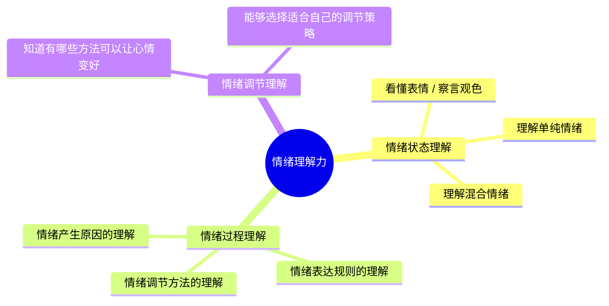

# 第23课：情绪认知力（下）——帮助孩子认识与表达情绪

## Learning Objectives
- 掌握情绪理解力的三大组成部分及其内涵
- 了解四大基本情绪与混合情绪的概念
- 学会分享心情、接纳情绪、问原因、引导解决四步法
- 掌握不同年龄段孩子的情绪沟通策略

## 核心概念

### 情绪理解力的三大组成部分

情绪理解力（情绪认知力）包括三个核心维度：

#### 一、情绪状态理解

| 子能力 | 说明 | 发展参考 |
|--------|------|---------|
| **看懂表情（察言观色）** | 通过面部表情识别他人的情绪 | 9个月大婴儿能分辨高兴与伤心；2岁左右能分辨正负面情绪；约3岁能更好地区分生气、伤心、害怕等负面情绪 |
| **理解单纯情绪** | 知道特定事件引发特定情绪 | "他收到礼物，所以他很高兴" |
| **理解混合情绪** | 理解同一事件可能引发多种复杂情绪 | "幼儿园放假了，一方面好高兴不用上学，另一方面又有点伤心见不到小伙伴" |

#### 二、情绪过程理解

这个过程理解力包含三个关键方面：

1. **情绪产生原因的理解**——知道"为什么会有这样的情绪"
   - "我好难过，因为爸爸妈妈要出门工作"
   - "我很生气，因为他藏了我的玩具"
   - 想法决定心情，所以理解原因特别重要

2. **情绪表达规则的理解**——知道"在什么场合该如何表达"
   - 收到不喜欢的礼物，是直接说"我讨厌"还是微笑道谢
   - 孩子逐渐学会在不同的场合选择更合适的表达方式

3. **情绪调节方法的理解**——知道"有哪些方法能让心情变好"
   - 我可以深呼吸
   - 我可以唱首儿歌
   - 我可以跑去玩一会儿

#### 三、情绪调节理解

知道有哪些方法能够让自己从坏心情中恢复，是情绪管理的第一步。先有"理解"，才能付出行动。

> [!TIP] 父母自检
> 很多父母在学习这一课后发现，自己的情绪理解力也"大有进步空间"。这很正常——我们小时候也未必得到了足够的情商教育。好消息是：现在你可以和孩子一起充值！

### 四大基本情绪

人类的基本情绪可分为四大类：

| 基本情绪 | 常见表现 | 儿童常见场景 |
|---------|---------|-------------|
| **高兴** | 开心、快乐、愉快、兴奋 | 得到夸奖、收到礼物、和伙伴玩耍 |
| **伤心** | 难过、悲伤、失落、沮丧 | 与亲人分离、心爱玩具损坏、被拒绝 |
| **生气** | 愤怒、恼怒、不耐烦 | 需求不被满足、被不公平对待、被打扰 |
| **害怕** | 恐惧、担心、焦虑、紧张 | 陌生环境、陌生面孔、黑暗、大声响 |

## 深入讲解

### 混合情绪的理解

混合情绪是指同一事件引发的多种不同甚至矛盾的感受。

**常见场景示例：**
- 幼儿园放假：高兴（不用上学）+ 伤心（见不到小伙伴）
- 妈妈生了弟弟/妹妹：高兴（有玩伴）+ 担心（父母的爱被分走）
- 要上台表演：兴奋（能展示自己）+ 紧张（怕出错）

> [!WARNING] 别忽视混合情绪
> 孩子在面对复杂变化时（如二胎、转学、搬家），往往会经历混合情绪。如果父母只看到其中一种（比如只看到孩子"应该高兴"），孩子会感到被误解。帮助孩子梳理这些复杂的情绪，是提升情绪认知力的重要一环。

### 培养情绪认知力的"四步法"

#### 第一步：分享心情

父母多和孩子**分享自己的心情，并说出原因**。

> "宝宝，你今天主动帮妈妈收拾玩具，妈妈好高兴啊！"
> "你刚才生气的时候打了奶奶一下，爸爸很不高兴，因为再怎么生气都不能打人。"

**要点：** 把情绪的原因和情绪的状态一起描述出来，帮助孩子理解"情绪从哪里来"。

#### 第二步：接纳情绪

接纳**所有**情绪——不管是积极的还是让父母头疼的。

> [!TIP] 接纳不等于同意
> 接纳代表"我理解你有这样的感觉"，不代表"我同意你这样做"。先接纳情绪，再处理行为。

**具体做法：**
1. 表达对他情绪的关注和理解
2. 用问句确认："妈妈知道你生气了，对吗？"
3. 给孩子空间确认或纠正你的理解

那个问号"对吗？"特别重要——给孩子机会说出真实的感受，也让他练习自我觉察。

#### 第三步：问原因

帮助孩子找到情绪产生背后的原因。

- **孩子年龄小（3岁以下）：** 给选择题
  - "你有点失望，是因为不能去小朋友的派对了，还是因为特别喜欢那个小朋友？"

- **孩子年龄大些：** 开放提问
  - "你好像有点难过，为什么呢？"
  - "刚刚发生了什么事，让你这么生气？"

#### 第四步：引导解决

在孩子情绪平复后，引导他思考如何让心情好起来。

> "我知道你现在很生气。我们一起来想想，有什么好方法能让心情好起来呢？"

**关键提醒：** 父母自己要先保持平静。如果自己已经情绪失控，这时候问"有什么好方法"，只会让孩子更有压力、哭得更凶。

### 不同年龄段的沟通策略

| 年龄段 | 特点 | 推荐策略 |
|--------|------|---------|
| **1-2岁** | 语言能力尚未发展 | 用简单的情绪词汇命名情绪（"宝宝生气了"），配合拥抱安抚 |
| **2-3岁** | 开始学说话 | 使用基础情绪词汇（高兴、伤心、生气、害怕），给选择题，使用情绪卡片游戏 |
| **3-4岁** | 语言能力快速发展 | 扩充情绪家族词汇（开心/高兴/快乐/愉快替换使用），读绘本引入更复杂的情绪概念 |
| **4-5岁+** | 能进行对话式交流 | 深入追问原因，引导思考解决办法，讨论混合情绪 |

### 答疑精华：情绪词汇扩充

**问题：** 家长自己的情绪词汇比较少，该怎么扩充？

**回答要点：**
- 2-3岁孩子使用基础情绪词汇足够了（高兴、伤心、生气、害怕）
- 可以在同类情绪中使用不同词汇替换（开心/高兴/快乐/愉快）——这叫做"情绪家族"
- 读**情绪绘本**是最好的扩充方式——故事情节带出情绪，孩子更容易理解复杂情绪词汇（如"尴尬""羞愧""沮丧"）
- 即使词汇暂时不准确也没关系，亲子之间持续对话比词汇精确更重要

### 答疑精华：孩子不愿意开口怎么办

**问题：** 问孩子"你有什么感觉"，孩子不回答怎么办？

**应对策略：**
1. **检查原因：** 是不是过去表达情绪时曾被批评？先修复亲子关系
2. **主动观察并反馈：** "爸妈感觉你好像很生气，气到都不想说话，是这样吗？"
3. **给选择题：** "你现在不想说话，是因为很生气，还是想自己待一会儿？"
4. **给时间：** 安静地陪伴，让孩子和情绪待一会儿
5. **建立安全氛围：** "请跟我说，我一定不会骂你"

### 答疑精华：孩子情绪爆发时先别问原因

**重要原则：** 当孩子已经情绪大爆发（气得不可理喻），**先不要问"你为什么生气"**。

这是因为情绪脑被激活后，理性脑暂时无法工作。此时问原因，孩子会觉得你在责怪我，反而哭得更凶。

**正确做法：**
1. 先陪伴——"我知道你生气了，我知道你很难过"
2. 简单地重复同样的话，抱抱他
3. 等情绪平复之后再问："刚才为什么这么生气呢？"
4. 和孩子演练下一次如何用语言表达

### 不好的做法

| 错误做法 | 问题所在 |
|---------|---------|
| **喜怒不形于色** | 完全冷漠，不表达任何情绪，孩子没有学习榜样 |
| **忽视孩子的情绪** | 只问"老师教了什么""吃了什么"，从不问心情 |
| **情绪混为一谈** | 认为"我高兴宝宝也必须高兴，我生气宝宝不能高兴"——每个人都是独立的个体 |

## 实用方法

### 本周亲子情商任务

每天进行以下心情对话：

1. **爸妈先主动说**自己今天的三个心情及发生的原因
2. **问孩子**今天有什么心情及发生的原因
3. **4-5岁以上再加一问：** 心情不好的时候，觉得有什么好方法能让自己心情好起来？

### 情绪卡片游戏（适用于不爱说话的孩子）

1. 在卡片上画出或写下情绪：生气、伤心、害怕、开心……
2. 和孩子轮流抽卡片
3. 抽到后说出这是什么情绪
4. 用脸上的表情来表演这个情绪
5. 玩着玩着，孩子就熟悉了情绪词汇

## 实践练习

> [!QUESTION] 思考题
> 你的孩子目前几岁？他的情绪理解力处于什么水平？请根据他的年龄段，设计一个适合他的"心情对话"方案。

思路引导

- **2岁以下：** 多用简单的情绪命名+"对吗？"，配合拥抱安抚
- **2-3岁：** 晚饭时先说自己的心情，再给选择题问孩子
- **3-4岁：** 用情绪卡片或情绪绘本，每天玩一个情绪游戏
- **4-5岁+：** 每天固定时间做三个心情的分享，讨论如何让坏心情变好

关键在于**坚持每天练习**——情商力是需要练习才能培养的能力。

## 总结

情绪认知力是情商力的**基础中的基础**。没有自我觉察和识别情绪的能力，孩子就无法管理情绪、无法理解他人。培养情绪认知力的核心四步是：**分享心情、接纳情绪、问原因、引导解决**。父母需要根据不同年龄段的语言发展水平调整策略，同时最重要的是——父母自己先做好高情绪粒度的榜样。

## 延伸阅读

上一课：[[../lessons/0022-情绪认知力理解孩子的情绪|第22课：情绪认知力（上）——理解孩子的情绪]]
下一课：[[../lessons/0024-安全感粘人与安全依恋培养|第24课：安全感——粘人行为与安全依恋培养]]